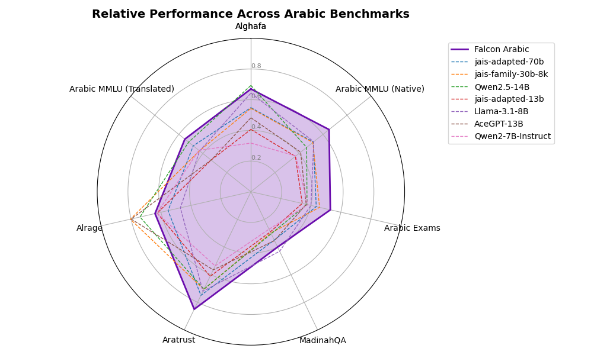

<div dir="rtl">

يسعدنا أن نعلن عن إطلاق Falcon-Arabic، نموذج لغوي يحتوي على 7 مليارات معلمة، ويُعدّ معيارًا جديدًا لمعالجة اللغة العربية طبيعيًا (NLP). تم تطوير Falcon-Arabic استنادًا إلى بنية Falcon 3، وهو نموذج متعدد اللغات يدعم العربية والإنجليزية وعددًا من اللغات الأخرى. يتميز النموذج بتفوقه في المعرفة العامة، قواعد اللغة العربية، التفكير الرياضي، حل المشكلات المعقدة، وفهم تنوع اللهجات العربية بشكل عميق.

يدعم Falcon-Arabic طول سياق يصل إلى 32,000 رمز (token)، مما يمكّنه من التعامل مع الوثائق الطويلة ويتيح استخدامه في تطبيقات متقدمة مثل التوليد المعزز بالاسترجاع (RAG)، إنتاج المحتوى المتعمق، والمهام المعرفية عالية التعقيد.

يعيد Falcon-Arabic تعريف حدود الإمكانات للنماذج اللغوية العربية. فهو يتفوق بشكل ملحوظ على النماذج الأخرى في فئته من حيث الحجم، بل ويتفوق على نماذج أكبر بأربعة أضعاف، سواء كانت نماذج عربية الأصل أو نماذج تم تكييفها من لغات أخرى. وبهذا، يُعد Falcon-Arabic نموذجًا متقدمًا من حيث الأداء، كما يوفر حلًا فريدًا يجمع بين الكفاءة وسهولة الوصول للباحثين والمطورين المهتمين باللغة العربية.

</div>

<div dir="rtl">

## 🚀 نقدم Falcon-Arabic: نحو تطوير النماذج اللغوية الكبرى لخدمة العالم العربي

شهدت السنوات الأخيرة تحولًا جذريًا في الذكاء الاصطناعي بفضل النماذج اللغوية الكبرى (LLMs)، والتي أصبحت تقف خلف العديد من الأدوات المتقدمة مثل الترجمة، وإنشاء المحتوى، والمساعدات الافتراضية، وغيرها. ومع ذلك، فإن معظم هذا التقدم ركّز على اللغات ذات التمثيل العالي مثل اللغة الإنجليزية، في حين بقيت لغات أخرى مثل اللغة العربية ممثلة تمثيلًا محدودًا. وتُعدّ العربية لغة فريدة بتحدياتها: فهي غنية صرفيًا، وتتميز بالازدواجية اللغوية بين الفصحى واللهجات الإقليمية المتنوعة، وتُستخدم في نطاق جغرافي واسع وثقافي متنوع. ومن هنا، يصبح تطوير نماذج لغوية قوية باللغة العربية أمرًا ضروريًا لضمان إشراك المجتمعات الناطقة بالعربية في ثورة الذكاء الاصطناعي بشكل فعّال.

وانطلاقًا من هذا الهدف، نقدم لكم **Falcon-Arabic**، نسخة متخصصة من عائلة نماذج [**Falcon 3**](https://huggingface.co/collections/tiiuae/falcon3-67605ae03578be86e4e87026)، التي طوّرها [**معهد الابتكار التكنولوجي (TII)**](https://www.tii.ae/) في دولة الإمارات العربية المتحدة. لقد حازت نماذج Falcon على اعتراف عالمي بفضل قدرتها القوية على التعامل مع اللغات المتعددة ونهجها المفتوح المصدر. ويأتي Falcon-Arabic استمرارًا لهذا الإرث، حيث يجلب قدرات متقدمة في فهم اللغة العربية وتوليدها. من خلال تدريب النموذج على التعامل مع كل من اللغة العربية الفصحى واللهجات المحورية، يسد Falcon-Arabic فجوة حرجة في تقنيات اللغة، مما يمكّن من تطوير تطبيقات ذكاء اصطناعي عربية أكثر طبيعية وذكاءً وشمولًا في منطقة الخليج والشرق الأوسط وشمال إفريقيا.

</div>

<a id="pull-figures"></a>
<div style="display: flex; justify-content: center; flex-wrap: wrap; gap: 20px;">
  
</div>


<div dir="rtl">

## 🧪 Falcon-Arabic قد حطّ رحاله  - إليكم وصفة التدريب

بدأ تطوير Falcon-Arabic بقرار استراتيجي: بدلًا من تدريب نموذج من الصفر، اخترنا تكييف أساس متعدد اللغات قوي. في مشهد النماذج اللغوية العربية، هناك ثلاثة توجهات رئيسية: تدريب نموذج من البداية (مثل Jais-native)، تكييف نماذج متعددة اللغات (مثل Allam أو Fanar)، أو استخدام نماذج تدعم اللغة العربية ضمن مجموعة من اللغات الأخرى (مثل Qwen أو LLaMA). ومن خلال متابعة [لوحة صدارة النماذج العربية المفتوحة](https://huggingface.co/spaces/OALL/Open-Arabic-LLM-Leaderboard)، أصبح من الواضح أن النماذج المُكيّفة والمتعددة اللغات تتفوق بشكل مستمر من حيث الكفاءة والقدرة. استنادًا إلى هذا الزخم، اخترنا **Falcon 3-7B**، وهو نموذج يحقق توازنًا عمليًا بين الأداء وكفاءة الموارد ضمن عائلة Falcon 3 التي طورها **معهد الابتكار التكنولوجي (TII)**.

تمثلت التحديات الأساسية في تكييف [Falcon 3-7B](https://huggingface.co/tiiuae/Falcon3-7B-Base)، الذي لم يكن يدعم اللغة العربية في مستوى المحلل الصرفي (tokenizer) أو التمثيلات الأولية (embeddings). لمعالجة ذلك، قمنا بتوسيع مفردات المحلل الصرفي بإضافة **32,000 رمز خاص باللغة العربية**، وطبقنا **استراتيجية جديدة لتهيئة التمثيلات الأولية** مبنية على **تشابه النصوص**. تعتمد هذه التقنية على مطابقة الرموز العربية الجديدة مع تمثيلات مشابهة معنويًا من المفردات الأصلية، مما يسمح للنموذج بوراثة المعرفة السابقة وتسريع التعلم، وخصوصًا في مجالات مثل المشاعر والمفاهيم المجردة وأنماط الاستدلال. وقد منح ذلك Falcon-Arabic نقطة انطلاق قوية في فهم وتوليد نصوص عربية عالية الجودة.

مع تجهيز المحلل الصرفي والتمثيلات الأولية، بدأنا **مرحلة ما قبل التدريب المستمر** باستخدام بيانات عالية الجودة **باللغة العربية الأصلية بنسبة 100%**، دون اللجوء إلى المحتوى المترجم آليًا، وذلك لتقليل الانحياز الثقافي والحفاظ على الأصالة اللغوية. اتبع التدريب منهجًا متعدد المراحل: ركزت المراحل الأولى على **المعرفة العامة والمحتوى الغني باللهجات** من أجل استقرار النموذج وتعزيز قدراته المنطقية، بينما ركزت المراحل اللاحقة على **الرياضيات، والبرمجة، والاستدلال**. والنتيجة هي نموذج لا يجيد اللغة العربية بجميع لهجاتها فحسب، بل يحتفظ أيضًا بقدرات Falcon في اللغات المتعددة والاستدلال، دافعًا حدود الذكاء الاصطناعي الموجه للعربية إلى آفاق جديدة.

</div>

### Falcon-Arabic-7B-Base Avg

[
    {"category": "avg", "model": "jais-adapted-70b", "value": 0.5194},
    {"category": "avg", "model": "jais-family-30b-8k", "value": 0.5363},
    {"category": "avg", "model": "Qwen2.5-14B", "value": 0.5426},
    {"category": "avg", "model": "AceGPT-13B", "value": 0.4721},
    {"category": "avg", "model": "jais-adapted-13b", "value": 0.4253},
    {"category": "avg", "model": "Llama-3.1-8B", "value": 0.5164},
    {"category": "avg", "model": "Qwen2.5-7B", "value": 0.41969999999999996},
    {"category": "avg", "model": "Falcon-Arabic-7B-Base", "value": 0.6257}
]


<div dir="rtl">

## 📊 Falcon-Arabic: يرفع معايير نماذج اللغة العربية

قمنا بتقييم Falcon-Arabic باستخدام **[إصدار OALL v2](https://huggingface.co/spaces/OALL/Open-Arabic-LLM-Leaderboard)**، والذي يُعد المعيار المرجعي الأبرز لنماذج اللغة العربية. يتضمن هذا التقييم ست مهام اختيار من متعدد مثل MMLU باللغة العربية (بالصيغتين الأصلية والمترجمة)، الامتحانات العربية، الغافة، MadinahQA، Aratrust، بالإضافة إلى معيار توليدي واحد هو Alrage. **تفوق Falcon-Arabic على جميع نماذج اللغة العربية الحالية في فئته من حيث الحجم، بل وتجاوز أداء نماذج أكبر منه حتى بأربعة أضعاف**. يتصدر النموذج نتائج معايير رئيسية مثل MMLU، الامتحانات، MadinahQA، وAratrust، ما يضع معيارًا جديدًا للنماذج التي تركّز على اللغة العربية أولًا.

</div>

### Falcon-Arabic-7B-Base Details


[
    {"category": "ALGhafa", "model": "jais-adapted-70b", "value": 0.5482},
    {"category": "ALGhafa", "model": "jais-family-30b-8k", "value": 0.5434},
    {"category": "ALGhafa", "model": "Qwen2.5-14B", "value": 0.6931999999999999},
    {"category": "ALGhafa", "model": "AceGPT-13B", "value": 0.48229999999999995},
    {"category": "ALGhafa", "model": "jais-adapted-13b", "value": 0.40619999999999995},
    {"category": "ALGhafa", "model": "Llama-3.1-8B", "value": 0.6434000000000001},
    {"category": "ALGhafa", "model": "Qwen2.5-7B", "value": 0.3172},
    {"category": "ALGhafa", "model": "Falcon-Arabic-7B-Base", "value": 0.67},
    {"category": "ArabicMMLU", "model": "jais-adapted-70b", "value": 0.5196999999999999},
    {"category": "ArabicMMLU", "model": "jais-family-30b-8k", "value": 0.5153},
    {"category": "ArabicMMLU", "model": "Qwen2.5-14B", "value": 0.4637},
    {"category": "ArabicMMLU", "model": "AceGPT-13B", "value": 0.4138},
    {"category": "ArabicMMLU", "model": "jais-adapted-13b", "value": 0.3697},
    {"category": "ArabicMMLU", "model": "Llama-3.1-8B", "value": 0.5228},
    {"category": "ArabicMMLU", "model": "Qwen2.5-7B", "value": 0.3736},
    {"category": "ArabicMMLU", "model": "Falcon-Arabic-7B-Base", "value": 0.65},
    {"category": "Exams", "model": "jais-adapted-70b", "value": 0.43579999999999997},
    {"category": "Exams", "model": "jais-family-30b-8k", "value": 0.4581},
    {"category": "Exams", "model": "Qwen2.5-14B", "value": 0.3743},
    {"category": "Exams", "model": "AceGPT-13B", "value": 0.36869999999999997},
    {"category": "Exams", "model": "jais-adapted-13b", "value": 0.34259999999999996},
    {"category": "Exams", "model": "Llama-3.1-8B", "value": 0.4004},
    {"category": "Exams", "model": "Qwen2.5-7B", "value": 0.3799},
    {"category": "Exams", "model": "Falcon-Arabic-7B-Base", "value": 0.53},
    {"category": "MadinahQA", "model": "jais-adapted-70b", "value": 0.3496},
    {"category": "MadinahQA", "model": "jais-family-30b-8k", "value": 0.2982},
    {"category": "MadinahQA", "model": "Qwen2.5-14B", "value": 0.3038},
    {"category": "MadinahQA", "model": "AceGPT-13B", "value": 0.35369999999999996},
    {"category": "MadinahQA", "model": "jais-adapted-13b", "value": 0.2904},
    {"category": "MadinahQA", "model": "Llama-3.1-8B", "value": 0.43079999999999996},
    {"category": "MadinahQA", "model": "Qwen2.5-7B", "value": 0.2711},
    {"category": "MadinahQA", "model": "Falcon-Arabic-7B-Base", "value": 0.49},
    {"category": "AraTrust", "model": "jais-adapted-70b", "value": 0.7497},
    {"category": "AraTrust", "model": "jais-family-30b-8k", "value": 0.7066},
    {"category": "AraTrust", "model": "Qwen2.5-14B", "value": 0.7045999999999999},
    {"category": "AraTrust", "model": "AceGPT-13B", "value": 0.5650999999999999},
    {"category": "AraTrust", "model": "jais-adapted-13b", "value": 0.6118},
    {"category": "AraTrust", "model": "Llama-3.1-8B", "value": 0.7198},
    {"category": "AraTrust", "model": "Qwen2.5-7B", "value": 0.5366},
    {"category": "AraTrust", "model": "Falcon-Arabic-7B-Base", "value": 0.85},
    {"category": "ALRAGE", "model": "jais-adapted-70b", "value": 0.5528},
    {"category": "ALRAGE", "model": "jais-family-30b-8k", "value": 0.8047},
    {"category": "ALRAGE", "model": "Qwen2.5-14B", "value": 0.7403},
    {"category": "ALRAGE", "model": "AceGPT-13B", "value": 0.7996},
    {"category": "ALRAGE", "model": "jais-adapted-13b", "value": 0.6253},
    {"category": "ALRAGE", "model": "Llama-3.1-8B", "value": 0.4708},
    {"category": "ALRAGE", "model": "Qwen2.5-7B", "value": 0.6268},
    {"category": "ALRAGE", "model": "Falcon-Arabic-7B-Base", "value": 0.64},
    {"category": "ArbMMLU-HT", "model": "jais-adapted-70b", "value": 0.48},
    {"category": "ArbMMLU-HT", "model": "jais-family-30b-8k", "value": 0.428},
    {"category": "ArbMMLU-HT", "model": "Qwen2.5-14B", "value": 0.5184000000000001},
    {"category": "ArbMMLU-HT", "model": "AceGPT-13B", "value": 0.3212},
    {"category": "ArbMMLU-HT", "model": "jais-adapted-13b", "value": 0.3312},
    {"category": "ArbMMLU-HT", "model": "Llama-3.1-8B", "value": 0.4267},
    {"category": "ArbMMLU-HT", "model": "Qwen2.5-7B", "value": 0.433},
    {"category": "ArbMMLU-HT", "model": "Falcon-Arabic-7B-Base", "value": 0.55}
]


<!-- <details>
<summary class="bold"> Detailed results: </summary> -->

| Model   | Avg    | ALGhafa | ArabicMMLU | Exams | MadinahQA | AraTrust | ALRAGE | ArbMMLU-HT |
|---------|---------|------------|-------|-----------|----------|--------|------------|--------|
| jais-adapted-70b | 51.94 | 54.82  | 51.97     | 43.58| 34.96    | 74.97   | 55.28 | 48.00     |
| jais-family-30b-8k | 53.63 | 54.34  | 51.53     | 45.81| 29.82    | 70.66   | 80.47 | 42.80     |
| Qwen2.5-14B | 54.26 | 69.32  | 46.37     | 37.43| 30.38    | 70.46   | 74.03 | 51.84     |
| AceGPT-13B | 47.21 | 48.23  | 41.38     | 36.87| 35.37    | 56.51   | 79.96 | 32.12     |
| jais-adapted-13b | 42.53 | 40.62  | 36.97     | 34.26| 29.04    | 61.18   | 62.53 | 33.12     |
| Llama-3.1-8B | 51.64 | 64.34  | 52.28     | 40.04| 43.08    | 71.98   | 47.08 | 42.67     |
| Qwen2.5-7B | 41.97 | 31.72  | 37.36     | 37.99| 27.11    | 53.66   | 62.68 | 43.30     |
| **Falcon-Arabic-7B-Base** | 62.57 | 67.17  | 64.85     | 52.89| 48.79    | 85.36   | 63.71 | 55.25     |

<!-- </details> -->

<div dir="rtl">

## 🗣️ من مرحلة ما قبل التدريب إلى المحادثة: مواءمة Falcon-Arabic للحوار

بعد الانتهاء من تدريب النموذج الأساسي، قمنا بتنفيذ مرحلة **مواءمة بعد التدريب**، لضبط استجابات Falcon-Arabic بما يتوافق مع تفضيلات البشر. بدأت هذه المرحلة بـ **الضبط الدقيق الخاضع للإشراف (SFT)** باستخدام مزيج من البيانات العامة عالية الجودة وبيانات تعليمات عربية أصلية تم جمعها داخليًا، تغطي طيفًا واسعًا من المهام وسيناريوهات المحادثة.

ولتعزيز عملية المواءمة بشكل أكبر، طبقنا تقنية **تحسين التفضيلات المباشر (DPO)**، وهي طريقة تعتمد على التعلم المعزز لضبط النموذج بحيث يفضل المخرجات التي يُقيّمها البشر على أنها أكثر فائدة، أمانًا، وملاءمة. يضمن هذا النهج المكوّن من خطوتين أن يكون Falcon-Arabic Chat قادرًا ليس فقط على فهم اللغة العربية بعمق، بل وأن يستجيب بطريقة تتماشى مع توقعات المستخدمين الفعلية.

كما يتضح من الرسوم البيانية للنتائج، **يتصدر Falcon-Arabic Chat القائمة**، متفوقًا على جميع نماذج اللغة العربية الأخرى المخصصة للمحادثة ضمن نفس الفئة الحجمية، بل وحتى على نماذج أكبر بكثير في العديد من المعايير. ويُظهر النموذج أداءً قويًا في كل من اتباع التعليمات والحوار المفتوح، مما يرسّخ مكانته كنموذج رائد في مجال الذكاء الاصطناعي الحواري باللغة العربية.

</div>


### Falcon-Arabic-7B-Chat Avg


[
    {"category": "avg", "model": "aya-expanse-32b", "value": 0.6717},
    {"category": "avg", "model": "c4ai-command-r7b-arabic-02-2025", "value": 0.6707},
    {"category": "avg", "model": "jais-family-30b-16k-chat", "value": 0.6543000000000001},
    {"category": "avg", "model": "jais-adapted-13b-chat", "value": 0.5808},
    {"category": "avg", "model": "ALLaM-7B-Instruct-preview", "value": 0.6525},
    {"category": "avg", "model": "Yehia-7B-preview", "value": 0.6568},
    {"category": "avg", "model": "Qwen2-7B-Instruct", "value": 0.6361},
    {"category": "avg", "model": "Falcon-Arabic-7B-Chat", "value": 0.683}
]



### Falcon-Arabic-7B-Chat Details


[
    {"category": "ALGhafa", "model": "aya-expanse-32b", "value": 0.7761},
    {"category": "ALGhafa", "model": "c4ai-command-r7b-arabic-02-2025", "value": 0.7484000000000001},
    {"category": "ALGhafa", "model": "jais-family-30b-16k-chat", "value": 0.7121999999999999},
    {"category": "ALGhafa", "model": "jais-adapted-13b-chat", "value": 0.6728000000000001},
    {"category": "ALGhafa", "model": "ALLaM-7B-Instruct-preview", "value": 0.6949},
    {"category": "ALGhafa", "model": "Yehia-7B-preview", "value": 0.7081000000000001},
    {"category": "ALGhafa", "model": "Qwen2-7B-Instruct", "value": 0.7323999999999999},
    {"category": "ALGhafa", "model": "Falcon-Arabic-7B-Chat", "value": 0.7237},
    {"category": "ArabicMMLU", "model": "aya-expanse-32b", "value": 0.6063000000000001},
    {"category": "ArabicMMLU", "model": "c4ai-command-r7b-arabic-02-2025", "value": 0.5934},
    {"category": "ArabicMMLU", "model": "jais-family-30b-16k-chat", "value": 0.6122},
    {"category": "ArabicMMLU", "model": "jais-adapted-13b-chat", "value": 0.5423},
    {"category": "ArabicMMLU", "model": "ALLaM-7B-Instruct-preview", "value": 0.649},
    {"category": "ArabicMMLU", "model": "Yehia-7B-preview", "value": 0.649},
    {"category": "ArabicMMLU", "model": "Qwen2-7B-Instruct", "value": 0.6001},
    {"category": "ArabicMMLU", "model": "Falcon-Arabic-7B-Chat", "value": 0.6827},
    {"category": "Exams", "model": "aya-expanse-32b", "value": 0.5102},
    {"category": "Exams", "model": "c4ai-command-r7b-arabic-02-2025", "value": 0.6498999999999999},
    {"category": "Exams", "model": "jais-family-30b-16k-chat", "value": 0.5009},
    {"category": "Exams", "model": "jais-adapted-13b-chat", "value": 0.473},
    {"category": "Exams", "model": "ALLaM-7B-Instruct-preview", "value": 0.5158},
    {"category": "Exams", "model": "Yehia-7B-preview", "value": 0.5214},
    {"category": "Exams", "model": "Qwen2-7B-Instruct", "value": 0.473},
    {"category": "Exams", "model": "Falcon-Arabic-7B-Chat", "value": 0.5345},
    {"category": "MadinahQA", "model": "aya-expanse-32b", "value": 0.5345},
    {"category": "MadinahQA", "model": "c4ai-command-r7b-arabic-02-2025", "value": 0.6384000000000001},
    {"category": "MadinahQA", "model": "jais-family-30b-16k-chat", "value": 0.6626000000000001},
    {"category": "MadinahQA", "model": "jais-adapted-13b-chat", "value": 0.442},
    {"category": "MadinahQA", "model": "ALLaM-7B-Instruct-preview", "value": 0.5424},
    {"category": "MadinahQA", "model": "Yehia-7B-preview", "value": 0.5437},
    {"category": "MadinahQA", "model": "Qwen2-7B-Instruct", "value": 0.595},
    {"category": "MadinahQA", "model": "Falcon-Arabic-7B-Chat", "value": 0.7363},
    {"category": "AraTrust", "model": "aya-expanse-32b", "value": 0.89},
    {"category": "AraTrust", "model": "c4ai-command-r7b-arabic-02-2025", "value": 0.8047},
    {"category": "AraTrust", "model": "jais-family-30b-16k-chat", "value": 0.8157},
    {"category": "AraTrust", "model": "jais-adapted-13b-chat", "value": 0.7968000000000001},
    {"category": "AraTrust", "model": "ALLaM-7B-Instruct-preview", "value": 0.8693000000000001},
    {"category": "AraTrust", "model": "Yehia-7B-preview", "value": 0.8748999999999999},
    {"category": "AraTrust", "model": "Qwen2-7B-Instruct", "value": 0.8277},
    {"category": "AraTrust", "model": "Falcon-Arabic-7B-Chat", "value": 0.8262},
    {"category": "ALRAGE", "model": "aya-expanse-32b", "value": 0.7964},
    {"category": "ALRAGE", "model": "c4ai-command-r7b-arabic-02-2025", "value": 0.759},
    {"category": "ALRAGE", "model": "jais-family-30b-16k-chat", "value": 0.7495},
    {"category": "ALRAGE", "model": "jais-adapted-13b-chat", "value": 0.6840999999999999},
    {"category": "ALRAGE", "model": "ALLaM-7B-Instruct-preview", "value": 0.7681},
    {"category": "ALRAGE", "model": "Yehia-7B-preview", "value": 0.7664},
    {"category": "ALRAGE", "model": "Qwen2-7B-Instruct", "value": 0.7112999999999999},
    {"category": "ALRAGE", "model": "Falcon-Arabic-7B-Chat", "value": 0.7226},
    {"category": "ArbMMLU-HT", "model": "aya-expanse-32b", "value": 0.5886},
    {"category": "ArbMMLU-HT", "model": "c4ai-command-r7b-arabic-02-2025", "value": 0.5014},
    {"category": "ArbMMLU-HT", "model": "jais-family-30b-16k-chat", "value": 0.5273},
    {"category": "ArbMMLU-HT", "model": "jais-adapted-13b-chat", "value": 0.4545},
    {"category": "ArbMMLU-HT", "model": "ALLaM-7B-Instruct-preview", "value": 0.5281},
    {"category": "ArbMMLU-HT", "model": "Yehia-7B-preview", "value": 0.534},
    {"category": "ArbMMLU-HT", "model": "Qwen2-7B-Instruct", "value": 0.513},
    {"category": "ArbMMLU-HT", "model": "Falcon-Arabic-7B-Chat", "value": 0.5547}
]


<!-- <details>
<summary class="bold"> Detailed results: </summary> -->

| Model                           |     avg |  ALGhafa |   ALRAGE |   AraTrust |   ArabicMMLU |   ArbMMLU-HT |   Exams |   MadinahQA |
|:--------------------------------|----------:|---------:|-----------:|-------------:|-------------:|--------:|------------:|-------:|
| aya-expanse-32b                 | 67.17 |    77.61 |   79.64 |     89.00 |       60.63 |       58.86 |  51.02 |      53.45 |
| c4ai-command-r7b-arabic-02-2025 | 67.07 |    74.84 |   75.90 |     80.47 |       59.34 |       50.14 |  64.99 |      63.84 |
| jais-family-30b-16k-chat        | 65.43 |    71.22 |   74.95 |     81.57 |       61.22 |       52.73 |  50.09 |      66.26 |
| jais-adapted-13b-chat           | 58.08 |    67.28 |   68.41 |     79.68 |       54.23 |       45.45 |  47.30 |      44.20 |
| ALLaM-7B-Instruct-preview       | 65.25 |    69.49 |   76.81 |     86.93 |       64.90 |       52.81 |  51.58 |      54.24 |
| Yehia-7B-preview                | 65.68 |    70.81 |   76.64 |     87.49 |       64.90 |       53.40 |  52.14 |      54.37 |
| Qwen2-7B-Instruct               | 63.61 |    73.24 |   71.13 |     82.77 |       60.01 |       51.30 |  47.30 |      59.50 |
| **Falcon-Arabic-7B-Chat**       | 68.30 |    72.37 |   72.26 |     82.62 |       68.27 |       55.47 |  53.45 |      73.63 |

<!-- </details> -->

<div dir="rtl">

## 🔓 إطلاق العنان لإمكانات الذكاء الاصطناعي العربي

يضع Falcon-Arabic معيارًا جديدًا لنماذج اللغة العربية. فرغم احتوائه على 7 مليارات معامل فقط، يقدم أداءً متقدمًا يتفوق على نماذج ذات حجم مماثل وحتى على نماذج أكبر عدة مرات في معايير رئيسية مثل Arabic MMLU، MadinahQA، وAratrust. يجمع النموذج بين الطلاقة في اللغة العربية الفصحى الحديثة، وفهم قوي للهجات الإقليمية، وقدرات متينة في الاستدلال واللغات المتعددة، مما يجعله مثاليًا لمجموعة واسعة من التطبيقات: من روبوتات المحادثة التي تركز على اللغة العربية والأدوات التعليمية، إلى توليد المحتوى، والمساعدة في البرمجة، وفهم المستندات. إذا رغبت في تجربته، يتوفر Falcon-Arabic للاختبار عبر الرابط.

</div>

<div dir="rtl">

## ⚠️ القيود

مثل جميع نماذج اللغة الكبيرة، يرث Falcon-Arabic بعض القيود الشائعة. تشمل هذه أحيانًا **الهلوسات** (إنتاج مخرجات معقولة ولكنها غير صحيحة)، و**حساسية النموذج لصياغة التعليمات النصية**، وتفاوت الأداء عبر سياقات طويلة جدًا. رغم أن Falcon-Arabic صُمم لتقليل هذه المشكلات خصوصًا في المهام العربية، يجب على المستخدمين ممارسة التفكير النقدي عند تفسير النتائج، لا سيما في حالات الاستخدام ذات المخاطر العالية أو الحساسة للحقائق.

</div>

<div dir="rtl">

## الاستشهاد

إذا وجدت هذا العمل مفيدًا لأبحاثك أو مشاريعك، نرجو منك التكرم بالاستشهاد به.

</div>

```latex
@misc{falcon-arabic,
    title = {Falcon-Arabic: A Breakthrough in Arabic Language Models},
    author = {Falcon-LLM Team},
    month = {May},
    url = {https://falcon-lm.github.io/blog/falcon-arabic},
    year = {2025}
}
```
