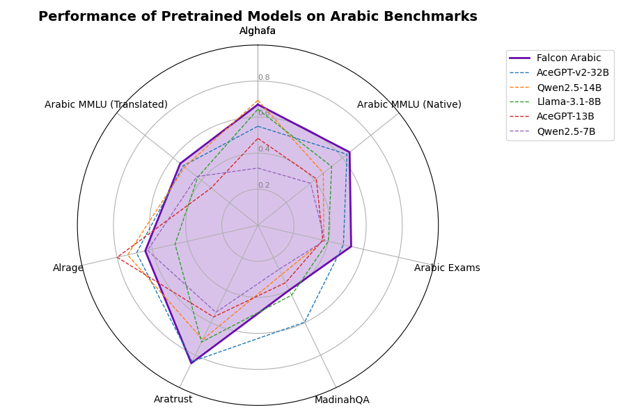

We are excited to introduce **Falcon-Arabic**, a 7B parameter language model that sets a new benchmark for Arabic NLP. Built on the Falcon 3 architecture, Falcon-Arabic is a multilingual model that supports Arabic, English, and several other languages. It excels in general knowledge, Arabic grammar, mathematical reasoning, complex problem solving, and understanding the rich diversity of Arabic dialects. Falcon-Arabic supports a context length of 32,000 tokens, allowing it to handle long documents and enabling advanced applications like retrieval-augmented generation (RAG), in-depth content creation, and knowledge-intensive tasks. 

Falcon-Arabic redefines the boundaries of what is possible for Arabic language models. It significantly outperforms other Arabic LLMs in its size category and even models up to four times larger across both Arabic-native models and those adapted from other languages. This makes Falcon-Arabic not only a state-of-the-art model in terms of performance, but also a uniquely efficient and accessible solution for developers and researchers working with the Arabic language.

<!-- Whether you are generating high-quality Arabic content, exploring the nuances of dialects, or solving complex tasks that require deep reasoning and arithmetic, Falcon-Arabic is the model that will change the way we interact with the Arabic language in AI. -->


## 🚀 Introducing Falcon-Arabic: Advancing LLMs for the Arabic-Speaking World

In recent years, Large Language Models (LLMs) have transformed artificial intelligence, powering tools for translation, content creation, virtual assistance, and more. Yet much of this progress has focused on highly represented languages like English, leaving languages such as Arabic underrepresented. Arabic presents unique challenges it's morphologically rich, diglossic (spanning both Modern Standard Arabic (MSA) and diverse regional dialects), and used across a vast and culturally varied population. Developing robust Arabic LLMs is essential to ensure Arabic-speaking communities are fully included in the AI revolution.

With this goal in mind, we’re introducing **Falcon-Arabic** a specialized adaptation of the [**Falcon 3** model family](https://huggingface.co/collections/tiiuae/falcon3-67605ae03578be86e4e87026), developed by the [**Technology Innovation Institute (TII)**](https://www.tii.ae/) in the UAE. The Falcon models have earned global recognition for their multilingual strength and open-source approach. Falcon-Arabic builds on this legacy, bringing advanced language understanding and generation to Arabic. By training the model to handle both Modern Standard Arabic and key dialects, Falcon-Arabic fills a critical gap in language technology enabling more natural, intelligent, and inclusive Arabic AI across the Gulf, Middle East, and North Africa.

<a id="pull-figures"></a>
<div style="display: flex; justify-content: center; flex-wrap: wrap; gap: 20px;">
  
</div>


## 🦅 Falcon-Arabic Has Landed - Here’s the Training Recipe 🧪

Building Falcon-Arabic started with a strategic decision: rather than training a model from scratch, we chose to adapt a strong multilingual foundation. In the Arabic LLM landscape, three main approaches exist: training from scratch (e.g., Jais-native), adapting multilingual models (like Allam or Fanar), or using models that natively support Arabic alongside other languages (such as Qwen or LLaMA). Observing the [Open Arabic LLM Leaderboard](https://huggingface.co/spaces/OALL/Open-Arabic-LLM-Leaderboard), it became clear that adapted and multilingual models consistently outperformed others in both efficiency and capability. To build on that momentum, we selected **Falcon 3-7B**, a model that strikes a practical balance between performance and resource efficiency within the Falcon 3 family developed by the **Technology Innovation Institute (TII)**.

The core challenge was adapting [Falcon 3-7B](https://huggingface.co/tiiuae/Falcon3-7B-Base), which originally lacked Arabic support at the tokenizer and embedding level. We addressed this by extending the tokenizer’s vocabulary with **32,000 Arabic-specific tokens**, and applying a **novel embedding initialization strategy** based on **textual similarity**. This technique mapped new Arabic tokens to semantically related embeddings from the existing vocabulary, allowing the model to inherit prior knowledge and accelerate learning particularly around sentiment, abstract concepts, and reasoning patterns. This gave Falcon-Arabic a head start in understanding and generating high-quality Arabic text.

With the tokenizer and embeddings in place, we began **continuous pretraining** on high-quality, **100% native Arabic datasets**, avoiding the use of machine-translated content to minimize cultural bias and preserve linguistic authenticity. Training followed a **multi-stage curriculum**: early stages focused on **general knowledge and dialect-rich Arabic content** to stabilize the model and reinforce logical capabilities, while later phases emphasized **math, code, and reasoning**. The result is a model that not only speaks Arabic fluently across dialects, but also retains Falcon’s multilingual and reasoning strengths pushing the boundaries for Arabic-first AI.


### Average Performance of Pretrained Models

[
    {"category": "Average", "model": "AceGPT-v2-32B", "value": 0.6174},
    {"category": "Average", "model": "Qwen2.5-14B", "value": 0.5426},
    {"category": "Average", "model": "AceGPT-13B", "value": 0.4721},
    {"category": "Average", "model": "gemma-2-9b-it", "value": 0.4664},
    {"category": "Average", "model": "Llama-3.1-8B", "value": 0.5164},
    {"category": "Average", "model": "Qwen2.5-7B", "value": 0.41969999999999996},
    {"category": "Average", "model": "Falcon-Arabic-7B-Base", "value": 0.6257}
]


## 📊 Falcon-Arabic: Raising the Bar in Arabic LLMs

We evaluated Falcon-Arabic on **[OALL v2](https://huggingface.co/spaces/OALL/Open-Arabic-LLM-Leaderboard)**, the leading benchmark for Arabic language models. It includes six multiple-choice tasks such as Arabic MMLU (native and translated), Arabic Exams, Alghafa, MadinahQA, Aratrust and one generative benchmark, Alrage. **Falcon-Arabic outperforms all existing Arabic LLMs in its size range and even surpasses models up to 4× larger**. It leads in key benchmarks like Arabic MMLU, Exams, MadinahQA, and Aratrust, setting a new standard for Arabic-first language models. 



[
    {"category": "ALGhafa", "model": "AceGPT-v2-32B", "value": 0.5493},
    {"category": "ALGhafa", "model": "Qwen2.5-14B", "value": 0.6931999999999999},
    {"category": "ALGhafa", "model": "AceGPT-13B", "value": 0.48229999999999995},
    {"category": "ALGhafa", "model": "gemma-2-9b-it", "value": 0.4792},
    {"category": "ALGhafa", "model": "Llama-3.1-8B", "value": 0.6434000000000001},
    {"category": "ALGhafa", "model": "Qwen2.5-7B", "value": 0.3172},
    {"category": "ALGhafa", "model": "Falcon-Arabic-7B-Base", "value": 0.67},
    {"category": "ArabicMMLU", "model": "AceGPT-v2-32B", "value": 0.6315},
    {"category": "ArabicMMLU", "model": "Qwen2.5-14B", "value": 0.4637},
    {"category": "ArabicMMLU", "model": "AceGPT-13B", "value": 0.4138},
    {"category": "ArabicMMLU", "model": "gemma-2-9b-it", "value": 0.3628},
    {"category": "ArabicMMLU", "model": "Llama-3.1-8B", "value": 0.5228},
    {"category": "ArabicMMLU", "model": "Qwen2.5-7B", "value": 0.3736},
    {"category": "ArabicMMLU", "model": "Falcon-Arabic-7B-Base", "value": 0.65},
    {"category": "Exams", "model": "AceGPT-v2-32B", "value": 0.486},
    {"category": "Exams", "model": "Qwen2.5-14B", "value": 0.3743},
    {"category": "Exams", "model": "AceGPT-13B", "value": 0.36869999999999997},
    {"category": "Exams", "model": "gemma-2-9b-it", "value": 0.2793},
    {"category": "Exams", "model": "Llama-3.1-8B", "value": 0.4004},
    {"category": "Exams", "model": "Qwen2.5-7B", "value": 0.3799},
    {"category": "Exams", "model": "Falcon-Arabic-7B-Base", "value": 0.53},
    {"category": "MadinahQA", "model": "AceGPT-v2-32B", "value": 0.5971},
    {"category": "MadinahQA", "model": "Qwen2.5-14B", "value": 0.3038},
    {"category": "MadinahQA", "model": "AceGPT-13B", "value": 0.35369999999999996},
    {"category": "MadinahQA", "model": "gemma-2-9b-it", "value": 0.317},
    {"category": "MadinahQA", "model": "Llama-3.1-8B", "value": 0.43079999999999996},
    {"category": "MadinahQA", "model": "Qwen2.5-7B", "value": 0.2711},
    {"category": "MadinahQA", "model": "Falcon-Arabic-7B-Base", "value": 0.49},
    {"category": "AraTrust", "model": "AceGPT-v2-32B", "value": 0.8396},
    {"category": "AraTrust", "model": "Qwen2.5-14B", "value": 0.7045999999999999},
    {"category": "AraTrust", "model": "AceGPT-13B", "value": 0.5650999999999999},
    {"category": "AraTrust", "model": "gemma-2-9b-it", "value": 0.7715},
    {"category": "AraTrust", "model": "Llama-3.1-8B", "value": 0.7198},
    {"category": "AraTrust", "model": "Qwen2.5-7B", "value": 0.5366},
    {"category": "AraTrust", "model": "Falcon-Arabic-7B-Base", "value": 0.85},
    {"category": "ALRAGE", "model": "AceGPT-v2-32B", "value": 0.6896},
    {"category": "ALRAGE", "model": "Qwen2.5-14B", "value": 0.7403},
    {"category": "ALRAGE", "model": "AceGPT-13B", "value": 0.7996},
    {"category": "ALRAGE", "model": "gemma-2-9b-it", "value": 0.8047},
    {"category": "ALRAGE", "model": "Llama-3.1-8B", "value": 0.4708},
    {"category": "ALRAGE", "model": "Qwen2.5-7B", "value": 0.6268},
    {"category": "ALRAGE", "model": "Falcon-Arabic-7B-Base", "value": 0.64},
    {"category": "ArbMMLU-HT", "model": "AceGPT-v2-32B", "value": 0.5287},
    {"category": "ArbMMLU-HT", "model": "Qwen2.5-14B", "value": 0.5184000000000001},
    {"category": "ArbMMLU-HT", "model": "AceGPT-13B", "value": 0.3212},
    {"category": "ArbMMLU-HT", "model": "gemma-2-9b-it", "value": 0.2501},
    {"category": "ArbMMLU-HT", "model": "Llama-3.1-8B", "value": 0.4267},
    {"category": "ArbMMLU-HT", "model": "Qwen2.5-7B", "value": 0.433},
    {"category": "ArbMMLU-HT", "model": "Falcon-Arabic-7B-Base", "value": 0.55}
]


### Comparison Table of Pretrained Models
<!-- <details>
<summary class="bold"> Detailed results: </summary> -->

<div class="custom-table"> 
| Model   | Average    | ALGhafa | ArabicMMLU | Exams | MadinahQA | AraTrust | ALRAGE | ArbMMLU-HT |
|---------|---------|------------|-------|-----------|----------|--------|------------|--------|
| AceGPT-v2-32B | 61.74 | 54.93  | 63.15     | 48.6| <u>59.71   | 83.96   | 68.96 | 52.87    |
| Qwen2.5-14B | 54.26 | <u>69.32</u>  | 46.37     | 37.43| 30.38    | 70.46   | 74.03 | 51.84     |
| AceGPT-13B | 47.21 | 48.23  | 41.38     | 36.87| 35.37    | 56.51   | 79.96 | 32.12     |
| gemma-2-9b-it | 46.64 | 47.92  | 36.28     | 27.93| 31.7    | 77.15   | <u>80.47 | 25.01     |
| Llama-3.1-8B | 51.64 | 64.34  | 52.28     | 40.04| 43.08    | 71.98   | 47.08 | 42.67     |
| Qwen2.5-7B | 41.97 | 31.72  | 37.36     | 37.99| 27.11    | 53.66   | 62.68 | 43.30     |
| **Falcon-Arabic-7B-Base** | <u>62.57</u> | 67.17  | <u>64.85     | <u>52.89| 48.79    | <u>85.36   | 63.71 | <u>55.25     |
</div> 

<!-- </details> -->

## 🗣️ From Pretraining to Instruct: Aligning Falcon-Arabic for Conversations

After finalizing the base model training, we performed a **post-training alignment** phase to fine-tune Falcon-Arabic’s responses according to human preferences. This phase began with **supervised fine-tuning (SFT)** using a combination of high-quality public datasets and internally collected **native Arabic instruction data**, covering a range of tasks and conversational scenarios.

To further enhance alignment, we applied **Direct Preference Optimization (DPO)** a reinforcement learning-based method that tunes the model to prefer outputs that humans rate as more helpful, safe, and relevant. This two-step process ensures that Falcon-Arabic Instruct not only understands Arabic well but responds in a way that aligns with real user expectations.

### Average Performance of Instruct Models


[
    {"category": "Average", "model": "aya-expanse-32b", "value": 0.6717},
    {"category": "Average", "model": "c4ai-command-r7b-arabic-02-2025", "value": 0.6707},
    {"category": "Average", "model": "ALLaM-7B-Instruct-preview", "value": 0.6525},
    {"category": "Average", "model": "Yehia-7B-preview", "value": 0.6568},
    {"category": "Average", "model": "Qwen2-7B-Instruct", "value": 0.6361},
    {"category": "Average", "model": "Falcon-Arabic-7B-Instruct", "value": 0.6808}
]


As shown in the results plots, **Falcon-Arabic Instruct leads the pack**, outperforming all other Instruct-aligned Arabic LLMs in its size class and even models significantly larger across multiple benchmarks. The model demonstrates strong performance in both instruction following and open-ended dialogue, setting a new standard for Arabic conversational AI.

### Performance of Instruct Models by Benchmark


[
    {"category": "ALGhafa", "model": "aya-expanse-32b", "value": 0.7761},
    {"category": "ALGhafa", "model": "c4ai-command-r7b-arabic-02-2025", "value": 0.7484000000000001},
    {"category": "ALGhafa", "model": "ALLaM-7B-Instruct-preview", "value": 0.6949},
    {"category": "ALGhafa", "model": "Yehia-7B-preview", "value": 0.7081000000000001},
    {"category": "ALGhafa", "model": "Qwen2-7B-Instruct", "value": 0.7323999999999999},
    {"category": "ALGhafa", "model": "Falcon-Arabic-7B-Instruct", "value": 0.724033370817286},
    {"category": "ArabicMMLU", "model": "aya-expanse-32b", "value": 0.6063000000000001},
    {"category": "ArabicMMLU", "model": "c4ai-command-r7b-arabic-02-2025", "value": 0.5934},
    {"category": "ArabicMMLU", "model": "ALLaM-7B-Instruct-preview", "value": 0.649},
    {"category": "ArabicMMLU", "model": "Yehia-7B-preview", "value": 0.649},
    {"category": "ArabicMMLU", "model": "Qwen2-7B-Instruct", "value": 0.6001},
    {"category": "ArabicMMLU", "model": "Falcon-Arabic-7B-Instruct", "value": 0.682331855997309},
    {"category": "Exams", "model": "aya-expanse-32b", "value": 0.5102},
    {"category": "Exams", "model": "c4ai-command-r7b-arabic-02-2025", "value": 0.6498999999999999},
    {"category": "Exams", "model": "ALLaM-7B-Instruct-preview", "value": 0.5158},
    {"category": "Exams", "model": "Yehia-7B-preview", "value": 0.5214},
    {"category": "Exams", "model": "Qwen2-7B-Instruct", "value": 0.473},
    {"category": "Exams", "model": "Falcon-Arabic-7B-Instruct", "value": 0.532588454376163},
    {"category": "MadinahQA", "model": "aya-expanse-32b", "value": 0.5345},
    {"category": "MadinahQA", "model": "c4ai-command-r7b-arabic-02-2025", "value": 0.6384000000000001},
    {"category": "MadinahQA", "model": "ALLaM-7B-Instruct-preview", "value": 0.5424},
    {"category": "MadinahQA", "model": "Yehia-7B-preview", "value": 0.5437},
    {"category": "MadinahQA", "model": "Qwen2-7B-Instruct", "value": 0.595},
    {"category": "MadinahQA", "model": "Falcon-Arabic-7B-Instruct", "value": 0.729505774912704},
    {"category": "AraTrust", "model": "aya-expanse-32b", "value": 0.89},
    {"category": "AraTrust", "model": "c4ai-command-r7b-arabic-02-2025", "value": 0.8047},
    {"category": "AraTrust", "model": "ALLaM-7B-Instruct-preview", "value": 0.8693000000000001},
    {"category": "AraTrust", "model": "Yehia-7B-preview", "value": 0.8748999999999999},
    {"category": "AraTrust", "model": "Qwen2-7B-Instruct", "value": 0.8277},
    {"category": "AraTrust", "model": "Falcon-Arabic-7B-Instruct", "value": 0.825389146267096},
    {"category": "ALRAGE", "model": "aya-expanse-32b", "value": 0.7964},
    {"category": "ALRAGE", "model": "c4ai-command-r7b-arabic-02-2025", "value": 0.759},
    {"category": "ALRAGE", "model": "ALLaM-7B-Instruct-preview", "value": 0.7681},
    {"category": "ALRAGE", "model": "Yehia-7B-preview", "value": 0.7664},
    {"category": "ALRAGE", "model": "Qwen2-7B-Instruct", "value": 0.7112999999999999},
    {"category": "ALRAGE", "model": "Falcon-Arabic-7B-Instruct", "value": 0.717711301044635},
    {"category": "ArbMMLU-HT", "model": "aya-expanse-32b", "value": 0.5886},
    {"category": "ArbMMLU-HT", "model": "c4ai-command-r7b-arabic-02-2025", "value": 0.5014},
    {"category": "ArbMMLU-HT", "model": "ALLaM-7B-Instruct-preview", "value": 0.5281},
    {"category": "ArbMMLU-HT", "model": "Yehia-7B-preview", "value": 0.534},
    {"category": "ArbMMLU-HT", "model": "Qwen2-7B-Instruct", "value": 0.513},
    {"category": "ArbMMLU-HT", "model": "Falcon-Arabic-7B-Instruct", "value": 0.553732273891484}
]


### Comparison Table of Instruct Models

<!-- <details>
<summary class="bold"> Detailed results: </summary> -->
<div class="custom-table"> 
| Model                           |     Average |  ALGhafa |   ALRAGE |   AraTrust |   ArabicMMLU |   ArbMMLU-HT |   Exams |   MadinahQA |
|:--------------------------------|----------:|---------:|-----------:|-------------:|-------------:|--------:|------------:|-------:|
| aya-expanse-32b                 | 67.17 |    <u>77.61 |   <u>79.64 |     <u>89.00 |       60.63 |       <u>58.86 |  51.02 |      53.45 |
| c4ai-command-r7b-arabic-02-2025 | 67.07 |    74.84 |   75.90 |     80.47 |       59.34 |       50.14 | <u>64.99 |      63.84 |
| ALLaM-7B-Instruct-preview       | 65.25 |    69.49 |   76.81 |     86.93 |       64.90 |       52.81 |  51.58 |      54.24 |
| Yehia-7B-preview                | 65.68 |    70.81 |   76.64 |     87.49 |       64.90 |       53.40 |  52.14 |      54.37 |
| Qwen2-7B-Instruct               | 63.61 |    73.24 |   71.13 |     82.77 |       60.01 |       51.30 |  47.30 |      59.50 |
| **Falcon-Arabic-7B-Instruct**       | <u>68.03 |    72.40 | 71.77  |     82.54 |       <u>68.23 |       55.37 |  53.25 |      <u>72.95 |
</div> 
<!-- </details> -->

## 🔓 Unlocking the Potential of Arabic AI

Falcon-Arabic sets a new benchmark for Arabic language models. With only 7B parameters, it delivers state-of-the-art performance outperforming models of similar size and even those several times larger across key benchmarks like Arabic MMLU, MadinahQA, and Aratrust. It combines fluency in Modern Standard Arabic, strong understanding of regional dialects, and robust reasoning and multilingual capabilities, making it ideal for a wide range of applications: from Arabic-first chatbots and educational tools to content generation, code assistance, and document understanding. 

To give you a hands-on feel for what Falcon-Arabic can do, we built a simple demo that showcases its capabilities in **machine translation** even though the model hasn’t been fine-tuned specifically for that task. The tool runs purely on **Falcon-7B-Arabic-Instruct**, and the results are surprisingly strong across various translation directions. You can try it yourself through the demo linked just below. In fact, we used the same setup to translate this blog post into Arabic for our Arabic-speaking audience. Check it out [here](https://falcon-lm.github.io/ar/blog/falcon-arabic/) 🚀. And if you're curious to explore more, we also provide access to a live [playground](https://chat.falconllm.tii.ae) where you can interact with Falcon-Arabic Instruct and experience its performance across different tasks ✨.



<iframe
  src="https://tiiuae-falcon-arabic-translation-demo.hf.space/?__theme=light"
  frameborder="0"
  width="100%"
  height="300px"
  allow="accelerometer; camera; microphone; encrypted-media"
></iframe>

<div style="
  display: flex;
  flex-wrap: wrap;
  gap: 0.5rem;
  margin: 1rem 0;
  justify-content: center;
">
  <a href="https://chat.falconllm.tii.ae" target="_blank" style="
    flex: 1 1 200px;
    background-color: #f5f0ff;
    border: none;
    border-left: 4px solid #800080;
    outline: none;
    padding: 0.75rem;
    text-align: center;
    font-weight: 600;
    text-decoration: none;
    color: inherit;
  ">
    🗣️ <span style="color: #800080; text-decoration: underline;">Chat with Falcon-Arabic</span>
  </a>
  <a href="https://huggingface.co/collections/tiiuae/falcon-arabic-682cd54f8560f4baf57641d7" target="_blank" style="
    flex: 1 1 200px;
    background-color: #f5f0ff;
    border-buttom: none;
    border-left: 4px solid #800080;
    outline: none;
    padding: 0.75rem;
    text-align: center;
    font-weight: 600;
    text-decoration: none;
    color: inherit;
  ">
    📊 <span style="color: #800080; text-decoration: underline;">View 🤗 Collection &amp; Scores</span>
  </a>
</div>

## ⚠️ Limitations

Like all Large Language Models, Falcon-Arabic inherits some common limitations. These include occasional **hallucinations** (producing plausible but incorrect outputs), **sensitivity to how prompts are phrased**, and varying performance across very long contexts. While Falcon-Arabic is designed to reduce these issues especially for Arabic tasks users should still apply critical thinking when interpreting results, particularly in high-stakes or fact-sensitive use cases.

## Citation

If you find this work helpful for your research or projects, please consider citing it.

```latex
@misc{falcon-arabic,
    title = {Falcon-Arabic: A Breakthrough in Arabic Language Models},
    author = {Falcon-LLM Team},
    month = {May},
    url = {https://falcon-lm.github.io/blog/falcon-arabic},
    year = {2025}
}
```
