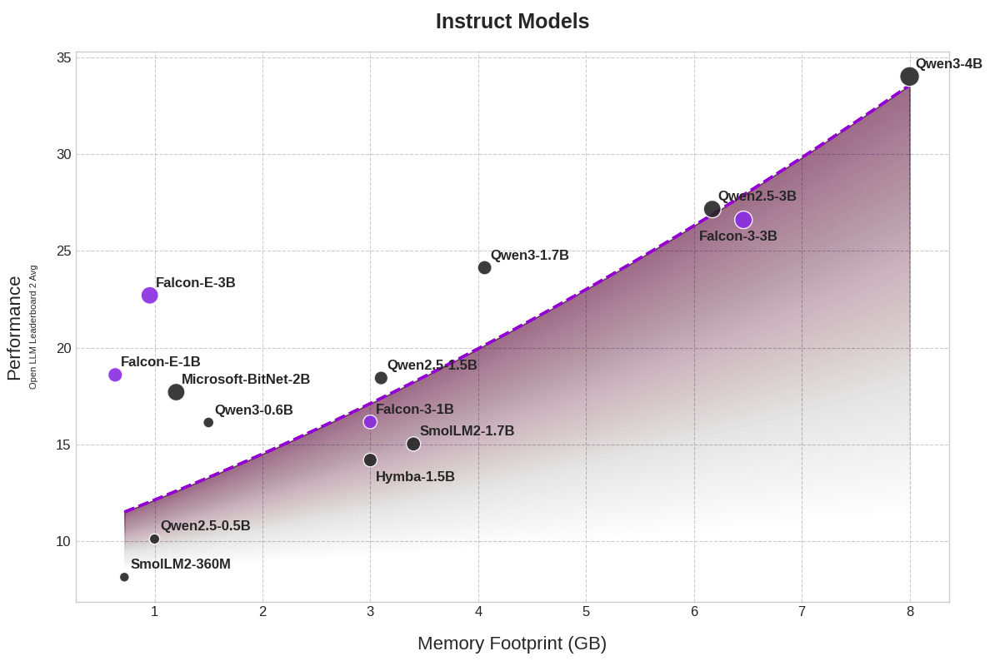
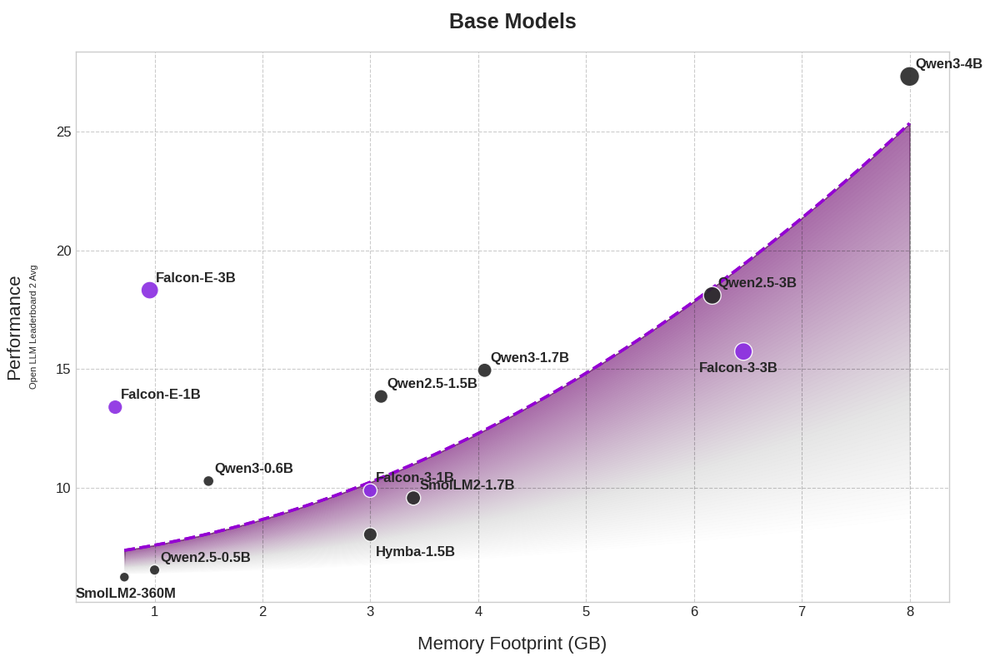

In this blogpost, we present the key highlights and rationales about the *Falcon-Edge* series - a collection of *powerful*, *universal*, and *fine-tunable* language models available in ternary format, based on the BitNet architecture.

Drawing from our experience with BitNet, **Falcon-Edge** introduces and validates an new pre-training paradigm that delivers a full-scope output from a single training process, simultaneously yielding both non-quantized and quantized model variants. This comprehensive approach produces a non-BitNet model in bfloat16 format, the native BitNet model, and a pre-quantized BitNet variant specifically engineered for effortless fine-tuning, enabling users and developers to precisely tailor these models to their specific applications and needs. 

Available now in two sizes—1 Billion and 3 Billion parameters—each size comes in both base and instruction-tuned models. Discover the Falcon-Edge series on [our dedicated Hugging Face collection](https://huggingface.co/collections/tiiuae/falcon-edge-series-6804fd13344d6d8a8fa71130).

<a id="pull-figures"></a>
<div style="display: flex; justify-content: center; flex-wrap: wrap; gap: 20px;">
  
  
</div>


## Introduction

Large Language Models (LLMs), by design, are inherently large and resource-intensive. As demand grows to deploy these models efficiently on edge devices, research into model compression has accelerated. Recent efforts, such as those by DeepSeek and Llama 4, explore training with reduced precision formats—down to FP8—to improve deployment scalability. On the other hand, many state-of-the-art methods emphasize post-training quantization. In contrast to these approaches, BitNet introduces a fundamentally different paradigm: unlike reduced-precision training which still relies on floating-point formats, and post-training quantization which adjusts weights after full-precision training, BitNet operates with the lowest possible precision — ternary weights ({-1, 0, 1}) — directly during training, enabling an end-to-end ultra-efficient model design. 

These ternary weights are paving the way for a "matmul-free" LLM design that is notably faster and remarkably memory-efficient in practice. The primary challenge of this innovative approach is the necessity for pre-training BitNet models, which can be computationally demanding and costly for typical users.


### Unleashing the full potential of Bitnet models

Six months ago, Microsoft introduced [bitnet.cpp](https://github.com/microsoft/BitNet), a framework designed to accelerate CPU inference speeds by up to 5 times for certain architectures. This advancement makes BitNet models highly appealing for local deployment, significantly enhancing their readiness for production and ease of use across various applications. However, from the community's viewpoint, BitNet is still largely regarded as a proof of concept or prototype, primarily due to two key challenges:

- Model Performance: Despite efforts by the community, including our own, to develop robust BitNet models, recent 1-bit large language models (LLMs) have struggled to match the overall performance of similarly sized models using other frameworks. This was the case at the time of writing the blogpost but Microsoft recently released [a powerful BitNet model](https://huggingface.co/collections/microsoft/bitnet-67fddfe39a03686367734550).
- Accessibility: The process of 1-bit fine-tuning—which involves converting a non-BitNet model checkpoint into a BitNet one—has proven ineffective. Currently, pre-training appears to be the most viable approach.

With this release, we aim to demonstrate that a novel pre-training approach has the potential to overcome these limitations and cater to a wide range of applications. In the subsequent sections, we will delve deeper into each of these issues and explore how our new paradigm addresses them.

### Proposed architecture

We adopted the architecture outlined in the paper [*The Era of 1-bit LLMs: All Large Language Models are in 1.58 Bits*](https://arxiv.org/abs/2402.17764), but made a key modification by eliminating the Layer Normalization layers within the BitNet layers. However, we retained the original pre-attention and pre-MLP layer norms to ensure compatibility with the Llama architecture, allowing seamless integration from the outset. Interestingly, we discovered that removing these Layer Normalization layers had no adverse effect on model performance, while also ensuring compatibility with the broader ecosystem with minimal adjustments.

Beyond the methods described in the paper, we implemented optimized Triton kernels for both `activation_quant` and `weight_quant`, significantly lowering the pre-training costs of our models. We are making these kernels accessible to the community through the Python package `onebitllms`, enabling researchers and developers to leverage them for efficient BitNet pre-training and fine-tuning.

To further reduce the memory footprint of the final model, we intentionally opted for a smaller vocabulary size of `32678`. This tokenizer was trained on a large English-focused corpus, with the most common LaTeX tokens manually added to the vocabulary.

### *Falcon-Edge*, a series of powerful Bitnet models

Leveraging the learnings from pre-training data strategies from our center, we pre-train our model on an internal data mixture for approximately 1.5 Tera Tokens. We use the classic WSD learning rate scheduler for pre-training.

We evaluate our models (base and instruct versions) on the former Hugging Face leaderboard v2 benchmark and report the normalized results below in comparison with other models of similar size:

#### For 1B scale models and below


[
    { "category": "IFEVAL", "model": "Qwen-2.5-0.5B", "value": 0.1627 },
    { "category": "IFEVAL", "model": "SmolLM2-360M", "value": 0.2115 },
    { "category": "IFEVAL", "model": "Qwen-2.5-1.5B", "value": 0.2674 },
    { "category": "IFEVAL", "model": "SmolLM2-1.7B", "value": 0.244 },
    { "category": "IFEVAL", "model": "Falcon-3-1B-Base", "value": 0.2428 },
    { "category": "IFEVAL", "model": "Falcon-E-1B-Base", "value": 0.3290 },

    { "category": "Math-Hard", "model": "Qwen-2.5-0.5B", "value": 0.0393 },
    { "category": "Math-Hard", "model": "SmolLM2-360M", "value": 0.0121 },
    { "category": "Math-Hard", "model": "Qwen-2.5-1.5B", "value": 0.0914 },
    { "category": "Math-Hard", "model": "SmolLM2-1.7B", "value": 0.0264 },
    { "category": "Math-Hard", "model": "Falcon-3-1B-Base", "value": 0.0332 },
    { "category": "Math-Hard", "model": "Falcon-E-1B-Base", "value": 0.1097 },

    { "category": "GPQA", "model": "Qwen-2.5-0.5B", "value": 0.00 },
    { "category": "GPQA", "model": "SmolLM2-360M", "value": 0.00 },
    { "category": "GPQA", "model": "Qwen-2.5-1.5B", "value": 0.0470 },
    { "category": "GPQA", "model": "SmolLM2-1.7B", "value": 0.0391 },
    { "category": "GPQA", "model": "Falcon-3-1B-Base", "value": 0.0391 },
    { "category": "GPQA", "model": "Falcon-E-1B-Base", "value": 0.0280 },

    { "category": "MuSR", "model": "Qwen-2.5-0.5B", "value": 0.0208 },
    { "category": "MuSR", "model": "SmolLM2-360M", "value": 0.0773 },
    { "category": "MuSR", "model": "Qwen-2.5-1.5B", "value": 0.0527 },
    { "category": "MuSR", "model": "SmolLM2-1.7B", "value": 0.0460 },
    { "category": "MuSR", "model": "Falcon-3-1B-Base", "value": 0.0971 },
    { "category": "MuSR", "model": "Falcon-E-1B-Base", "value": 0.0365 },

    { "category": "BBH", "model": "Qwen-2.5-0.5B", "value": 0.0695 },
    { "category": "BBH", "model": "SmolLM2-360M", "value": 0.0554 },
    { "category": "BBH", "model": "Qwen-2.5-1.5B", "value": 0.1666 },
    { "category": "BBH", "model": "SmolLM2-1.7B", "value": 0.0930 },
    { "category": "BBH", "model": "Falcon-3-1B-Base", "value": 0.1134 },
    { "category": "BBH", "model": "Falcon-E-1B-Base", "value": 0.1228 },

    { "category": "MMLU-Pro", "model": "Qwen-2.5-0.5B", "value": 0.1006 },
    { "category": "MMLU-Pro", "model": "SmolLM2-360M", "value": 0.0188 },
    { "category": "MMLU-Pro", "model": "Qwen-2.5-1.5B", "value": 0.2061 },
    { "category": "MMLU-Pro", "model": "SmolLM2-1.7B", "value": 0.1264 },
    { "category": "MMLU-Pro", "model": "Falcon-3-1B-Base", "value": 0.0676 },
    { "category": "MMLU-Pro", "model": "Falcon-E-1B-Base", "value": 0.1782 },

    { "category": "Avg", "model": "Qwen-2.5-0.5B", "value": 0.0655 },
    { "category": "Avg", "model": "SmolLM2-360M", "value": 0.0625 },
    { "category": "Avg", "model": "Qwen-2.5-1.5B", "value": 0.1385 },
    { "category": "Avg", "model": "SmolLM2-1.7B", "value": 0.0958 },
    { "category": "Avg", "model": "Falcon-3-1B-Base", "value": 0.0989 },
    { "category": "Avg", "model": "Falcon-E-1B-Base", "value": 0.1340 }
]



[    
    { "category": "Memory Footprint", "model": "Qwen-2.5-0.5B", "value": 1.0 },
    { "category": "Memory Footprint", "model": "SmolLM2-360M", "value": 0.720 },
    { "category": "Memory Footprint", "model": "Qwen-2.5-1.5B", "value": 3.1 },
    { "category": "Memory Footprint", "model": "SmolLM2-1.7B", "value": 3.4 },
    { "category": "Memory Footprint", "model": "Falcon-3-1B-Base", "value": 3.0 },
    { "category": "Memory Footprint", "model": "Falcon-E-1B-Base", "value": 0.665 }
]


<details>
<summary class="bold"> Detailed results: </summary>

| Model    | Nb Params | Mem Footprint | IFEVAL | Math-Hard | GPQA | MuSR | BBH | MMLU-Pro | Avg. |
| -------- | ------- | ------- | ------- | ------ | ----- | ----- | ----- | ------ | ---- |
| Qwen-2.5-0.5B | 0.5B | 1GB | 16.27  | 3.93 | 0.0 | 2.08 | 6.95 | 10.06 | 6.55 |
| SmolLM2-360M | 0.36B | 720MB | 21.15  | 1.21 | 0.0 | 7.73 | 5.54 | 1.88 | 6.25 |
| Qwen-2.5-1.5B | 1.5B  | 3.1GB  | 26.74 | 9.14 | 16.66 | 5.27 | 20.61 | 4.7  | 13.85 |
| SmolLM2-1.7B  | 1.7B  | 3.4GB  | 24.4  | 2.64 | 9.3   | 4.6  | 12.64 | 3.91 | 9.58  |
| Falcon-3-1B-Base | 1.5B | 3GB   | 24.28 | 3.32 | 11.34 | 9.71 | 6.76  | 3.91 | 9.89  |
| Falcon-E-1B-Base | 1.8B | **665MB** | 32.9  | 10.97 | 2.8 | 3.65 | 12.28 | 17.82 | 13.40 |

</details>

#### For 3B scale models


[
    { "category": "IFEVAL", "model": "Qwen2.5-3B", "value": 0.2690 },
    { "category": "IFEVAL", "model": "Falcon-3-3B-Base", "value": 0.1574 },
    { "category": "IFEVAL", "model": "Falcon-E-3B-Base", "value": 0.3667 },

    { "category": "Math-Hard", "model": "Qwen2.5-3B", "value": 0.1480 },
    { "category": "Math-Hard", "model": "Falcon-3-3B-Base", "value": 0.1178 },
    { "category": "Math-Hard", "model": "Falcon-E-3B-Base", "value": 0.1345 },

    { "category": "GPQA", "model": "Qwen2.5-3B", "value": 0.0638 },
    { "category": "GPQA", "model": "Falcon-3-3B-Base", "value": 0.0626 },
    { "category": "GPQA", "model": "Falcon-E-3B-Base", "value": 0.0867 },

    { "category": "MuSR", "model": "Qwen2.5-3B", "value": 0.1176 },
    { "category": "MuSR", "model": "Falcon-3-3B-Base", "value": 0.0627 },
    { "category": "MuSR", "model": "Falcon-E-3B-Base", "value": 0.0414 },

    { "category": "BBH", "model": "Qwen2.5-3B", "value": 0.2430 },
    { "category": "BBH", "model": "Falcon-3-3B-Base", "value": 0.2158 },
    { "category": "BBH", "model": "Falcon-E-3B-Base", "value": 0.1983 },

    { "category": "MMLU-Pro", "model": "Qwen2.5-3B", "value": 0.2448 },
    { "category": "MMLU-Pro", "model": "Falcon-3-3B-Base", "value": 0.2088 },
    { "category": "MMLU-Pro", "model": "Falcon-E-3B-Base", "value": 0.2716 },

    { "category": "Avg", "model": "Qwen2.5-3B", "value": 0.1810 },
    { "category": "Avg", "model": "Falcon-3-3B-Base", "value": 0.1574 },
    { "category": "Avg", "model": "Falcon-E-3B-Base", "value": 0.1832 }
]




[    
    { "category": "Memory Footprint", "model": "Qwen2.5-3B", "value": 6.46 },
    { "category": "Memory Footprint", "model": "Falcon-3-3B-Base", "value": 6.17 },
    { "category": "Memory Footprint", "model": "Falcon-E-3B-Base", "value": 0.999 }
]


<details>
<summary class="bold"> Detailed result: </summary>

| Model    | Nb Params | Mem Footprint | IFEVAL | Math-Hard | GPQA | MuSR | BBH | MMLU-Pro | Avg. |
| -------- | ------- | ------- | ------- | ------ | ----- | ----- | ----- | ------ | ---- |
| Falcon-3-3B-Base | 3B   | 6.46GB | 15.74 | 11.78 | 6.26 | 6.27  | 21.58 | 18.09 | 15.74 |
| Qwen2.5-3B       | 3B   | 6.17GB | 26.9  | 14.8  | 6.38  | 11.76 | 24.3 | 24.48 | 18.1  |
| Falcon-E-3B-Base |  3B | **999MB** | 36.67  | 13.45 | 8.67 | 4.14 | 19.83 | 27.16 | 18.32 |

</details>

Below are the results for instruction fine-tuned models:


[
    { "category": "IFEVAL", "model": "Qwen-2.5-0.5B", "value": 0.3071 },
    { "category": "IFEVAL", "model": "SmolLM2-360M", "value": 0.3842 },
    { "category": "IFEVAL", "model": "Qwen-2.5-1.5B", "value": 0.4476 },
    { "category": "IFEVAL", "model": "SmolLM2-1.7B", "value": 0.5368 },
    { "category": "IFEVAL", "model": "Bitnet-b1.58-2B-4T", "value": 0.5911 },
    { "category": "IFEVAL", "model": "Falcon-3-1B-Instruct", "value": 0.5557 },
    { "category": "IFEVAL", "model": "Falcon-E-1B-Instruct", "value": 0.5435 },

    { "category": "Math-Hard", "model": "Qwen-2.5-0.5B", "value": 0.0 },
    { "category": "Math-Hard", "model": "SmolLM2-360M", "value": 0.0151 },
    { "category": "Math-Hard", "model": "Qwen-2.5-1.5B", "value": 0.2205 },
    { "category": "Math-Hard", "model": "SmolLM2-1.7B", "value": 0.0582 },
    { "category": "Math-Hard", "model": "Bitnet-b1.58-2B-4T", "value": 0.07233 },
    { "category": "Math-Hard", "model": "Falcon-3-1B-Instruct", "value": 0.0634 },
    { "category": "Math-Hard", "model": "Falcon-E-1B-Instruct", "value": 0.0912 },

    { "category": "BBH", "model": "Qwen-2.5-0.5B", "value": 0.0843 },
    { "category": "BBH", "model": "SmolLM2-360M", "value": 0.0417 },
    { "category": "BBH", "model": "Qwen-2.5-1.5B", "value": 0.1981 },
    { "category": "BBH", "model": "SmolLM2-1.7B", "value": 0.1092 },
    { "category": "BBH", "model": "Bitnet-b1.58-2B-4T", "value": 0.1794},
    { "category": "BBH", "model": "Falcon-3-1B-Instruct", "value": 0.0932 },
    { "category": "BBH", "model": "Falcon-E-1B-Instruct", "value": 0.1650 },

    { "category": "MuSR", "model": "Qwen-2.5-0.5B", "value": 0.0094 },
    { "category": "MuSR", "model": "SmolLM2-360M", "value": 0.0277 },
    { "category": "MuSR", "model": "Qwen-2.5-1.5B", "value": 0.0319 },
    { "category": "MuSR", "model": "SmolLM2-1.7B", "value": 0.041 },
    { "category": "MuSR", "model": "Bitnet-b1.58-2B-4T", "value": 0.0174 },
    { "category": "MuSR", "model": "Falcon-3-1B-Instruct", "value": 0.1056 },
    { "category": "MuSR", "model": "Falcon-E-1B-Instruct", "value": 0.0251 },

    { "category": "MMLU-Pro", "model": "Qwen-2.5-0.5B", "value": 0.0775 },
    { "category": "MMLU-Pro", "model": "SmolLM2-360M", "value": 0.013 },
    { "category": "MMLU-Pro", "model": "Qwen-2.5-1.5B", "value": 0.1999 },
    { "category": "MMLU-Pro", "model": "SmolLM2-1.7B", "value": 0.1171 },
    { "category": "MMLU-Pro", "model": "Bitnet-b1.58-2B-4T", "value": 0.1482 },
    { "category": "MMLU-Pro", "model": "Falcon-3-1B-Instruct", "value": 0.1296 },
    { "category": "MMLU-Pro", "model": "Falcon-E-1B-Instruct", "value": 0.1942 },

    { "category": "GPQA", "model": "Qwen-2.5-0.5B", "value": 0.0 },
    { "category": "GPQA", "model": "SmolLM2-360M", "value": 0.0067 },
    { "category": "GPQA", "model": "Qwen-2.5-1.5B", "value": 0.0078 },
    { "category": "GPQA", "model": "SmolLM2-1.7B", "value": 0.0 },
    { "category": "GPQA", "model": "Bitnet-b1.58-2B-4T", "value": 0.0525},
    { "category": "GPQA", "model": "Falcon-3-1B-Instruct", "value": 0.0932 },
    { "category": "GPQA", "model": "Falcon-E-1B-Instruct", "value": 0.0964 },

    { "category": "Avg", "model": "Qwen-2.5-0.5B", "value": 0.0659 },
    { "category": "Avg", "model": "SmolLM2-360M", "value": 0.0814 },
    { "category": "Avg", "model": "Qwen-2.5-1.5B", "value": 0.1843 },
    { "category": "Avg", "model": "SmolLM2-1.7B", "value": 0.1502 },
    { "category": "Avg", "model": "Bitnet-b1.58-2B-4T", "value": 0.1770},
    { "category": "Avg", "model": "Falcon-3-1B-Instruct", "value": 0.1616 },
    { "category": "Avg", "model": "Falcon-E-1B-Instruct", "value": 0.1859 }
]


<details>
<summary class="bold"> Detailed results: </summary>

| Model    | Nb Params | Mem Footprint | IFEVAL | Math-Hard | GPQA | MuSR | BBH | MMLU-Pro | Avg. |
| ----------- | ------- | ------- | ------- | ------ | ----- | ----- | ----- | ------ | ---- |
| Qwen-2.5-0.5B-Instruct    | 500M | 1GB    | 30.71 | 0     | 0  | 0.94  | 7.75  | 8.43     | 6.59        |
| SmolLM2-360M-Instruct     | 360M | 720MB  | 38.42 | 1.51 | 0.67 | 2.77  | 4.17  | 1.3   | 8.14        |
| Qwen-2.5-1.5B-Instruct    | 1.5B | 3.1GB  | 44.76 | 22.05 | 0.78 | 3.19  | 19.91 | 19.99 | 18.43       |
| SmolLM2-1.7B              | 1.7B | 3.4GB  | 53.68 | 5.82  | 0 | 4.1   | 10.92 | 11.71     | 15.02       |
| Bitnet-b1.58-2B-4T             | 2B | 1.18GB  | 59.11 | 7.23  | 5.25 | 1.74   | 17.94 | 14.82     | 17.70       |
| Falcon-3-1B-Instruct      | 1.5B | 3GB    | 55.57 | 6.34  | 2.24 | 10.56 | 12.96  | 9.32  | 16.16       |
| Falcon-E-1B-Instruct | 1.8B | **665MB**  | 54.35 | 9.12  | 9.64  | 2.51  | 19.42 | 16.5  | 18.59       |

</details>


#### For 3B scale models:


[
    { "category": "IFEVAL", "model": "Falcon-3-3B-Instruct", "value": 0.6977 },
    { "category": "IFEVAL", "model": "Qwen2.5-3B-Instruct", "value": 0.6475 },
    { "category": "IFEVAL", "model": "Falcon-E-3B-Instruct", "value": 0.6097 },

    { "category": "Math-Hard", "model": "Falcon-3-3B-Instruct", "value": 0.25 },
    { "category": "Math-Hard", "model": "Qwen2.5-3B-Instruct", "value": 0.3678 },
    { "category": "Math-Hard", "model": "Falcon-E-3B-Instruct", "value": 0.1530 },

    { "category": "MMLU-Pro", "model": "Falcon-3-3B-Instruct", "value": 0.2228 },
    { "category": "MMLU-Pro", "model": "Qwen2.5-3B-Instruct", "value": 0.258 },
    { "category": "MMLU-Pro", "model": "Falcon-E-3B-Instruct", "value": 0.2359 },

    { "category": "MuSR", "model": "Falcon-3-3B-Instruct", "value": 0.1113 },
    { "category": "MuSR", "model": "Qwen2.5-3B-Instruct", "value": 0.0757 },
    { "category": "MuSR", "model": "Falcon-E-3B-Instruct", "value": 0.0212 },

    { "category": "BBH", "model": "Falcon-3-3B-Instruct", "value": 0.2629 },
    { "category": "BBH", "model": "Qwen2.5-3B-Instruct", "value": 0.258 },
    { "category": "BBH", "model": "Falcon-E-3B-Instruct", "value": 0.2359 },

    { "category": "GPQA", "model": "Falcon-3-3B-Instruct", "value": 0.0515 },
    { "category": "GPQA", "model": "Qwen2.5-3B-Instruct", "value": 0.0302 },
    { "category": "GPQA", "model": "Falcon-E-3B-Instruct", "value": 0.0745 },

    { "category": "Avg", "model": "Falcon-3-3B-Instruct", "value": 0.266 },
    { "category": "Avg", "model": "Qwen2.5-3B-Instruct", "value": 0.2716 },
    { "category": "Avg", "model": "Falcon-E-3B-Instruct", "value": 0.2265 }
]


<details>
<summary class="bold"> Detailed results: </summary>

| Model    | Nb Params | Mem Footprint | IFEVAL | Math-Hard | GPQA | MuSR | BBH | MMLU-Pro | Avg. |
| -------- | ------- | ------- | ------- | ------ | ----- | ----- | ----- | ------ | ---- |
| Falcon-3-3B-Instruct      | 3B   | 6.46GB | 69.77 | 25    | 5.15 | 11.13 | 26.29 | 22.28  | 26.6        |
| Qwen2.5-3B-Instruct       | 3B   | 6.17GB | 64.75 | 36.78 | 3.02  | 7.57  | 25.80 | 25.05  | 27.16       |
| Falcon-E-3B-Instruct   | 3B   | **999MB**  | 60.97 | 15.3  | 7.45 | 2.12  | 23.59 | 26.45  | 22.65 |

</details>


Additional results (leaderboard v1) on comparing our instructed models with Microsoft's new BitNet model:

| Model    | Nb Params | Mem Footprint | ARC-Challenge | GSM8K | HellaSwag | MMLU | TruthfulQA | Average |
| -------- | ------- | ------- | ------- | ------ | ----- | ----- | ----- | ----- |
| Bitnet-b1.58-2B-4T | 2B | 1.18GB | 38.31 | 65.27 | 59.02 | 47.43 | 47.65 | 51.54 |
| Falcon-E-1B-Instruct | 1.8B | 665MB | 36.60 | 54.74 | 50.19 | 48.33 | 42.09 | 46.39  |
| Falcon-E-3B-Instruct | 3B | 999MB | 43.09 | 64.52 | 56.97 | 55.70 | 45.58 |  53.17|

*Falcon-Edge* demonstrates on-par and better performances than models of comparable sizes on the leaderboard v2 tasks, demonstrating that it is possible to train powerful BitNet models on some target domains. 

### *Falcon-Edge*, a series of universal models

If we look closer at the formula of the BitNet linear layer for inference (in terms of Python code): 

```python
def activation_norm_quant(x):
    scale = 127.0 / x.abs().max(dim=-1, keepdim=True).values.clamp_(min=1e-5)
    y = (x * scale).round().clamp_(-128, 127)
    return y, scale

class BitLinear(nn.Linear):
    
    def post_quant_process(self, input, input_scale, weight_scale):
        out = input / (input_scale * weight_scale)
        return out

    def forward(self, input):
        w = self.weight
        w_quant = unpack_weights(w, dtype=self.dtype)
        input_quant, input_scale = self.activation_quant(input)
        y = F.linear(input_quant.to(self.dtype), w_quant)
        y = self.post_quant_process(y, self.weight_scale, input_scale)
        if self.bias is not None:
            y += self.bias.view(1, -1).expand_as(y)
        return y
```

The normalization `activation_norm_quant` quantizes the activations in `int8` format, then the activation is computed back in half precision by diving it by `x_scale`. Since the model has been trained with fake 8-bit activation quantization, we argue that it is possible to approximate that:

```
x_quant, x_scale = activation_norm_quant(x)
x ~= (x_quant / x_scale)
```

Therefore, instead of quantizing the model post-training, injecting the weight scale after quantizing the weights should lead to a good enough "approximation" of the non-BitNet version of the model:

```py
def _weight_quant(w):
    scale = 1.0 / w.abs().mean().clamp_(min=1e-05)
    u = (w * scale).round().clamp_(-1, 1)
    return u, scale

for param_name, param_value in state_dict.items():
    if _is_param_to_not_quantize(param_name):
        continue

    param_value, param_scale = _weight_quant(param_value)
    param_value = param_value / param_scale

    state_dict_quant[param_name] = param_value
```

We confirm this by running end-to-end evaluations on the bfloat16 variant of our 1B and 3B base models and below are the results:

| Model    | IFEVAL | Math-Hard | GPQA | MuSR | BBH | MMLU-Pro | Avg. |
| -------- | ------- | ------ | ----- | ----- | ----- | ------ | ---- |
| Falcon-E-1B |   32.9  | 10.97 | 2.8 | 3.65 | 12.28 | 17.82 | 13.40 |
| Falcon-E-1B-bf16 |  29.89  | 11.23 | 1.8 | 3.32 | 12.27 | 18.04 | 12.75 |
| Falcon-E-3B |   36.67  | 13.45 | 8.67 | 4.14 | 19.83 | 27.16 | 18.32 |
| Falcon-E-3B-bf16 |  34.84  | 13.21 | 8.91 | 4.88 | 20.3 | 27.00 | 18.19 |

The `bfloat16` counterparts of the models can be loaded directly via Hugging Face transformers by passing `revision="bfloat16"` in the `from_pretrained` function:

```py
import torch

from transformers import AutoModelForCausalLM, AutoTokenizer
from trl import SFTTrainer

model_id = "tiiuae/Falcon-E-1B-Base"

tokenizer = AutoTokenizer.from_pretrained(model_id, revision="prequantized")
model = AutoModelForCausalLM.from_pretrained(
    model_id,
    torch_dtype=torch.bfloat16,
    revision="bfloat16"
)
```


### *Falcon-Edge*, a series of fine-tunable Bitnet models 

To the best of our knowledge, [except from the most recent release from Microsoft](https://huggingface.co/collections/microsoft/bitnet-67fddfe39a03686367734550) previous BitNet releases only focus on releasing the final quantized model, making it usable only for inference. Similarly to the release from Microsoft, we propose to extend the accessibility of research and application of BitNet models by releasing their pre-quantized weights. That way, users can either perform fine-tuning on their target domain, or do continuous pre-training of the BitNet checkpoint as long as `nn.Linear` layers are replaced by `BitnetLinear` layers, and by making sure to quantize the model post training in BitNet format. Since the weights corresponds to the pre-quantized weights, performing text generation without replacing the `nn.Linear` layers with `BitnetLinear` layers will produce gibberish output.

The pre-quantized weights can be downloaded via Hugging Face's transformers library by specifying the `revision` argument to be `prequantized`:

```py
import torch
from transformers import AutoModelForCausalLM, AutoTokenizer

model_id = "tiiuae/Falcon-E-1B-Base"

tokenizer = AutoTokenizer.from_pretrained(model_id, revision="prequantized")
model = AutoModelForCausalLM.from_pretrained(
    model_id,
    torch_dtype=torch.bfloat16,
    revision="prequantized"
)
```

This way, we will help fostering an ecosystem around first powerful 1-bit fine-tunes by the community. We provide to community the tools to get easily started and fine-tune their own version of powerful BitNet models by packaging all needed utility methods for performing fine-tuning on the pre-quantized weights on a Python package called `onebitllms` that we will cover in the next section.

## Introducing `onebitllms` - a lightweight python package for 1-bit LLMs training toolkit

<a id="lib-logo"></a>
<div style="display: flex; justify-content: center;">
  
</div>

In this release, we also introduce `onebitllms` - a lightweight Python package that can be plugged into your favorite LLM fine-tuning tools in order to fine-tune any pre-quantized BitNet model. At this time of writing `onebitllms` exposes these main functionalities:

- Utility method to convert the prequantized model checkpoints into BitNet training format in order to pass it to any of your favorite LLM fine-tuning framework. We currently tested our library with Hugging Face's `trl` library.
- Utility method to quantize the trained checkpoint in BitNet format as well as in usual `bfloat16` format.
- Fore more fine-grained control: Bare `BitnetLinear` and triton kernels that be injected and used for your pre-training framework.

Currently, only full-finetuning is supported through this framework, while in this release the model sizes are relatively small, supporting Parameter-Efficient Fine-tuning (PEFT) methods for BitNet models remains an exciting and impactful open question for upcoming BitNet models.

To get started, simply install the package directly through `pip` or from source, and take a look at `examples/` folders inside the [source code](https://github.com/tiiuae/onebitllms).

```py
import torch

from transformers import AutoModelForCausalLM, AutoTokenizer
from trl import SFTTrainer
from onebitllms import replace_linear_with_bitnet_linear, quantize_to_1bit

model_id = "tiiuae/Falcon-E-1B-Base"

tokenizer = AutoTokenizer.from_pretrained(model_id, revision="prequantized")
model = AutoModelForCausalLM.from_pretrained(
    model_id,
    torch_dtype=torch.bfloat16,
    revision="prequantized"
)
model = replace_linear_with_bitnet_linear(model)

trainer = SFTTrainer(
    model,
    ...
)

trainer.train()

quantize_to_1bit(output_directory)
```

With this package, we hope to accelerate research and development around ternary format LLMs, and hope to see many derivations of *Falcon-Edge* and other future powerful BitNet models developed by the community.

## Going further

We believe this release opens up multiple interesting directions - among all the possible follow up directions, we currently think that the following open questions will make BitNet models much more impactful in the near future:

- *Writing more powerful GPU inference kernels for BitNet architecture*: leveraging the same core ideas behind [`bitnet.cpp`](https://github.com/microsoft/BitNet), we hope that this release will convince the research community to focus on developping powerful BitNet inference kernels for faster inference on GPUs - thus making them faster than native models on GPUs.
- *Support PEFT methods for BitNet fine-tuning*: This remains an unexplored research question that can open up multiple new possibilities for BitNet models.
- *More rigourous investigation on the universality of Bitnet checkpoints*: While we observe that simply injecting the weight scale leads to having a descent non-Bitnet checkpoint, we believe that more research can be done to minimize the performance degradation between the Bitnet checkpoint and its `bfloat16` counterpart, thus making it fully performance degradation-free.
- *On multi-modal Bitnet models*: We hope these Bitnet foundational models together with `onebitllms` package can serve a as a foundational work for creating first multi-modal Bitnet VLM (Vision Language Model) etc.
- *More optimized Bitnet training kernels*: To write our kernels, we decided to take a two stages approach to first compute the global maximum to later use it block-wise for normalization. This approach can be revised to write more efficient kernels. In our tests, we estimate the overhead to be around ~20% between non-Bitnet pre-training against Bitnet pre-training. We will release soon more extensive numbers on the overhead introduced by Bitnet for training.

## Citation

If you find this work useful for your research and work, please consider citing our work, as well as citing all the foundational work behind BitNet models:

```latex
@misc{tiionebitllms,
    title = {Falcon-E, a series of powerful, universal and fine-tunable 1.58bit language models.},
    author = {Falcon-LLM Team},
    month = {April},
    url = {https://falcon-lm.github.io/blog/falcon-edge},
    year = {2025}
}
```

<details>
<summary class="bold"> More References </summary>

```latex
@misc{ma2025bitnetb1582b4ttechnical,
      title={BitNet b1.58 2B4T Technical Report}, 
      author={Shuming Ma and Hongyu Wang and Shaohan Huang and Xingxing Zhang and Ying Hu and Ting Song and Yan Xia and Furu Wei},
      year={2025},
      eprint={2504.12285},
      archivePrefix={arXiv},
      primaryClass={cs.CL},
      url={https://arxiv.org/abs/2504.12285}, 
}
@misc{wang2025bitnetcppefficientedgeinference,
      title={Bitnet.cpp: Efficient Edge Inference for Ternary LLMs}, 
      author={Jinheng Wang and Hansong Zhou and Ting Song and Shijie Cao and Yan Xia and Ting Cao and Jianyu Wei and Shuming Ma and Hongyu Wang and Furu Wei},
      year={2025},
      eprint={2502.11880},
      archivePrefix={arXiv},
      primaryClass={cs.LG},
      url={https://arxiv.org/abs/2502.11880}, 
}
```

```latex
@misc{,
      title={1.58-Bit LLM: A New Era of Extreme Quantization}, 
      author={Mohamed Mekkouri and Marc Sun and Leandro von Werra and Thomas Wolf},
      year={2024},
}
```

```latex
@misc{ma2024era1bitllmslarge,
      title={The Era of 1-bit LLMs: All Large Language Models are in 1.58 Bits}, 
      author={Shuming Ma and Hongyu Wang and Lingxiao Ma and Lei Wang and Wenhui Wang and Shaohan Huang and Li Dong and Ruiping Wang and Jilong Xue and Furu Wei},
      year={2024},
      eprint={2402.17764},
      archivePrefix={arXiv},
      primaryClass={cs.CL},
      url={https://arxiv.org/abs/2402.17764}, 
}
```

```latex
@misc{wang2023bitnetscaling1bittransformers,
      title={BitNet: Scaling 1-bit Transformers for Large Language Models}, 
      author={Hongyu Wang and Shuming Ma and Li Dong and Shaohan Huang and Huaijie Wang and Lingxiao Ma and Fan Yang and Ruiping Wang and Yi Wu and Furu Wei},
      year={2023},
      eprint={2310.11453},
      archivePrefix={arXiv},
      primaryClass={cs.CL},
      url={https://arxiv.org/abs/2310.11453}, 
}
```
</details>
