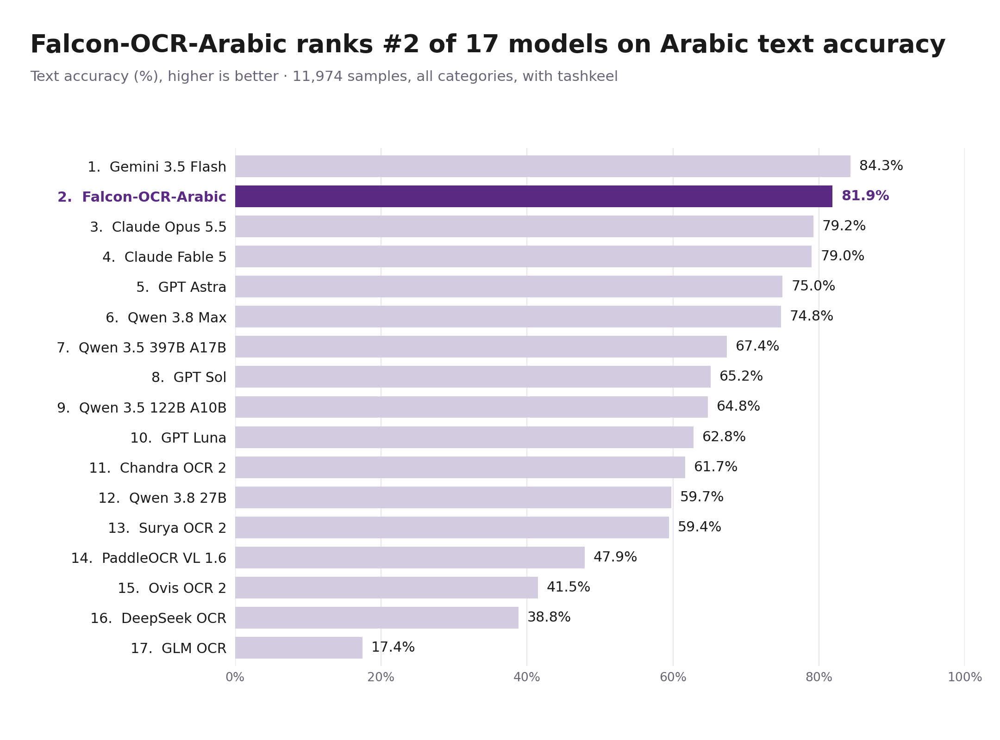
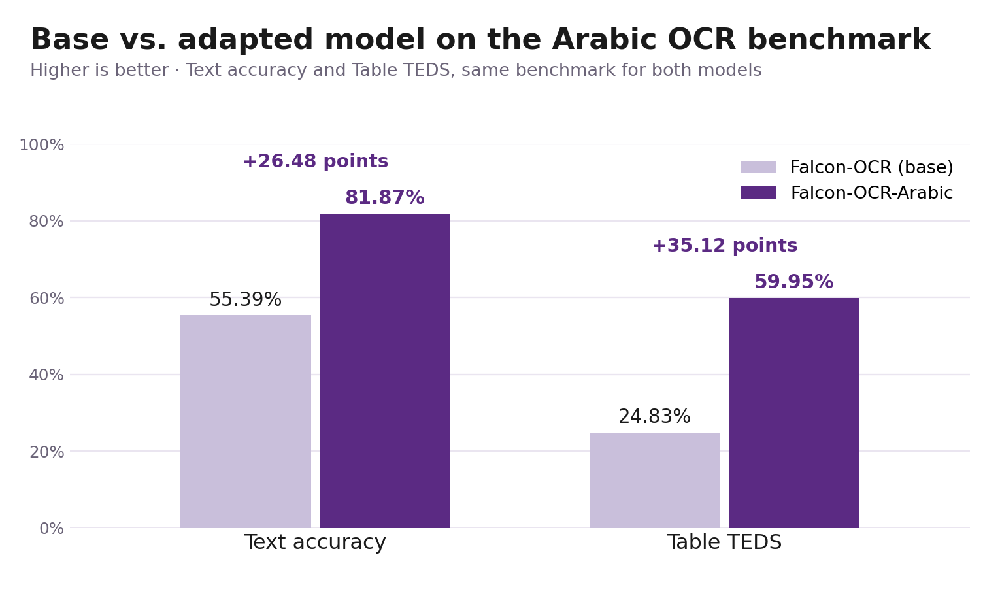
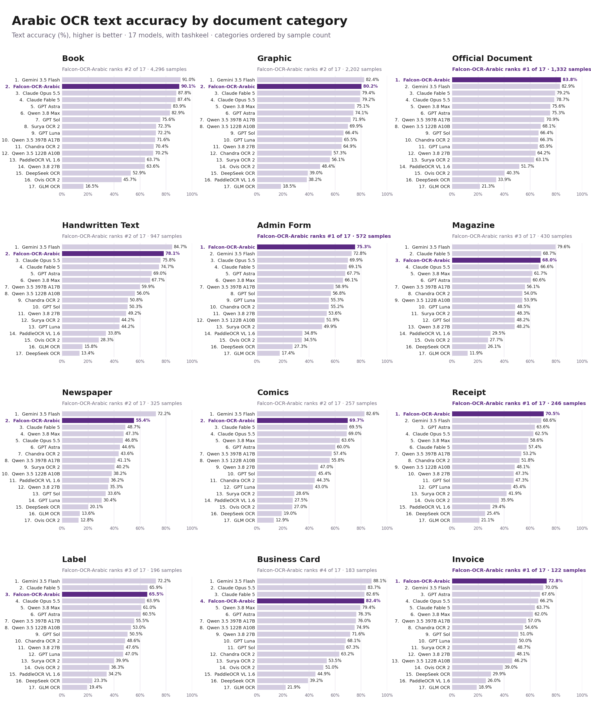

> Check out the [Arabic version](https://falcon-lm.github.io/ar/blog/falcon-ocr/) translated by **Falcon-Arabic**

## TL;DR

**Falcon-OCR-Arabic** extends [Falcon OCR](https://huggingface.co/tiiuae/Falcon-OCR) to Arabic documents without changing its architecture. Falcon OCR is our 270M-parameter early-fusion OCR model, introduced in the [Falcon Perception blog post](https://huggingface.co/blog/tiiuae/falcon-perception). We adapt it in two stages: supervised finetuning (SFT) on real and synthetic Arabic documents, then reinforcement learning (RL) on a curated set of high-quality samples.
 
On our Arabic document benchmark, Falcon-OCR-Arabic:
 
- ranks **#2 of 17 models** with **81.9%** text accuracy, behind only Gemini 3.5 Flash (84.3%)
- beats Claude Opus 5.5, Claude Fable 5, GPT Astra and Qwen 3.8 Max, and leads every dedicated OCR model in the comparison by more than 20 points
- has the **highest Table TEDS of all 17 models** (59.95%), 8.65 points ahead of the next best
- ranks **#1 on official documents, administrative forms, receipts and invoices**, and finishes in the top 4 in all 15 categories

It does this with 270M parameters. [Try it in the playground](https://ocr.arabic.aidrc.tii.ae/).

## Why Arabic is hard

Arabic is a hard script for OCR, and the difficulty goes beyond the letters themselves.

- **Cursive joining.** Most letters change shape depending on their position in a word: isolated, initial, medial or final.
- **Dots carry meaning.** Several letters share the same base shape and differ only in their dots, as in ب ت ث ن ي. One missed dot gives a different letter, and often a different word.
- **Optional diacritics.** Tashkeel sit above and below the line, so they are easy to drop or to invent.
- **Messy real-world layouts.** Documents contain right-to-left tables, Arabic mixed with Latin text, and both Western (123) and Eastern Arabic (١٢٣) numerals. Thermal receipts and stamped forms add noise on top.
- **Logical reading order.** The model has to output text in the order it is read, not the order it appears visually on the page.

An English-only OCR model has seen none of these cases.

## The base model

Falcon OCR reuses the early-fusion design from [Falcon Perception](https://huggingface.co/blog/tiiuae/falcon-perception). A single dense Transformer reads image patches and text tokens in one shared parameter space, starting from the first layer, with no separate vision encoder. A **hybrid attention mask**, implemented with PyTorch FlexAttention, controls how tokens see each other: image tokens attend to each other bidirectionally, while text tokens decode causally, conditioned on the whole image.

The task is set through the prompt, not through extra modules. A `category` argument selects the output: plain text, LaTeX for formulas, or HTML for tables. The model was trained from scratch for OCR rather than distilled from vision teachers, so its features capture fine glyph and stroke detail. That makes it a good starting point for a script where a single dot changes the letter. On English documents it scores 80.3 on olmOCR and 88.64 on OmniDocBench.

## Adaptation recipe

### 1. Data

We built a training mixture of real and synthetic Arabic documents covering the categories people most need to digitize: receipts, invoices, administrative forms, books and more. Real documents bring authentic layouts and real-world noise. Synthetic documents add scale, exact labels and coverage of rare cases, such as dense diacritics, right-to-left tables and mixed-script lines.

### 2. Supervised finetuning

We finetune with the same objective as the base model: next-token prediction on structured text. Arabic comes in as new data, not as a new module. In an early-fusion model, the same weights both read the image patches and write the output text, so the model learns to see Arabic glyphs and to write Arabic text together.

### 3. Reinforcement learning

SFT teaches the model what Arabic documents look like. RL then targets errors that a token-level loss barely penalizes but that matter a lot to users: a misplaced dot, an invented diacritic, a skipped line, or a loop that repeats a table row. We run this stage on a curated set of high-quality samples, and the rewards favor faithful, complete and well-structured transcriptions.

## Results

### The benchmark

To measure performance on real Arabic documents, we built a benchmark of 11,974 real-world samples covering 15 document categories. We integrated it into the OmniDocBench evaluation framework, so every model is scored with the same matching and metrics used for full-page document parsing.
 
We report **text accuracy** (higher is better), computed as 100 minus the mean normalized edit distance per page, with tashkeel, so a missing or invented diacritic counts against the model. For tables we also report **Table TEDS**, which scores how closely a predicted table matches the reference in both structure and content. A missing table scores zero. We compared 17 models in two groups:
 
- **General-purpose vision-language models:** Gemini 3.5 Flash, Claude Opus 5.5, Claude Fable 5, GPT Astra, GPT Sol, GPT Luna, Qwen 3.8 Max, Qwen 3.5 397B A17B, Qwen 3.5 122B A10B and Qwen 3.8 27B.
- **Dedicated OCR models:** Chandra OCR 2, Surya OCR 2, PaddleOCR VL 1.6, Ovis OCR 2, DeepSeek OCR and GLM OCR.

### Overall accuracy


*Text accuracy (%) on the full benchmark, with tashkeel. Falcon-OCR-Arabic is highlighted.*
 
Falcon-OCR-Arabic scores **81.9%**, second only to Gemini 3.5 Flash at 84.3%. That is a 2.5-point gap to the top model, and a lead over everything else. The table also shows Table TEDS for each model:
 
| Model | Text accuracy | Falcon-OCR-Arabic lead (points) | Table TEDS |
|---|---|---|---|
| Gemini 3.5 Flash | 84.34% | -2.47 | 51.30% |
| **Falcon-OCR-Arabic (270M)** | **81.87%** | | **59.95%** |
| Claude Opus 5.5 | 79.22% | +2.65 | 43.98% |
| Claude Fable 5 | 79.01% | +2.86 | 31.24% |
| GPT Astra | 75.02% | +6.85 | 51.23% |
| Qwen 3.8 Max | 74.79% | +7.08 | 41.34% |
| Qwen 3.5 397B A17B | 67.37% | +14.50 | 30.79% |
| Chandra OCR 2 (best dedicated OCR model) | 61.67% | +20.20 | 32.63% |
 
Three comparisons stand out. First, size: the largest Qwen model in the comparison, Qwen 3.5 397B A17B, has roughly 1,500 times more total parameters and scores 14.5 points lower. Second, specialization: the strongest dedicated OCR model reaches 61.7%, and the rest fall between 17.4% and 59.4%. For Arabic documents, adapting a compact OCR model beat both bigger general models and other OCR-specific models. Third, tables: Falcon-OCR-Arabic has the highest Table TEDS of all 17 models, 8.65 points ahead of the next best, Gemini 3.5 Flash.

### Base model vs. adapted model

How much does the adaptation add on its own? We ran the base Falcon OCR on the same benchmark. It reaches 55.39% text accuracy and 24.83% Table TEDS. Falcon-OCR-Arabic reaches 81.87% and 59.95%, gains of 26.48 and 35.12 points. Text accuracy improves by about 48% in relative terms, and table quality more than doubles. The base model was built for English documents, so this gap is the measurable effect of the Arabic adaptation.



### Accuracy by document category


*Text accuracy (%) per document category, categories ordered by sample count. The overall score covers all 15 categories; Other, Scene Text and Screenshot (866 samples in total) are not shown.*
 
The category view shows where the model is strongest.
 
**Where Falcon-OCR-Arabic ranks #1.** It leads on the structured business and administrative documents that people most often need to digitize, and beats Gemini 3.5 Flash on each of them, by 0.9 to 2.8 points:
 
| Category | Samples | Falcon-OCR-Arabic | Gemini 3.5 Flash |
|---|---|---|---|
| Official Document | 1,332 | **83.8%** | 82.9% |
| Admin Form | 572 | **75.3%** | 72.8% |
| Receipt | 246 | **70.5%** | 68.6% |
| Invoice | 122 | **72.8%** | 70.0% |
 
**Where it is a close second.** On books, the largest category with 4,296 samples and more than a third of the benchmark, it scores 90.1% against Gemini's 91.0%. On graphics it scores 80.2% against 82.4%, and on the catch-all Other category 81.0% against 81.9%. On handwritten text it ranks second at 78.1%, 6.6 points behind Gemini.
 
**Where it trails.** Gemini 3.5 Flash leads in every category where Falcon-OCR-Arabic is not first, and the gap grows on dense, visually complex pages: newspapers (55.4% vs. 72.2%), comics (69.7% vs. 82.6%) and magazines (68.0% vs. 79.6%). Falcon-OCR-Arabic still places in the top 4 in all 15 categories, including labels (#3, 65.5%), screenshots (#3, 79.5%), business cards (#4, 82.4%) and scene text (#4, 68.3%).

## Examples

Falcon OCR processes images captured under challenging real-world conditions with varying lighting, diverse text semantics (mathematical formulae, structured tables, handwritten notes), and complex document layouts, to produce structured text output.


<iframe
  src="https://tiiuae-falcon-ocr-arabic.static.hf.space/"
  title="Falcon-OCR-Arabic examples"
  width="100%"
  height="1050"
  style="width:100%;border:0;border-radius:18px;"
  loading="lazy"
></iframe>

## Limitations

Falcon-OCR-Arabic does not win everywhere. These are the areas where it still has room to improve, and what to keep in mind when you use it.
- **Dense, visually complex pages.** Newspapers, magazines and comics are where the gap to the strongest general-purpose model is largest.
- **Handwriting.** It ranks second, but still trails Gemini 3.5 Flash by 6.7 points.


## Try it

**Links:** [Falcon OCR Arabic](https://ocr.arabic.aidrc.tii.ae/) 

## Citation

```bibtex
@misc{falcon_ocr_arabic_270M_2026,
  title = {Falcon OCR Arabic: a 270M Parameters, State-of-the-Art Arabic early fusion OCR},
  author = {Falcon LLM team}, 
  organization = {Technology Innovation Institute},
  year = {2026}
}
```
