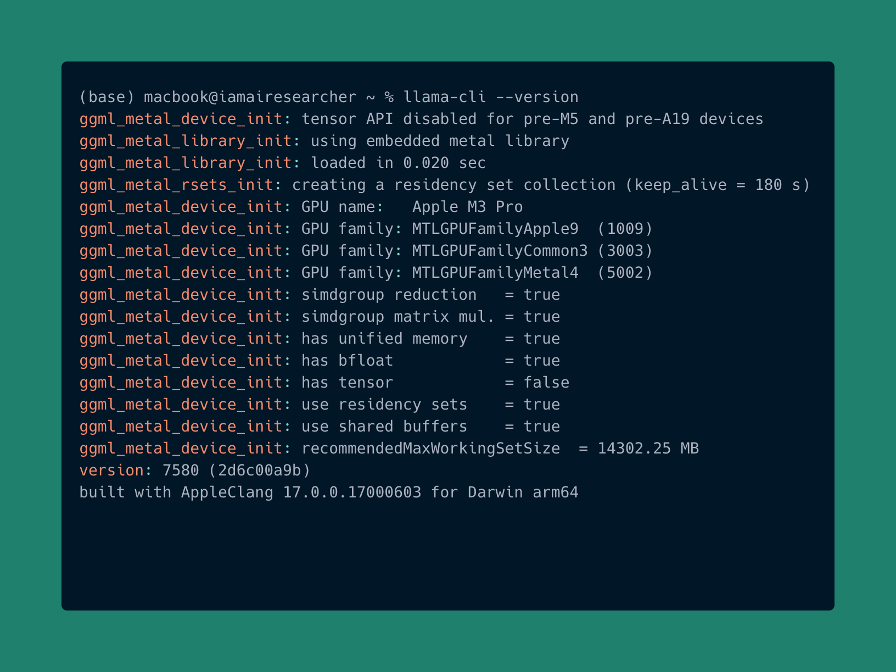
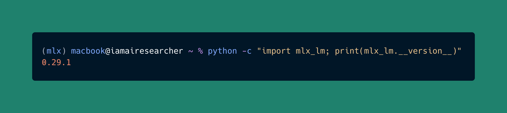
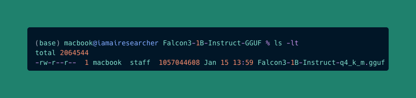
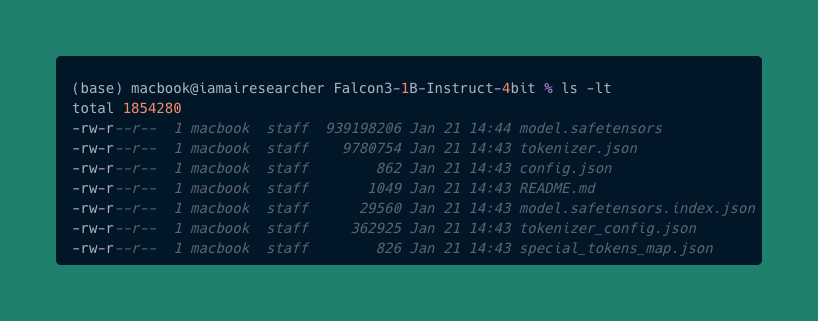
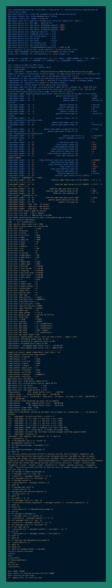

 
<style>
table {
  border-collapse: collapse;
  width: 100%;
  background-color: transparent; /* nền theo system/theme */
  border-radius: 8px;
  overflow: hidden;
  color: inherit; /* chữ theo theme */
}
th, td {
  padding: 12px 16px;
  border: 1px solid; /* rõ ràng */
  border-color: rgba(0,0,0,0.3); /* mặc định cho light */
}
@media (prefers-color-scheme: dark) {
  th, td {
    border-color: rgba(255,255,255,0.2); /* rõ hơn trong dark */
  }
  tr:nth-child(even) td {
    background-color: rgba(255,255,255,0.05); /* xen kẽ màu dark */
  }
  tr:hover td {
    background-color: rgba(255,255,255,0.1); /* hover rõ dark */
  }
}
@media (prefers-color-scheme: light) {
  tr:nth-child(even) td {
    background-color: rgba(0,0,0,0.05); /* xen kẽ màu light */
  }
  tr:hover td {
    background-color: rgba(0,0,0,0.1); /* hover rõ light */
  }
}
th {
  font-weight: bold;
}

blockquote {
  border-left: 4px solid rgba(128,128,128,0.4);
  margin: 1em 0;
  padding: 0.5em 1em;
  background-color: transparent;
  color: inherit;
  font-family: -apple-system, BlinkMacSystemFont, 'Segoe UI', Roboto, 'Helvetica Neue', Arial, sans-serif;
  font-size: 0.9em;
  font-style: italic;
}
blockquote p {
  margin: 0;
}
blockquote p strong {
  font-weight: bold;
  font-style: italic;
}
blockquote p::before {
  content: "“";
}
blockquote p::after {
  content: "”";
}

ul + p strong:first-child,
ul + p:has(strong:first-child) {
  display: block;
  margin-top: 1.5em;
  margin-bottom: 0.5em;
}
p strong:only-child {
  display: inline-block;
  margin-top: 1em;
  margin-bottom: 0.5em;
}
</style>

## Overview
If you have ever wanted to run a powerful AI model directly on your laptop for quick experiments or personal projects, Falcon 3 makes it simple. You do not need expensive servers or constant internet access, just your device and the model running locally. It is built for speed, lightweight setup, and customization so you can focus on creating, not configuring.

**Why Falcon 3 is a great fit for you**
- Model sizes from 1B to 10B parameters so you can pick what works best for your hardware.
- The model implements a decoder only architecture with Grouped Query Attention mechanism, enabling efficient processing and resource optimization.
- Handles up to 32K context tokens for richer responses (8K for the smaller 1B model).
- Two flavors: base for general tasks and instruct for friendly conversational AI.

**How to get started**
Falcon 3 can be deployed on Apple Silicon using MLX or on CPU/GPU laptops with llama.cpp in gguf format. When integrated with OpenWebUI, it provides a streamlined conversational interface for immediate interaction. This guide will walk you through the detailed steps for implementation.

Learn more:
- [Falcon 3 Release Blog Post](https://huggingface.co/blog/falcon3)
- [MLX Framework Overview](https://mlx-framework.org/#features)
- [llama.cpp Github Repository](https://github.com/ggml-org/llama.cpp)
- [Open-Web UI](https://openwebui.com)

## Model Variants
The Falcon 3 series offers a diverse range of open-sourced text-only models, including base, instruct, with sizes ranging from 1B to 10B. You can find more details at this [link](https://falconllm.tii.ae/falcon3/index.html). All variants are distributed under the permissive Falcon-LLM license.  

The smaller 1B model is especially well-suited for on-device deployment on personal computers, laptops, and other compact hardware platforms.  Conversely, the larger models, such as 3B, 7B and 10B, deliver superior computational performance, albeit necessitating higher computational resources. The complete range of available versions can be explored on [Hugging Face](https://huggingface.co/collections/tiiuae/falcon3).

The collection also includes GGUF formats, for further information on the gguf quantization formats, please refer to [Hugging Face GGUF Quantization Types](https://huggingface.co/docs/hub/gguf#quantization-types)

## Prerequisites
Before start deploying Falcon 3 on your system, it is essential to verify that the local environment satisfies the minimum specifications necessary for efficient model execution.

### Operating Systems
- Linux: Recommended for llama.cpp with full CPU/GPU support.
- macOS: Supported via MLX and llama.cpp, with GPU acceleration through Metal, optimized for Apple Silicon.
- Windows: Supports llama.cpp with CPU execution; GPU acceleration is available through CUDA for compatible NVIDIA graphics cards.

### Python  
- Utilize a virtual environment such as conda to manage dependencies.  
- While llama.cpp operates natively without Python, optional Python bindings are available through the <a href="https://github.com/abetlen/llama-cpp-python">llama-cpp-python</a> package.

### Hugging Face Account
- Active account required: [Hugging Face](https://huggingface.co/)
- A free account meets most needs.

## Installation
With the minimum requirements verified, we can proceed to configure the local environment and install the essential tools together with all required dependencies. We will begin by installing the fundamental libraries.

### Installing fundamental libraries
When utilizing the llama.cpp framework for model deployment, this section presents instructions for installing llama.cpp on macOS, Windows, and Linux. Various package managers can be employed for the installation process, and the following provides installation support details corresponding to each package manager for the respective operating systems.

| Install via | Windows | Mac | Linux |
|-------------|---------|-----|-------|
| Winget      | ✅      |     |       |
| Homebrew    |         | ✅  | ✅    |
| MacPorts    |         | ✅  |       |
| Nix         |         | ✅  | ✅    |

> **Note:** Ensure that the package managers are successfully installed in your operating system environment. 

#### Winget (Windows)
```bash
winget install llama.cpp
```
#### Homebrew (Mac and Linux)
> **Note:** The commands apply equally to both macOS and Linux.

```bash
brew install llama.cpp
```

#### MacPorts (Mac)
```bash
sudo port install llama.cpp
```
**See also:** [MacPorts llama.cpp details](https://ports.macports.org/port/llama.cpp/details/)

#### Nix (Mac and Linux)
> **Note:** The commands apply equally to both macOS and Linux.

#### For flake-enabled installs
```bash
nix profile install nixpkgs#llama-cpp
```

#### For non-flake-enabled installs
```bash
nix-env --file '<nixpkgs>' --install --attr llama-cpp
```
> **Note:** This expression is automatically updated within the [nixpkgs repo](https://github.com/NixOS/nixpkgs/blob/nixos-24.05/pkgs/by-name/ll/llama-cpp/package.nix#L164).

After installing llama.cpp, verify the installation by running the following command to ensure the framework is correctly set up in your local environment.  
```bash
llama-cli --version
```  
The terminal should display output similar to the example shown below.



Congratulations, the llama.cpp framework has been successfully installed on your system.

Now, let’s move on to installing MLX in case you choose this framework for serving. For model deployment with MLX, keep in mind that it is only supported on macOS. The next section provides a detailed installation guide.
First, create a virtual environment using conda. 
```bash
conda create -n mlx python=3.11
conda activate mlx
```  
Alright, with the environment activated, install the mlx-lm library. 
```bash
pip install mlx-lm
```  
For more information about the mlx-lm library, visit the [Git repository](https://github.com/ml-explore/mlx-lm)

To confirm that the mlx-lm library was installed successfully, you should see a log in the terminal similar to the one shown when running the same command.



## Download Model Weights from Hugging Face
With the environment set up and all necessary tools and dependencies installed, the next step is to download a model. As this guide focuses on the **Falcon 1B Instruct** model, let's get the Falcon 3 1B model from the official [Hugging Face](https://huggingface.co/collections/tiiuae/falcon3) repository maintained by TII. 

The Hugging Face collection offers complete model weights in multiple formats, including `.safetensors` and `.gguf`. The default format for storing model weights is `.safetensors`. Keep in mind that **llama.cpp** can serve models only in the `.gguf` format, while the **MLX** framework supports both `.gguf` and `.safetensors`. 

> **Note:** Currently, TII provides ready-to-use .gguf and quantized model versions on their official Hugging Face repository. This means you can directly download the model weights to your local machine for use. When working with the llama.cpp framework, you’ll need a .gguf model as mentioned above. Make sure to choose a version that matches your hardware’s minimum requirements. In this example, we’ll experiment with the Falcon 1B Instruct .gguf model. If you’re using the mlx framework, you can use the model weights available on <a href="https://huggingface.co/mlx-community">mlx-community</a>  Hugging Face organization

To download the model weights, we’ll use the **hf** CLI tool. Ensure that you have it installed on your laptop and that you’re logged in with your Hugging Face account. To verify your installation and authentication, run: 
```bash
hf auth whoami
```  
If the installation or authentication hasn’t been completed, follow the instructions provided in [huggingface link](https://huggingface.co/docs/huggingface_hub/guides/cli).

Now, let’s download the .gguf model version by running the following command:  
```bash
hf download tiiuae/Falcon3-1B-Instruct-GGUF Falcon3-1B-Instruct-q4_k_m.gguf --local-dir Falcon3-1B-Instruct-GGUF 
```
> **Note:** that multiple quantized versions are available, so choose one that matches your hardware capabilities.

For demonstrating model serving with MLX, we’ll download the 4-bit quantized model version with this command:  
```bash
hf download mlx-community/Falcon3-1B-Instruct-4bit --local-dir Falcon3-1B-Instruct-4bit
```
> **Note:** This script will download the entire Hugging Face repository to your local machine.

By default, downloaded models are saved to Hugging Face’s `~/.cache/huggingface/hub` folder. However, if you prefer to specify a custom storage location, you can use the `--local-dir` tag and provide the exact folder path where you want the model saved. Once the downloads are complete, navigate to the folder where you saved the model weights to verify them. You should see output similar to the example shown below:
- `.gguf` model



- `.safetensors` quantized model



## Serving Falcon-3
The environment and all requirements for running the model are now fully set up. Next, we’ll walk through the steps for using each framework to serve LLMs directly on your system.
We will start with deploying the LLM using the **llama.cpp** framework.

### Running the llama.cpp Server  
First, make sure the server starts successfully and that it is running as expected.  
To confirm the binary works, run:  
```shell
llama-server --help
```  
This will display a list of available options. Some will be explained here, while others you can explore on your own. For now, the key options to note are:  
- `-m, --model FNAME`: Path to the model (default: `models/$filename` taken from `--hf-file` or `--model-url` if set, otherwise `models/7B/ggml-model-f16.gguf`). Environment variable: `LLAMA_ARG_MODEL`.  
- `--host HOST`: IP address for the server to listen on (default: `127.0.0.1`). Environment variable: `LLAMA_ARG_HOST`.  
- `--port PORT`: Port for the server to listen on (default: `8080`). Environment variable: `LLAMA_ARG_PORT`.  

To run the server with a quantized Falcon-3 GGUF model, execute:  
```shell
llama-server -m ./Falcon3-1B-Instruct-GGUF/Falcon3-1B-Instruct-q4_k_m.gguf
```
You should see similar output after running this command:



If nothing else is running on `127.0.0.1:8080`, the default host and port can be kept. You can also use environment variables instead of command-line arguments for convenience.  
When the server starts, it will expose a local OpenAI-compatible API at:  
```
http://127.0.0.1:8080
```  

### Server Settings in llama.cpp  
The `llama-server` includes a Web UI accessible via the API above. It shows a small set of configuration options focused on LLM sampling. For the full list, run:  
```shell
llama-server --help
```
These options can affect both how your model behaves and the speed of text generation. Many of them can be set via environment variables, which are consistent across other llama.cpp executables.  

<details>
<summary><strong>Click to view key general parameters</strong></summary>

- `--threads/--threads-batch (LLAMA_ARG_THREADS)`: Number of CPU threads to use. Default `-1` automatically detects available cores.  
- `--ctx-size (LLAMA_ARG_CTX_SIZE)`: The model’s context size (how many tokens it can remember). Larger sizes require more memory.  
- `--predict (LLAMA_ARG_N_PREDICT)`: Maximum tokens to generate. Default `-1` means continuous generation.  
- `--batch-size/--ubatch-size (LLAMA_ARG_BATCH/LLAMA_ARG_UBATCH)` – Number of tokens processed per step.  
- `--flash-attn (LLAMA_ARG_FLASH_ATTN)`: Enables flash attention optimization for supported models.  
- `--mlock (LLAMA_ARG_MLOCK)`: Keeps the model in memory to avoid swapping.  
- `--no-mmap (LLAMA_ARG_NO_MMAP)`: Disables memory mapping.  
- `--gpu-layers (LLAMA_ARG_N_GPU_LAYERS)`: Number of layers to offload to the GPU (requires GPU-enabled build).  

</details>

<details>
<summary><strong>Click to view server-specific parameters</strong></summary>

- `--no-context-shift (LLAMA_ARG_NO_CONTEXT_SHIFT)`: Stops generation when the context is full instead of discarding old tokens.  
- `--cont-batching (LLAMA_ARG_CONT_BATCHING)`: Allows prompts to be processed in parallel with generation.  
- `--alias (LLAMA_ARG_ALIAS)`: Sets a model name alias for the REST API.  
- `--slots (LLAMA_ARG_ENDPOINT_SLOTS)`: Enables the `/slots` endpoint.  
- `--props (LLAMA_ARG_ENDPOINT_PROPS)`: Enables the `/props` endpoint.  

</details>

### Deployment with the MLX Framework on macOS  
You now know how to serve the model on your laptop using llama.cpp. Next, I’ll show you how to use the MLX framework in case you have a MacBook. Another option for serving LLMs is the **MLX** framework, which is built specifically for macOS and optimized for Apple hardware.

### Running the MLX Server    
Start the server with:  
```shell
mlx_lm.server --model ./Falcon3-1B-Instruct-4bit
```  
You should see similar output after running this command:


This starts a text generation service on `localhost:8080` using the Falcon 3 1B Instruct model. If the model is not already in your local cache, it will be downloaded from the specified Hugging Face repository. However, I recommend downloading the model to your local system first, as described earlier.

To see all available options, run:  
```shell
mlx_lm.server --help
```  
To make a request to the model:  
```shell
curl localhost:8080/v1/chat/completions \
  -H "Content-Type: application/json" \
  -d '{
     "messages": [{"role": "user", "content": "Hello"}],
     "temperature": 0.7
   }'
```  

### Request Fields
<details>
<summary><strong>Click to view all request fields</strong></summary>

- `messages`: List of message objects with role and content.  
- `role_mapping`: Optional dictionary to customize role prefixes.  
- `stop`: Optional stop sequences.  
- `max_tokens`: Maximum tokens to generate (default: 512).  
- `stream`: Boolean to stream responses (default: `false`).  
- `temperature`: Controls randomness (default: 0.0).  
- `top_p`: Nucleus sampling parameter (default: 1.0).  
- `top_k`: Top-K sampling parameter (default: 0).  
- `min_p`: Minimum probability sampling parameter (default: 0.0).  
- `repetition_penalty`: Penalty for repeated tokens (default: 1.0).  
- `repetition_context_size`: Context size for applying repetition penalty (default: 20).  
- `logit_bias`: Mapping of token IDs to bias values.  
- `logprobs`: Number of top token probabilities to return (1–10).  
- `model`: Path or Hugging Face repo for the model.  
- `adapters`: Path to low-rank adapters.  
- `draft_model`: Smaller model for speculative decoding.  
- `num_draft_tokens`: Draft tokens predicted at once (default: 3).  

</details>

### Response Fields
<details>
<summary><strong>Click to view all response fields</strong></summary>

- `id`: Unique chat ID.  
- `system_fingerprint`: System identifier.  
- `object`: Response type (`chat.completion`, `chat.completion.chunk`, or `text.completion`).  
- `model`: Model path or repo name.  
- `created`: Timestamp of request.  
- `choices`: Output list with index, optional log probabilities, finish reason, and message text.  
- `usage`: Token statistics: prompt, completion, and total tokens.  

</details>

## Integrating with OpenwebUI
Once your selected serving framework is running, the next step is to connect Falcon-3 to Open WebUI, giving you a simple chat-based interface for interacting with the model.

### Starting Open WebUI
First, let's proceed with installing open-webui cli. Use the command below to install:
```bash
pip install open-webui
```
> **Note:** You should install open-webui cli within your existing conda virtual environment. If you are using MLX to serve local llm and already have a conda environment set up, install open-webui cli in that same one. Then activate your environment to proceed.
After successful installation, let's launch the server. 
```bash
open-webui serve
```
- Default access: [http://localhost:8080](http://localhost:8080)
- Custom port:

```bash
open-webui serve --port 3000 --host 0.0.0.0
```
### Connecting llama.cpp to Open WebUI  
1. Open **Open WebUI** in your browser.  
2. Navigate to **Admin Settings → Connections → OpenAI**.  
3. Click **Add Connection**.  
4. Under **Standard / Compatible** (if tabs are visible), configure the following:  
   - **URL:** `http://127.0.0.1:8080/v1`.  
   - **API Key:** Leave blank or enter a specific key if configured.

Once the connection is saved, Open WebUI will use your local **llama.cpp** server or **mlx** server as its backend.

Alright, let’s head back to the main screen and try out a few questions to test the model’s intelligence.


Congratulations — you now have your very own chatbot powered by the Falcon models running right on your laptop.

## Conclusion
This guide has outlined the process of deploying Falcon-3 locally using either the MLX framework for macOS-optimized workflows or the llama.cpp framework for GGUF model formats, along with integrating the chosen backend into Open WebUI to provide an interactive chat interface. The topics covered include minimum system requirements, environment setup, downloading model weights, server configuration, integration steps, and key considerations before deployment.  

Following these steps allows Falcon-3 to be deployed in a way that matches your hardware capabilities and performance goals, ensuring both efficiency and ease of use. The MLX framework delivers smooth integration with Apple’s hardware ecosystem, while llama.cpp offers portability and compatibility with GGUF models, giving you flexible options for various AI applications.  

For additional experimentation, you can explore other Falcon-3 variants available on Hugging Face, apply performance optimizations, or incorporate the model into custom workflows and interfaces. With the right setup, Falcon-3 can be a powerful and versatile asset in your local AI development environment.