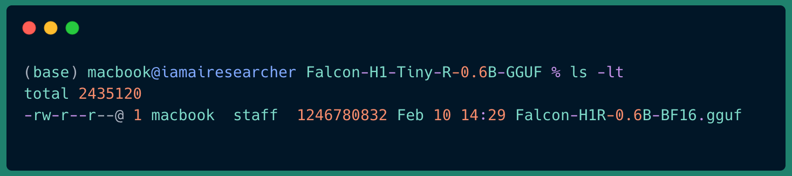
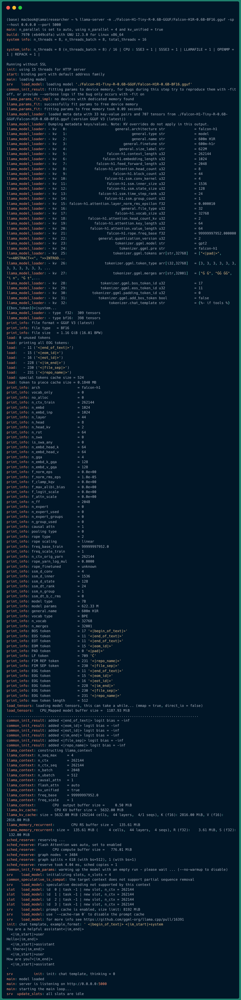

<style>
table {
  border-collapse: collapse;
  width: 100%;
  background-color: transparent; /* nền theo system/theme */
  border-radius: 8px;
  overflow: hidden;
  color: inherit; /* chữ theo theme */
}
th, td {
  padding: 12px 16px;
  border: 1px solid; /* rõ ràng */
  border-color: rgba(0,0,0,0.3); /* mặc định cho light */
}
@media (prefers-color-scheme: dark) {
  th, td {
    border-color: rgba(255,255,255,0.2); /* rõ hơn trong dark */
  }
  tr:nth-child(even) td {
    background-color: rgba(255,255,255,0.05); /* xen kẽ màu dark */
  }
  tr:hover td {
    background-color: rgba(255,255,255,0.1); /* hover rõ dark */
  }
}
@media (prefers-color-scheme: light) {
  tr:nth-child(even) td {
    background-color: rgba(0,0,0,0.05); /* xen kẽ màu light */
  }
  tr:hover td {
    background-color: rgba(0,0,0,0.1); /* hover rõ light */
  }
}
th {
  font-weight: bold;
}

blockquote {
  border-left: 4px solid rgba(128,128,128,0.4);
  margin: 1em 0;
  padding: 0.5em 1em;
  background-color: transparent;
  color: inherit;
  font-family: -apple-system, BlinkMacSystemFont, 'Segoe UI', Roboto, 'Helvetica Neue', Arial, sans-serif;
  font-size: 0.9em;
  font-style: italic;
}
blockquote p {
  margin: 0;
}
blockquote p strong {
  font-weight: bold;
  font-style: italic;
}
blockquote p::before {
  content: "“";
}
blockquote p::after {
  content: "”";
}

ul + p strong:first-child,
ul + p:has(strong:first-child) {
  display: block;
  margin-top: 1.5em;
  margin-bottom: 0.5em;
}
p strong:only-child {
  display: inline-block;
  margin-top: 1em;
  margin-bottom: 0.5em;
}
</style>

## Overview  
Not every task is about retrieving facts, sometimes you need the model to think, weigh options, and walk through a problem in multiple steps. That is where the new Falcon reasoning models come in. Built to deliver structured and logical outputs, they extend the capabilities of the Falcon family into domains like problem solving, mathematics, code logic, and multi stage decision making, while still being lightweight enough to run on laptops or compact devices. We have already gone through the series guiding you on how to work with the instruct model versions, including <a href="http://localhost:1313/tutorials/falcon-h1/">Falcon H1 Instruct</a>  and <a href="http://localhost:1313/tutorials/falcon-3/">Falcon3 Instruct</a> , and now it is time to start exploring reasoning models to see how they change the way we approach complex workloads.  

The lineup includes the Falcon H1R 7B, offering the highest reasoning capacity in the series, and two ultra portable versions, Falcon H1 Tiny R 0.6B and Falcon H1 Tiny R 90M, designed for situations where resources are limited but intelligent analysis is still essential.  

**What sets Falcon reasoning models apart**
1. Purpose built for step by step reasoning instead of purely inductive response generation.  
2. Optimized efficiency to run on consumer GPUs, Apple Silicon, and even low spec CPUs for mobile and embedded scenarios.  
3. Multiple size tiers, 7B, 0.6B, 90M to fit everything from full desktop deployments to ultra minimal setups.  
4. Robust in handling structured problem solving, whether it is complex math, long chain of thought analysis, or rule driven workflows.  

**Getting started**

These models are provided in gguf format for llama.cpp, which makes local deployment both fast and straightforward. Once served, you can connect them to OpenWebUI to get a clean, interactive workspace where the model walks through problems step by step. All of this runs entirely on your machine, no need for heavy cloud infrastructure, which makes it ideal for testing, experimenting, or building offline workflows. In the next section, we will cover the exact steps to set up Falcon reasoning models for maximum local performance.

Learn more:
- [Falcon H1R Release Blog Post](https://falcon-lm.github.io/blog/falcon-h1r-7b/)
- [Falcon H1R Paper](https://huggingface.co/papers/2601.02346)
- [Falcon H1 Tiny Release Blog Post](https://huggingface.co/spaces/tiiuae/tiny-h1-blogpost)
- [Mamba Paper](https://arxiv.org/abs/2405.21060)
- [Mamba2 Paper](https://arxiv.org/abs/2312.00752)
- [MLX Framework Overview](https://mlx-framework.org/#features)
- [llama.cpp Github Repository](https://github.com/ggml-org/llama.cpp)
- [Open-Web UI](https://openwebui.com)

## Model Variants  
The Falcon reasoning series brings together two main product lines, **Falcon H1R** and **Falcon H1 Tiny R**, each engineered to balance reasoning capability with deployment flexibility across a range of hardware environments. All models in this series are open source under the Falcon LLM license and are optimized for handling structured problem solving, multi stage analysis, and other logic driven tasks.  

Falcon H1R targets high performance reasoning in a compact form factor. The lineup includes the flagship Falcon H1R 7B, along with a Falcon H1R 7B GGUF quantized edition for llama.cpp.  Powered by a hybrid Transformer Mamba architecture, these models combine advanced attention mechanisms with efficient sequence modeling, delivering state of the art reasoning performance while remaining deployable on high end consumer GPUs, Apple Silicon devices, and performance oriented CPU setups. 

Falcon H1 Tiny R comes from a separate track - [Falcon-H1-Tiny series](https://huggingface.co/spaces/tiiuae/tiny-h1-blogpost) which focuses on ultra lightweight deployments. You can refer to the official blogpost for more details about how these models have been trained. The Falcon-H1-Tiny-R series is available in **0.6B** and **90M** parameter versions, these models are designed to fit scenarios where hardware resources are extremely limited, such as low spec laptops, compact desktops, or embedded devices, yet robust reasoning performance is still needed. They retain the core architectural strengths of the Falcon reasoning design, enabling efficient step by step logic without relying on large scale infrastructure.   

Whether selecting the 7B model for maximum reasoning power or choosing a Tiny R variant for portability, the Falcon reasoning series offers flexible options to match computational budgets and deployment goals. The complete set of available versions can be explored on [Hugging Face](https://huggingface.co/tiiuae). GGUF formats are also provided for llama.cpp, with details on quantization options available in [Hugging Face GGUF Quantization Types](https://huggingface.co/docs/hub/gguf#quantization-types).

## Prerequisites
Before configuring Falcon H1 reasoning models on your system, it is essential to verify that the local environment satisfies the minimum specifications necessary for efficient model execution.

### Operating Systems
- Linux: Recommended for llama.cpp with full CPU/GPU support.
- macOS: Supported via llama.cpp, with GPU acceleration through Metal, optimized for Apple Silicon.
- Windows: Supports llama.cpp with CPU execution; GPU acceleration is available through CUDA for compatible NVIDIA graphics cards.

### Python
- Utilize a virtual environment such as conda to manage dependencies.  
- While llama.cpp operates natively without Python, optional Python bindings are available through the <a href="https://github.com/abetlen/llama-cpp-python">llama-cpp-python</a> package.

### Hugging Face Account
- Active account required: [Hugging Face](https://huggingface.co/)
- A free account meets most needs.

## Installation
The installation section is identical as the one from <a href="http://localhost:1313/tutorials/falcon-3/">Falcon3 tutorial</a> - in case you went through already on the previous tutorial, you can directly move to the download section

## Download Model Weights from Hugging Face
With your environment ready and dependencies installed, the next step is to obtain the model weights for local deployment. For this guide, we’ll work with two reasoning models from TII’s official repositories: <a href="https://huggingface.co/tiiuae/Falcon-H1R-7B-GGUF/">Falcon-H1-7B-GGUF</a> and <a href="https://huggingface.co/tiiuae/Falcon-H1-Tiny-R-0.6B-GGUF/">Falcon-H1-Tiny-R-0.6B-GGUF</a>.  

> **Tip:** You can also choose from quantized `.gguf` versions tailored for different bit depths such as Q4 or Q8. Pick a variant that aligns with your hardware’s performance profile. The 0.6B tiny model is ideal for quick tests or resource-limited systems, while the 7B model delivers stronger reasoning capabilities for more demanding tasks. Finding the best quantization scheme often relies on multiple testing with your local setup and usecase.

We’ll use the **hf** CLI tool to download model weights. Ensure it is installed and authenticated with your Hugging Face account:  
```bash
hf auth whoami
```  
If authentication is not set up, follow the steps in [the CLI guide](https://huggingface.co/docs/huggingface_hub/guides/cli).  

**Download Falcon H1R 7B (.gguf format)**  
```bash
hf download tiiuae/Falcon-H1R-7B-GGUF Falcon-H1R-7B-Q4_K_M.gguf --local-dir Falcon-H1R-7B-GGUF
```  
> Choose a quantization level based on your system’s performance limits.  

**Download Falcon H1-tiny-R-0.6B-GGUF**  
```bash
hf download tiiuae/Falcon-H1-Tiny-R-0.6B-GGUF Falcon-H1R-0.6B-BF16.gguf --local-dir Falcon-H1-Tiny-R-0.6B-GGUF
```  

By default, files are stored in `~/.cache/huggingface/hub`. To save them to a different location, use `--local-dir` with your desired path. Once downloaded, navigate to the target folder to verify that the model weights are present. For example:  
- `.gguf` model (7B reasoning)


- `.gguf` model (tiny 0.6B reasoning)

  

## Serving Falcon-H1R-7B-GGUF
The environment and all requirements for running the model are now fully set up. Next, we’ll walk through the steps for using each framework to serve LLMs directly on your system.
We will start with deploying the LLM using the **llama.cpp** framework.

### Running the llama.cpp Server  
First, make sure the server starts successfully and that it is running as expected.  
To confirm the binary works, run:
```shell
llama-server --help
```  
This will display a list of available options. Some will be explained here, while others you can explore on your own. For now, the key options to note are:  
- `-m, --model FNAME`: Path to the model (default: `models/$filename` taken from `--hf-file` or `--model-url` if set, otherwise `models/7B/ggml-model-f16.gguf`). Environment variable: `LLAMA_ARG_MODEL`.  
- `--host HOST`: IP address for the server to listen on (default: `127.0.0.1`). Environment variable: `LLAMA_ARG_HOST`.  
- `--port PORT`: Port for the server to listen on (default: `8080`). Environment variable: `LLAMA_ARG_PORT`.  

To run the server with a quantized Falcon-H1R GGUF model, execute:  
```shell
llama-server -m ./Falcon-H1R-7B-GGUF/Falcon-H1R-7B-Q4_K_M.gguf --host 0.0.0.0 --port 5000
```
You should see similar output after running this command:

  

### Server Settings in llama.cpp  
The `llama-server` includes a Web UI accessible via the API above. It shows a small set of configuration options focused on LLM sampling. For the full list, run:  
```shell
llama-server --help
```
These options can affect both how your model behaves and the speed of text generation. Many of them can be set via environment variables, which are consistent across other llama.cpp executables.

<details>
<summary><strong>Click to view key general parameters</strong></summary>

- `--threads/--threads-batch (LLAMA_ARG_THREADS)`: Number of CPU threads to use. Default `-1` automatically detects available cores.  
- `--ctx-size (LLAMA_ARG_CTX_SIZE)`: The model’s context size (how many tokens it can remember). Larger sizes require more memory.  
- `--predict (LLAMA_ARG_N_PREDICT)`: Maximum tokens to generate. Default `-1` means continuous generation.  
- `--batch-size/--ubatch-size (LLAMA_ARG_BATCH/LLAMA_ARG_UBATCH)`: Number of tokens processed per step.  
- `--flash-attn (LLAMA_ARG_FLASH_ATTN)`: Enables flash attention optimization for supported models.  
- `--mlock (LLAMA_ARG_MLOCK)`: Keeps the model in memory to avoid swapping.  
- `--no-mmap (LLAMA_ARG_NO_MMAP)`: Disables memory mapping.  
- `--gpu-layers (LLAMA_ARG_N_GPU_LAYERS)`: Number of layers to offload to the GPU (requires GPU-enabled build).  

</details>

<details>
<summary><strong>Click to view server-specific parameters</strong></summary>

- `--no-context-shift (LLAMA_ARG_NO_CONTEXT_SHIFT)`: Stops generation when the context is full instead of discarding old tokens.  
- `--cont-batching (LLAMA_ARG_CONT_BATCHING)`: Allows prompts to be processed in parallel with generation.  
- `--alias (LLAMA_ARG_ALIAS)`: Sets a model name alias for the REST API.  
- `--slots (LLAMA_ARG_ENDPOINT_SLOTS)`: Enables the `/slots` endpoint.  
- `--props (LLAMA_ARG_ENDPOINT_PROPS)`: Enables the `/props` endpoint.  

</details>

## Serving Falcon-H1-Tiny-R-0.6B-GGUF 
And now, if your choice is the Tiny 0.6B model, we will move on to serving it on your machine. Basically, we will still use the `llama-server` command just like we did with [Falcon H1R 7B GGUF](#serving-falcon-h1r-7b-gguf). You can adjust the configuration parameters in the command to suit your own usage needs. 

First, let’s serve this model using the command line below:  
```shell
llama-server -m ./Falcon-H1-Tiny-R-0.6B-GGUF/Falcon-H1R-0.6B-BF16.gguf -sp --host 0.0.0.0 --port 5000
```  
> **Note:** Pay attention to the `-sp` (or `--special`) flag at the end of the command. This flag ensures a clear separation between thinking traces and the final answer. You must include it to prevent the model from returning both in the same response.  

To confirm that the model has been served successfully, check the terminal logs and make sure you see output similar to the screenshot below:  
  

If no other process is bound to your chosen port, you can freely set them to match your preference.  
For example, the server was run on `0.0.0.0` with a custom port `5000`.  
Once it starts, an OpenAI compatible API will be available locally at:  
```
http://<your_device_ip_address>:5000
```  
> **Note:** IP `0.0.0.0` and port `5000` were chosen instead of the default configuration of `localhost` and `8080` to allow public access. You can use the same setup, as it is flexible when running the model on a compact machine and connecting to another device, for example using the model hosted on one laptop from another laptop. When using this configuration, you will need to replace `0.0.0.0` with the actual IP address of your machine. If everything is running on the same machine, you can simply keep the default configuration.

Congratulations! If you’ve chosen the Falcon H1 reasoning models, you have now successfully served it on your laptop and it’s ready to use. Next, let’s look at integrating the model into OpenWebUI for chatting.

## Integrating with OpenwebUI
Once your selected serving framework is running, the next step is to connect Falcon-H1 to Open WebUI, giving you a simple chat-based interface for interacting with the model.

### Starting Open WebUI
First, let's proceed with installing open-webui cli. Use the command below to install:
```bash
pip install open-webui
```
> **Note:**  You should install open-webui cli within your existing conda virtual environment. If you are using MLX to serve local llm and already have a conda environment set up, install open-webui cli in that same one. Then activate your environment to proceed.

After successful installation, let's launch the server. 
```bash
open-webui serve
```
- Default access: [http://localhost:8080](http://localhost:8080)
- Custom port:

```bash
open-webui serve --port 3000 --host 0.0.0.0
```
### Connecting llama.cpp to Open WebUI  
1. Open **Open WebUI** in your browser.  
2. Navigate to **⚙️ Admin Settings → Connections → OpenAI**.  
3. Click **Add Connection**.  
4. Under **Standard / Compatible** (if tabs are visible), configure the following:  
   - **URL:** `http://<your_device_ip_address>:5000/v1`.  
   - **API Key:** Leave blank or enter a specific key if configured.

Once the connection is saved, Open WebUI will use your local **llama.cpp** server or **mlx** server as its backend.  

Keep the following points in mind when configuring Open WebUI for the Falcon H1 reasoning models:  
- The reasoning model outputs *thinking traces* in addition to the final answer. Therefore, you need to set up the thinking tag so Open WebUI can detect, extract, and display the thinking content before showing the answer. By default, these thinking traces are enclosed in `<think></think>` tags, which is the standard tag Open WebUI uses to retrieve this information. Fortunately, Falcon H1 reasoning models follow this convention, so you only need to enable **thinking mode**.  
- Open WebUI offers multiple ways to configure thinking mode, which you can explore in [link](https://docs.openwebui.com/features/chat-features/reasoning-models/). If you plan to run multiple models on Open WebUI simultaneously using different ports, it’s best to set up a dedicated configuration for Falcon H1 reasoning models.
1. Go to **⚙️ Admin Settings -> Models**  
2. Click **Edit**. You should see the model configuration section as shown below.  
3. In **Advanced Params**, enable **Reasoning Tags**.

Alright, let’s head back to the main screen and try out a few questions to test the model’s intelligence. Now we’ll start with the Falcon-H1-R-7B model,


followed by the Falcon-H1-Tiny-R-0.6B model


Congratulations — you now have your very own chatbot powered by the Falcon models running right on your laptop.

## Conclusion  
This guide has walked through the process of running Falcon H1 Reasoning models locally, covering both the MLX framework for macOS-optimized deployments and the llama.cpp framework for GGUF-based execution, along with integrating the setup into Open WebUI for an interactive chat experience. We have covered system prerequisites, environment preparation, model weight downloads, server configuration, integration steps, and important considerations before going live.  

By following these steps, you can deploy Falcon H1 Reasoning models in a way that aligns with your hardware resources and performance requirements. MLX provides seamless integration with Apple’s hardware for high efficiency, while llama.cpp offers broad compatibility and portability for GGUF models, giving you flexible options depending on your use case.  

You can further explore additional Falcon H1 Reasoning variants on Hugging Face, test different quantization levels, or embed the models into custom workflows and interfaces. With the right configuration, Falcon H1 Reasoning models can become a powerful, adaptable component of your local AI development toolkit.