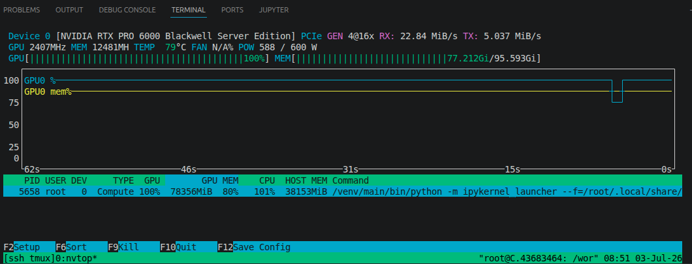
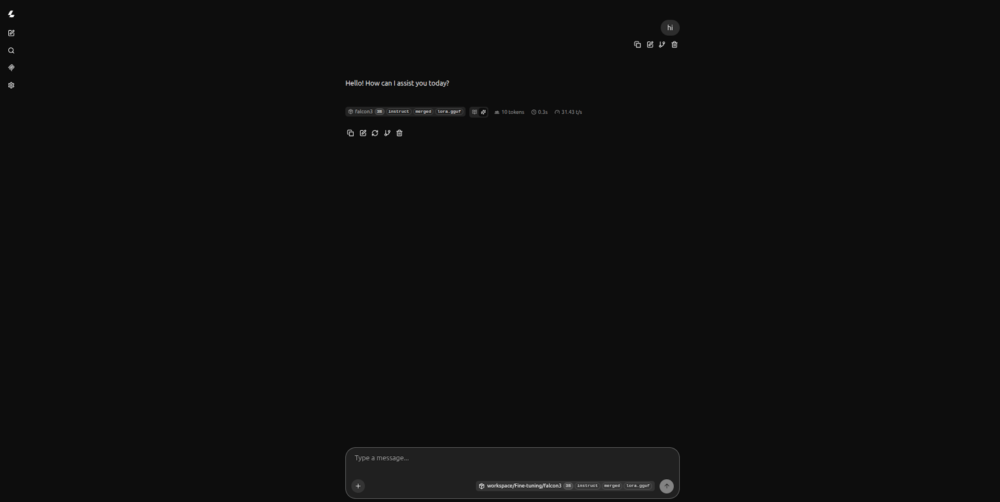
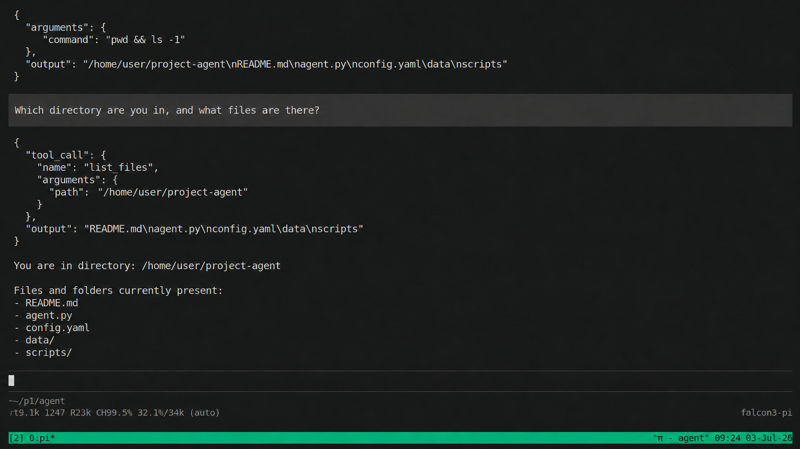

<style>
table {
  border-collapse: collapse;
  width: 100%;
  background-color: transparent;
  border-radius: 8px;
  overflow: hidden;
  color: inherit;
}
th, td {
  padding: 12px 16px;
  border: 1px solid;
  border-color: rgba(0,0,0,0.3);
}
@media (prefers-color-scheme: dark) {
  th, td {
    border-color: rgba(255,255,255,0.2);
  }
  tr:nth-child(even) td {
    background-color: rgba(255,255,255,0.05);
  }
  tr:hover td {
    background-color: rgba(255,255,255,0.1);
  }
}
@media (prefers-color-scheme: light) {
  tr:nth-child(even) td {
    background-color: rgba(0,0,0,0.05);
  }
  tr:hover td {
    background-color: rgba(0,0,0,0.1);
  }
}
th {
  font-weight: bold;
}
blockquote {
  border-left: 4px solid rgba(128,128,128,0.4);
  margin: 1em 0;
  padding: 0.5em 1em;
  background-color: transparent;
  color: inherit;
  font-family: -apple-system, BlinkMacSystemFont, 'Segoe UI', Roboto, 'Helvetica Neue', Arial, sans-serif;
  font-size: 0.9em;
  font-style: italic;
}
.screenshot {
  width: 100%;
  max-width: 800px;
  height: auto;
  border-radius: 8px;
  box-shadow: 0 4px 6px rgba(0, 0, 0, 0.1);
  display: block;
  margin: 1.5em auto;
  image-rendering: -webkit-optimize-contrast;
  image-rendering: crisp-edges;
}
.terminal-output {
  background: #1e1e1e;
  color: #d4d4d4;
  font-family: 'SF Mono', 'Fira Code', 'Cascadia Code', 'Menlo', 'Consolas', monospace;
  font-size: 0.85em;
  line-height: 1.5;
  padding: 1em 1.2em;
  border-radius: 8px;
  box-shadow: 0 4px 6px rgba(0, 0, 0, 0.1);
  overflow-x: auto;
  margin: 1.5em 0;
  white-space: pre;
}
@media (prefers-color-scheme: light) {
  .terminal-output {
    background: #f5f5f5;
    color: #1e1e1e;
    box-shadow: 0 4px 6px rgba(0, 0, 0, 0.08);
  }
}
</style>

## What this tutorial is about

What if you could take a small, open-weight language model, teach it how a coding agent works, and run the whole thing on your own machine? That is exactly what we will do here.

In this tutorial, we walk through the full journey: fine-tuning **Falcon3-3B-Instruct** on real coding-agent traces, converting the result into a format that runs locally with `llama.cpp`, and wiring it up to **Pi Coding Agent** so you can start using it right away.

Here is the plan:

1. Clean and prepare coding-agent traces for supervised fine-tuning.
2. Fine-tune Falcon3-3B-Instruct with LoRA on those traces.
3. Merge the adapter, convert to GGUF, and spin up a local server with `llama-server`.
4. Point Pi Coding Agent at the local endpoint and start coding.

To be clear, the goal is not to build a 3B model that rivals frontier coding models. Instead, this gives you a hands-on, reproducible pipeline for experimenting with custom model behavior, keeping your data private, and understanding how coding agents work under the hood.

## Experiment Setup

### Model

We use [Falcon3-3B-Instruct](https://huggingface.co/tiiuae/Falcon3-3B-Instruct), an instruction-tuned model that already understands chat roles and follows a native chat template. This means our fine-tuning data can focus on teaching coding-agent behavior rather than basic conversation protocol.

| Property | Value |
|---|---|
| Base model | Falcon3-3B-Instruct |
| Training format | Native chat template |
| LoRA setup | `r=16`, attention + MLP projections |
| Context length | 32,768 tokens |
| Output | LoRA adapter, then merged GGUF model |

The training data comes from [`julien-c/synthtraces`](https://huggingface.co/datasets/julien-c/synthtraces), a dataset of 2,876 coding-agent traces generated by the Pi harness.

### Hardware

The runs described here were tested on a single NVIDIA RTX PRO 6000 Blackwell Server Edition with roughly 95 GB VRAM and bfloat16 enabled.

A smaller CUDA GPU may work with more aggressive memory-saving settings, such as lower sequence length, 4-bit loading, smaller LoRA rank, or smaller batch accumulation. Treat the 24 GB VRAM prerequisite as a lower bound for experimentation, not a guarantee for the exact settings used in this document.

### Software prerequisites

- Python 3.10+
- A virtual environment managed by `conda` or `venv`
- A Hugging Face account for model and dataset access
- `llama.cpp` for GGUF conversion and local serving
- Pi Coding Agent, or an equivalent coding-agent client that can call an OpenAI-compatible endpoint

Install the notebook dependencies:

```bash
pip install unsloth datasets transformers trl peft accelerate
```

> For CUDA environments, install the PyTorch build that matches your driver and CUDA runtime. The generic `pip install torch` command may not select the wheel you want.

## Why Falcon3-3B-Instruct?

Falcon3-3B-Instruct already understands chat roles (`system`, `user`, `assistant`) and follows a native chat template. That means our fine-tuning data does not need to teach the model how conversations work. Instead, every training example can focus on what actually matters: coding-agent behavior, tool calling, and multi-step task execution.

The training data stays in structured message format. The tokenizer handles serialization through `apply_chat_template()`, so the data looks like this:

```json
{
  "messages": [
    {"role": "system", "content": "You are Pi Coding Agent."},
    {"role": "user", "content": "Find why CI is failing."},
    {
      "role": "assistant",
      "tool_calls": [
        {
          "function": {
            "name": "bash",
            "arguments": {"command": "ls .github/workflows"}
          }
        }
      ]
    },
    {"role": "tool", "content": "release.yml\ntest.yml"},
    {"role": "assistant", "content": "I'll inspect release.yml."}
  ]
}
```

The model still needs tool-use examples to learn when and how to call tools. A native chat template gives us a head start, but it does not automatically make the model a reliable coding agent.

## Data Processing Pipeline

The dataset contains raw traces from coding sessions. Each row contains three important fields:

| Field | Meaning |
|---|---|
| `messages` | User messages, assistant messages, tool calls, and tool results |
| `tools` | Tool schemas available to the agent during the session |
| `metadata` | Session metadata such as working directory and source model |

A raw trace can be inspected as follows:

```python
row = ds[0]
messages = json.loads(row["messages"])
metadata = json.loads(row["metadata"])

print("num messages:", len(messages))
print("cwd:", metadata["cwd"])
```

Example role summary:

```text
0  role=user      | content_len=43   | tool_calls=False | reasoning=False
1  role=assistant | content_len=0    | tool_calls=True  | reasoning=True
2  role=tool      | content_len=150  | tool_calls=False | reasoning=False
3  role=tool      | content_len=4537 | tool_calls=False | reasoning=False
4  role=assistant | content_len=0    | tool_calls=True  | reasoning=True
5  role=tool      | content_len=1559 | tool_calls=False | reasoning=False
6  role=assistant | content_len=1888 | tool_calls=False | reasoning=True
7  role=user      | content_len=0    | tool_calls=False | reasoning=False
```

The raw data has three issues that should be handled before training:

1. Some messages are empty and do not contain tool calls.
2. Some assistant messages include `reasoning_content` from the source model.
3. Some traces contain absolute file paths from the machine used to generate the dataset.

### Shared cleaning steps

Empty messages with no content and no tool call are dropped. The `reasoning_content` field is also removed. The fine-tuned model should learn observable agent behavior, not reproduce another model's hidden reasoning trace.

```python
cleaned_messages = []

for m in messages:
    content = m.get("content", "")
    has_tool_calls = bool(m.get("tool_calls"))

    if not content and not has_tool_calls:
        continue

    m2 = {k: v for k, v in m.items() if k != "reasoning_content"}
    cleaned_messages.append(m2)
```

Paths are normalized so the model does not memorize machine-specific directories.

```python
def normalize_path_text(text, cwd):
    if not isinstance(text, str):
        return text

    text = text.replace(cwd + "/", "")
    text = text.replace(cwd, ".")
    text = re.sub(
        r"/Users/gibbon/Desktop/synthtraces/repos/([^/\s\"']+)",
        r"$REPO_ROOT",
        text,
    )
    return text
```

Example:

```text
Before: ls /Users/gibbon/Desktop/synthtraces/repos/accelerate
After:  ls .
```

### Tokenization and formatting

The cleaned data stays in OpenAI-style message format. Roles, tool calls, and tool responses remain structured. The tokenizer serializes them with `apply_chat_template()`.

```python
input_ids = tokenizer.apply_chat_template(
    messages,
    tools=tools or None,
    tokenize=True,
    add_generation_prompt=False,
)

example = {
    "input_ids": input_ids,
    "attention_mask": [1] * len(input_ids),
    "labels": input_ids.copy(),
    "length": len(input_ids),
}
```

This notebook version uses full-sequence supervision (`labels = input_ids.copy()`). For a stricter SFT setup, you could mask non-assistant tokens so the model is only trained on its own outputs.

### Length filtering and split

Long traces are dropped instead of truncated. This avoids training on incomplete agent trajectories where a tool result, final answer, or intermediate step may be missing.

| Metric | Value |
|---|---:|
| Max sequence length | 32,768 tokens |
| Total raw traces | 2,876 |
| Kept after filtering | 2,059 |
| Dropped (too long) | 367 |
| Dropped (bad rows) | 450 |

The split is done by codebase name rather than by individual trace. This reduces leakage because traces from the same repository do not appear in both training and evaluation.

```python
def split_by_codebase(codebase):
    bucket = int(
        hashlib.md5((codebase or "unknown").encode()).hexdigest(),
        16,
    ) % 100

    if bucket < 80:
        return "train"
    elif bucket < 90:
        return "validation"
    else:
        return "test"
```

| Split | Traces |
|---|---:|
| Train | 1,499 |
| Validation | 196 |
| Test | 364 |
| Total | 2,059 |

## Fine-tuning Pipeline

The base weights remain frozen, and only injected low-rank (LoRA) matrices are updated. This section covers the key training decisions and parameters. Full implementation details are in the companion notebook.

### Loading the model

The model is loaded with Unsloth. No custom role tokens are needed because the tokenizer already provides a native chat template.

```python
model, tokenizer = FastLanguageModel.from_pretrained(
    model_name="tiiuae/Falcon3-3B-Instruct",
    max_seq_length=32768,
    dtype=None,
    load_in_4bit=False,
    trust_remote_code=True,
    unsloth_tiled_mlp=True,
)
```

Two flags in this call do most of the heavy lifting for GPU memory:

**`unsloth_tiled_mlp=True`** enables [Tiled MLP](https://unsloth.ai/docs/blog/500k-context-length-fine-tuning), an algorithm from Snowflake's Arctic long-sequence training research that Unsloth has integrated. Instead of computing the full MLP projection over the entire sequence at once, Tiled MLP splits the hidden states into tiles along the sequence dimension (each tile roughly the size of the model's hidden dimension). This drops almost all intermediate MLP activations from VRAM during training. The trade-off is extra forward passes per step (roughly 1.3x longer step time), but the memory savings are significant: Unsloth reports up to 40% lower peak VRAM, which makes long-context fine-tuning feasible on a single GPU.

Combined with **`use_gradient_checkpointing="unsloth"`** (set later in the LoRA config), activations are offloaded to CPU RAM between layers. Unsloth's implementation uses CUDA Streams to keep the overhead under 0.1% of training time. Together, these two techniques are what let us train at the full 32,768 tokens context length without running out of memory.

### LoRA configuration

LoRA targets both attention and MLP projection layers with rank 16.

```python
model = FastLanguageModel.get_peft_model(
    model,
    r=16,
    target_modules=[
        "q_proj", "k_proj", "v_proj", "o_proj",
        "gate_proj", "up_proj", "down_proj",
    ],
    lora_alpha=32,
    lora_dropout=0,
    bias="none",
    use_gradient_checkpointing="unsloth",
)
```

Observed trainable parameter count:

```text
trainable params: 20,185,088 || all params: 3,247,840,256 || trainable%: 0.6215
```

Training configuration:

| Parameter | Value |
|---|---:|
| Epochs | 10 |
| Per-device batch size | 4 |
| Gradient accumulation | 8 |
| Effective batch size | 32 |
| Learning rate | 2e-4 |
| Warmup ratio | 0.03 |
| Precision | bfloat16 |
| Eval strategy | epoch |
| Save strategy | epoch |
| Best checkpoint metric | eval loss |

With this configuration, the full 10-epoch run takes approximately 11 hours on a single RTX PRO 6000.

Before full training, the notebook runs a backward smoke test on the longest sample to catch OOM errors and verify that LoRA layers receive gradients.

```python
smoke_batch = data_collator([train_dataset[longest_index]])
smoke_batch = {k: v.to(model.device) for k, v in smoke_batch.items()}

smoke_loss = model(**smoke_batch).loss
smoke_loss.backward()

assert any(
    p.grad is not None
    for name, p in model.named_parameters()
    if "lora_" in name and p.requires_grad
)
```

### GPU usage during training

GPU utilization stayed near 100% throughout training, with peak memory usage around 78 GB out of 95 GB available on the RTX PRO 6000.



### Saving the adapter

After training, the LoRA adapter is saved. The main output files are `adapter_config.json`, `adapter_model.safetensors`, and `tokenizer.json`.

```python
FINAL_DIR = Path("outputs/adapter-final")

unwrapped_model = trainer.accelerator.unwrap_model(trainer.model)
unwrapped_model.save_pretrained(FINAL_DIR, safe_serialization=True)
tokenizer.save_pretrained(FINAL_DIR)
```

At this stage, the output is still a LoRA adapter. For `llama.cpp` serving, the adapter needs to be merged into the base model and then converted to GGUF.

## Merge Adapter and Export Model

Load the base model, apply the trained LoRA adapter, merge the weights, and save the result as a standard Hugging Face model directory.

```python
from peft import PeftModel
from transformers import AutoModelForCausalLM, AutoTokenizer
import torch

BASE_MODEL = "tiiuae/Falcon3-3B-Instruct"
ADAPTER_DIR = "outputs/adapter-final"
MERGED_DIR = "outputs/falcon3-3b-instruct-pi-merged"

tokenizer = AutoTokenizer.from_pretrained(ADAPTER_DIR)
base_model = AutoModelForCausalLM.from_pretrained(
    BASE_MODEL,
    torch_dtype=torch.bfloat16,
    trust_remote_code=True,
)

model = PeftModel.from_pretrained(base_model, ADAPTER_DIR)
model = model.merge_and_unload()

model.save_pretrained(MERGED_DIR, safe_serialization=True)
tokenizer.save_pretrained(MERGED_DIR)
```

## Convert to GGUF

After the model is merged and saved in Hugging Face format, convert it to GGUF with the conversion script from `llama.cpp`.

```bash
git clone https://github.com/ggml-org/llama.cpp
cd llama.cpp

cmake -B build -DGGML_CUDA=ON
cmake --build build --config Release -j
```

Example conversion command:

```bash
python convert_hf_to_gguf.py \
  /workspace/models/falcon3-3b-instruct-pi-merged \
  --outfile /workspace/models/falcon3-3b-instruct-pi-f16.gguf \
  --outtype f16
```

Optional quantization:

```bash
./build/bin/llama-quantize \
  /workspace/models/falcon3-3b-instruct-pi-f16.gguf \
  /workspace/models/falcon3-3b-instruct-pi-q4_k_m.gguf \
  Q4_K_M
```

Use the f16 GGUF for maximum fidelity when memory is available. Use a quantized GGUF for lower memory usage and faster local serving.

## Serve with llama.cpp

Start a local OpenAI-compatible server with `llama-server`.

```bash
./build/bin/llama-server \
  -m /workspace/models/falcon3-3b-instruct-pi-f16.gguf \
  --host 0.0.0.0 \
  --port 8080 \
  --ctx-size 32768
```

Validate that the server is reachable:

```bash
curl http://localhost:8080/v1/models
```

Run a chat completion smoke test:

```bash
curl http://localhost:8080/v1/chat/completions \
  -H "Content-Type: application/json" \
  -d '{
    "model": "falcon3-pi",
    "messages": [
      {"role": "system", "content": "You are Pi Coding Agent."},
      {"role": "user", "content": "Say hello and explain what you can do."}
    ],
    "temperature": 0.2,
    "max_tokens": 256
  }'
```

The `llama-server` also ships with a built-in chat UI. Once the server is running, open `http://localhost:8080` in your browser to interact with the model directly.



## Integrate with Pi Coding Agent

### Install Pi

Pi is an open-source coding agent CLI from [earendil-works/pi](https://github.com/earendil-works/pi). Install it globally via npm:

```bash
npm install -g --ignore-scripts @earendil-works/pi-coding-agent
```

Or use the installer script:

```bash
curl -fsSL https://pi.dev/install.sh | sh
```

Verify the installation:

```bash
pi --version
```

### Configure the local model

Pi supports custom providers through `~/.pi/agent/models.json`. Create this file to point Pi at the local `llama-server` endpoint:

```json
{
  "providers": {
    "local-falcon": {
      "baseUrl": "http://localhost:8080/v1",
      "api": "openai-completions",
      "apiKey": "local",
      "compat": {
        "supportsDeveloperRole": false,
        "supportsReasoningEffort": false
      },
      "models": [
        {
          "id": "falcon3-pi",
          "name": "Falcon3 3B Instruct (fine-tuned)",
          "reasoning": false,
          "input": ["text"],
          "contextWindow": 32768,
          "maxTokens": 4096,
          "cost": { "input": 0, "output": 0, "cacheRead": 0, "cacheWrite": 0 }
        }
      ]
    }
  }
}
```

The `apiKey` is a placeholder since `llama-server` does not require authentication. The `compat` flags tell Pi not to use the `developer` role or `reasoning_effort` parameter, which local servers typically do not support.

### Start a session

With `llama-server` running and `models.json` configured, start Pi and select the local model:

```bash
pi --provider local-falcon --model falcon3-pi
```

Or start Pi interactively and switch models with `/model` or `Ctrl+L`.

### Integration smoke test

A minimal validation flow should check three things:

1. The agent can reach the local model endpoint.
2. The model can respond to normal chat messages.
3. The model can produce the expected tool-call format for a coding-agent task.

Example prompt:

```text
Find why CI is failing. Start by listing the workflow files.
```

If the agent expects OpenAI-style tool calls, verify that the model response is parsed correctly by the client.



## Known Limitations

This setup is intended for controlled experimentation. Several limitations should be expected:

- A 3B model may not reliably solve complex coding tasks without strong prompting, retrieval, or additional fine-tuning data.
- Tool calling is format-sensitive. A small deviation in JSON shape or role formatting can break the agent loop.
- Long traces are dropped rather than truncated, so the training set favors examples that fit within the configured context length.
- The pipeline currently uses full-sequence supervision. Assistant-only masking may be preferable for a stricter SFT setup.

## Companion Notebook

Full preprocessing and training code is available in the companion notebook:



## References

- [tiiuae/Falcon3-3B-Instruct](https://huggingface.co/tiiuae/Falcon3-3B-Instruct)
- [julien-c/synthtraces](https://huggingface.co/datasets/julien-c/synthtraces)
- [Unsloth](https://github.com/unslothai/unsloth)
- [PEFT](https://github.com/huggingface/peft)
- [llama.cpp](https://github.com/ggml-org/llama.cpp)
