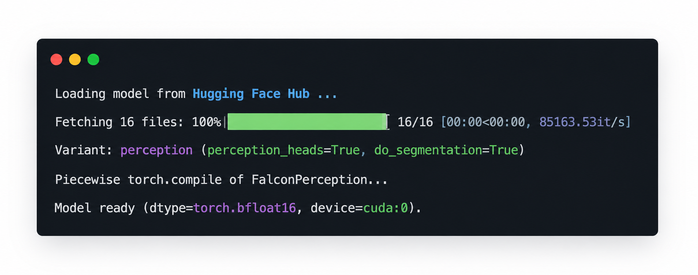
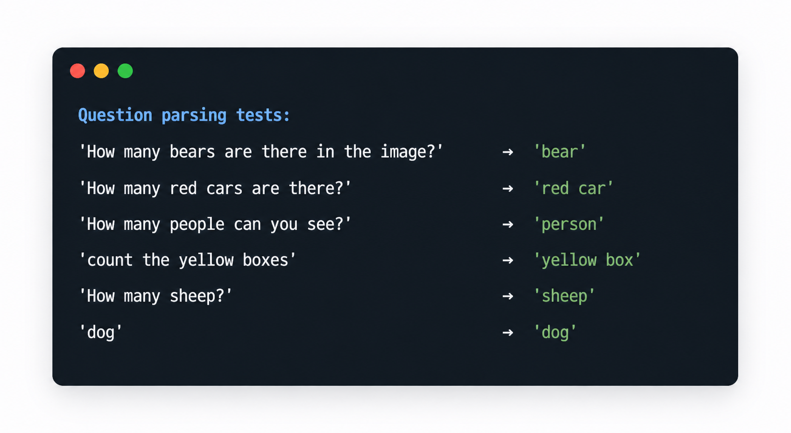
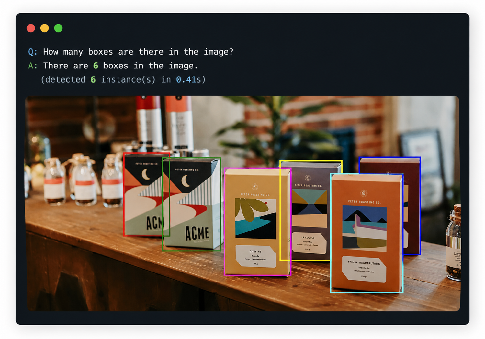
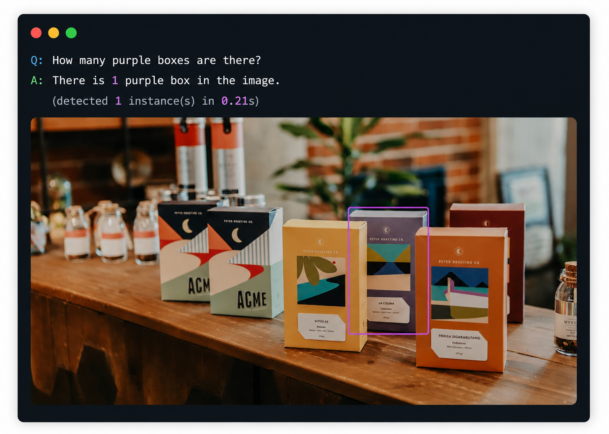
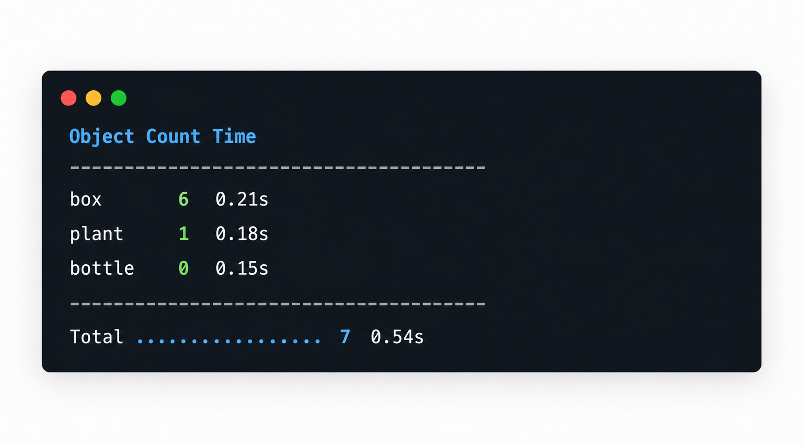
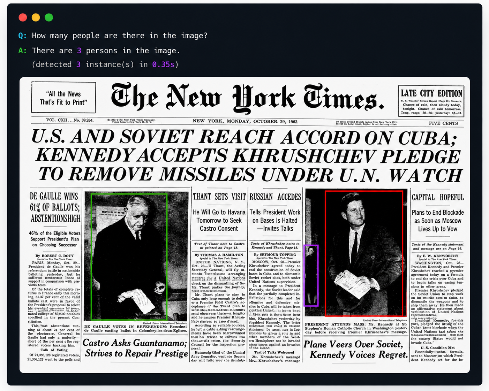
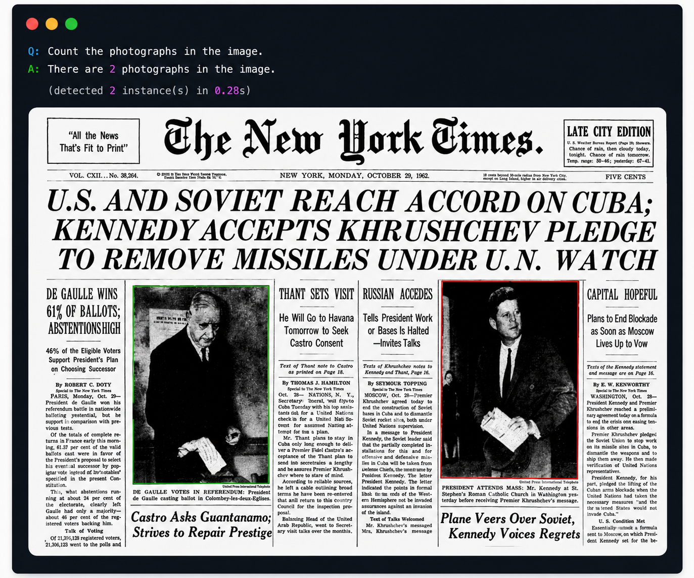
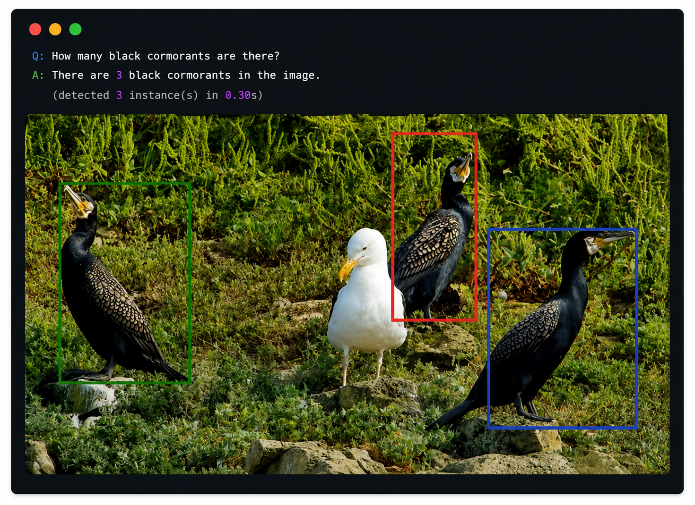
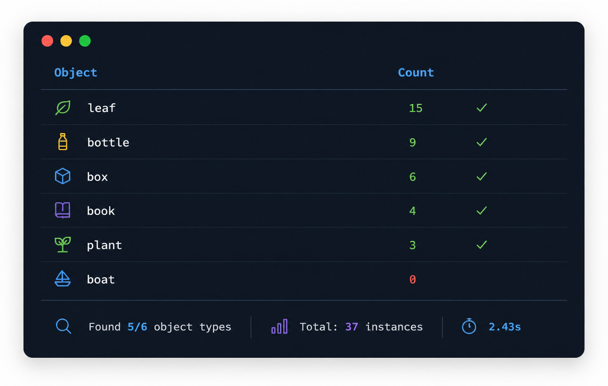

<style>
table {
  border-collapse: collapse;
  width: 100%;
  background-color: transparent;
  border-radius: 8px;
  overflow: hidden;
  color: inherit;
}
th, td {
  padding: 12px 16px;
  border: 1px solid;
  border-color: rgba(0,0,0,0.3);
}
@media (prefers-color-scheme: dark) {
  th, td {
    border-color: rgba(255,255,255,0.2);
  }
  tr:nth-child(even) td {
    background-color: rgba(255,255,255,0.05);
  }
  tr:hover td {
    background-color: rgba(255,255,255,0.1);
  }
}
@media (prefers-color-scheme: light) {
  tr:nth-child(even) td {
    background-color: rgba(0,0,0,0.05);
  }
  tr:hover td {
    background-color: rgba(0,0,0,0.1);
  }
}
th {
  font-weight: bold;
}

blockquote {
  border-left: 4px solid rgba(128,128,128,0.4);
  margin: 1em 0;
  padding: 0.5em 1em;
  background-color: transparent;
  color: inherit;
  font-family: -apple-system, BlinkMacSystemFont, 'Segoe UI', Roboto, 'Helvetica Neue', Arial, sans-serif;
  font-size: 0.9em;
  font-style: italic;
}
blockquote p {
  margin: 0;
}
blockquote p strong {
  font-weight: bold;
  font-style: italic;
}
blockquote p::before {
  content: "\201C";
}
blockquote p::after {
  content: "\201D";
}

ul + p strong:first-child,
ul + p:has(strong:first-child) {
  display: block;
  margin-top: 1.5em;
  margin-bottom: 0.5em;
}
p strong:only-child {
  display: inline-block;
  margin-top: 1em;
  margin-bottom: 0.5em;
}

/* Screenshot images — uniform size, crisp text on Retina */
.screenshot {
  width: 100%;
  max-width: 800px;
  height: auto;
  border-radius: 8px;
  box-shadow: 0 4px 6px rgba(0, 0, 0, 0.1);
  display: block;
  margin: 1.5em auto;
  image-rendering: -webkit-optimize-contrast;
  image-rendering: crisp-edges;
}
/* Text-heavy screenshots (terminal output, logs) — same width for consistency */
.screenshot-text {
  width: 100%;
  max-width: 800px;
}

/* Styled terminal output block (replaces low-res screenshots) */
.terminal-output {
  background: #1e1e1e;
  color: #d4d4d4;
  font-family: 'SF Mono', 'Fira Code', 'Cascadia Code', 'Menlo', 'Consolas', monospace;
  font-size: 0.85em;
  line-height: 1.5;
  padding: 1em 1.2em;
  border-radius: 8px;
  box-shadow: 0 4px 6px rgba(0, 0, 0, 0.1);
  overflow-x: auto;
  margin: 1.5em 0;
  white-space: pre;
}
@media (prefers-color-scheme: light) {
  .terminal-output {
    background: #f5f5f5;
    color: #1e1e1e;
    box-shadow: 0 4px 6px rgba(0, 0, 0, 0.08);
  }
}
</style>

## Overview

This tutorial walks through a **"Count Everything"** application built with **Falcon Perception**, a vision model designed for open-vocabulary object detection.

Given an image and a natural-language question such as *"How many bears are there in the image?"*, the system:

1. **Parses** the question to extract the target object name.
2. Runs **open-vocabulary detection** with Falcon Perception to locate every instance.
3. **Counts** the detections and returns the answer with a visual bounding-box overlay.

Because Falcon Perception is open-vocabulary, the same pipeline works for **any** object category, with no retraining required.

> **Key design choice:** We use `detection` mode (bounding boxes only) instead of `segmentation` mode. This avoids the expensive HR upsampler and keeps inference faster. For counting, we only need to know *where* objects are, not their pixel-precise masks.

You can download the full notebook and run it in Google Colab or in your own local environment:



## Model

For this tutorial, we use **Falcon Perception**, the full 0.6B model from the Falcon Perception family developed by TII.

- **0.6 billion parameters**, designed for open-vocabulary grounding and instance segmentation.
- Supports **open-vocabulary detection** out of the box, so it can detect and count arbitrary object types without fine-tuning.
- Runs on a single CUDA-capable GPU (tested on RTX 4000 Ada 20 GB with bfloat16, ~10 GB VRAM).

## Prerequisites

- A CUDA-capable GPU (tested on RTX 4000 Ada 20 GB with `Falcon-Perception` + bfloat16)
- `falcon-perception` package

---

## References

- [Falcon Perception on Hugging Face](https://huggingface.co/tiiuae/Falcon-Perception) — Model weights (0.6B).
- [PBench dataset](https://huggingface.co/datasets/tiiuae/PBench) — Benchmark dataset used in the examples.

---

## Install Dependencies

Install the `falcon-perception` package along with Pillow for image handling:

```python
%pip install falcon-perception
%pip install Pillow
```

## Load Model & Build Engine

We load the full Falcon Perception (0.6B) model in bfloat16 and configure the paged inference engine. Since detection mode does not require the HR upsampler, VRAM usage stays manageable at ~10 GB.

```python
import torch
from falcon_perception import (
    PERCEPTION_MODEL_ID,
    build_prompt_for_task,
    cuda_timed,
    load_and_prepare_model,
    setup_torch_config,
)
from falcon_perception.data import ImageProcessor, load_image, stream_samples_from_hf_dataset
from falcon_perception.paged_inference import (
    PagedInferenceEngine,
    SamplingParams,
    Sequence,
)
from falcon_perception.visualization_utils import (
    overlay_detections_on_image_v2,
    pair_bbox_entries,
)

setup_torch_config()

MAX_SEQ_LENGTH = 8192
MIN_IMAGE_SIZE = 256
MAX_IMAGE_SIZE = 1024

model, tokenizer, model_args = load_and_prepare_model(
    hf_model_id=PERCEPTION_MODEL_ID,
    dtype="bfloat16",
    compile=True,
)

image_processor = ImageProcessor(patch_size=16, merge_size=1)
stop_token_ids = [tokenizer.eos_token_id, tokenizer.end_of_query_token_id]
```

The engine configuration below is sized for roughly 10 GB of VRAM:

```python
cfg = dict(
    n_pages=128,
    page_size=128,
    max_batch_size=4,
    prefill_length_limit=8192,
    max_hr_cache_entries=0,
    max_image_size=MAX_IMAGE_SIZE,
)

engine = PagedInferenceEngine(
    model, tokenizer, image_processor,
    max_seq_length=MAX_SEQ_LENGTH,
    enable_hr_cache=False,
    capture_cudagraph=True,
    **cfg,
)
```

If the model loads successfully, you should see console output similar to the example below, including the Hugging Face fetch progress, the selected perception variant, and the final `Model ready` message. This is a good checkpoint to confirm that the model has been initialised correctly before moving on.



### Warmup

We run one warmup pass to absorb the `torch.compile` JIT cost and CUDA graph capture overhead before real inference:

```python
warmup_sample = stream_samples_from_hf_dataset("tiiuae/PBench", split="level_1", limit=1)[0]
warmup_prompt = build_prompt_for_task(str(warmup_sample["expression"]), "detection")
warmup_seq = Sequence(
    text=warmup_prompt,
    image=warmup_sample["image"],
    min_image_size=MIN_IMAGE_SIZE,
    max_image_size=MAX_IMAGE_SIZE,
    task="detection",
)
sp = SamplingParams(stop_token_ids=stop_token_ids)

engine.generate([warmup_seq], sampling_params=sp, use_tqdm=False, print_stats=False)
```

---

## Question Parsing

To make counting work from free-form questions, we first extract the **target object** from the user prompt. The parser handles several common question patterns and applies basic singularisation (for example, `bears` → `bear`, `buses` → `bus`).

Examples:
- *"How many bears are there in the image?"* → `bear`
- *"Count the red cars"* → `red car`
- *"How many people?"* → `person`

```python
import re

IRREGULAR_PLURALS = {
    "people": "person", "men": "man", "women": "woman",
    "children": "child", "mice": "mouse", "geese": "goose",
    "teeth": "tooth", "feet": "foot", "oxen": "ox",
    "sheep": "sheep", "fish": "fish", "deer": "deer",
}

QUESTION_PATTERNS = [
    re.compile(r"how\s+many\s+(.+?)\s+(?:are|is)\s+(?:there\s+)?(?:in|on|at)", re.IGNORECASE),
    re.compile(r"how\s+many\s+(.+?)\s+(?:are|is)\s+there", re.IGNORECASE),
    re.compile(r"how\s+many\s+(.+?)\s+(?:can|do)\s+you\s+(?:see|count|find|spot)", re.IGNORECASE),
    re.compile(r"how\s+many\s+(.+?)[\?\s]*$", re.IGNORECASE),
    re.compile(r"count\s+(?:the\s+|all\s+(?:the\s+)?)?(.+?)[\?\.\s]*$", re.IGNORECASE),
    re.compile(r"(?:number|amount)\s+of\s+(.+?)[\?\.\s]*$", re.IGNORECASE),
]


def singularise(word: str) -> str:
    word = word.strip().lower()
    if word in IRREGULAR_PLURALS:
        return IRREGULAR_PLURALS[word]
    if word.endswith("ies") and len(word) > 4:
        return word[:-3] + "y"
    if word.endswith(("ses", "xes", "zes", "ches", "shes")):
        return word[:-2]
    if word.endswith("s") and not word.endswith("ss"):
        return word[:-1]
    return word


def extract_object_from_question(question: str) -> str:
    question = question.strip()
    for pattern in QUESTION_PATTERNS:
        match = pattern.search(question)
        if match:
            raw = match.group(1).strip().rstrip("?.! ")
            words = raw.split()
            words[-1] = singularise(words[-1])
            return " ".join(words)
    return question.rstrip("?.! ").strip()
```

A quick sanity check:

```python
test_cases = [
    "How many bears are there in the image?",
    "How many red cars are there?",
    "How many people can you see?",
    "count the yellow boxes",
    "How many sheep?",
    "dog",
]
for q in test_cases:
    print(f"  {q!r:55s} → {extract_object_from_question(q)!r}")
```

If the parser is working as expected, you should see each question mapped to a clean object label.



---

## Core Counting Engine

The `count_objects` function ties everything together:
1. Parse the question → extract object name
2. Build a detection prompt via `build_prompt_for_task(object_name, "detection")`
3. Run inference with `engine.generate()`
4. Count bounding boxes via `pair_bbox_entries()`
5. Return the count and optionally a visual overlay

```python
def count_objects(image, question, coord_dedup_threshold=0.01):
    object_name = extract_object_from_question(question)
    prompt = build_prompt_for_task(object_name, "detection")
    seq = Sequence(
        text=prompt, image=image,
        min_image_size=MIN_IMAGE_SIZE,
        max_image_size=MAX_IMAGE_SIZE,
        task="detection",
    )
    sp = SamplingParams(
        stop_token_ids=stop_token_ids,
        coord_dedup_threshold=coord_dedup_threshold,
    )

    with cuda_timed() as t:
        engine.generate([seq], sampling_params=sp, use_tqdm=False, print_stats=False)

    bboxes = pair_bbox_entries(seq.output_aux.bboxes_raw)
    return {
        "object": object_name,
        "count": len(bboxes),
        "bboxes": bboxes,
        "sequence": seq,
        "elapsed_s": t.elapsed,
    }
```

We also provide `count_and_display`, a small helper that prints a readable answer and renders the annotated image with bounding boxes:

```python
def count_and_display(image, question, coord_dedup_threshold=0.01, max_display_side=1024):
    result = count_objects(image, question, coord_dedup_threshold)
    obj, count = result["object"], result["count"]

    if count == 0:
        answer = f"I don't see any {obj} in the image."
    elif count == 1:
        answer = f"There is 1 {obj} in the image."
    else:
        answer = f"There are {count} {obj}s in the image."

    print(f"Q: {question}")
    print(f"A: {answer}")
    print(f"   (detected {count} instance(s) in {result['elapsed_s']:.2f}s)")

    # Render overlay with bounding boxes
    if result["bboxes"]:
        dets = [
            {"xy": {"x": b["x"], "y": b["y"]}, "hw": {"w": b["w"], "h": b["h"]}}
            for b in result["bboxes"]
        ]
        overlay = overlay_detections_on_image_v2(
            image, dets, draw_bbox=True, masks_are_binary=True,
        )
        display(Image.fromarray(overlay))

    return result
```

---

## Basic Counting Demo

We start with a simple example: load an image, ask a direct counting question, and inspect the result.

```python
from falcon_perception.data import load_image

demo_img = load_image(
    "https://huggingface.co/datasets/tiiuae/PBench/resolve/main/examples/pexels-tahaasamett-10540813.jpg"
)
```

```python
count_and_display(demo_img, "How many boxes are there in the image?")
```

The first result should show the detected boxes overlaid on the image together with the final count.




The same setup also supports **attribute-filtered counting**, such as counting only objects of a specific colour:

```python
count_and_display(demo_img, "How many purple boxes are there?")
```

This second example is a good place to show how the model narrows the count to only the requested attribute.



---

## Multi-Object Counting

A common extension is to scan one image for several object types and summarise the results. The `count_multiple_objects` function runs multiple queries against the same image and prints a compact summary table:

```python
def count_multiple_objects(image, questions, coord_dedup_threshold=0.01):
    results = []
    total_time = 0.0
    for question in questions:
        result = count_objects(image, question, coord_dedup_threshold)
        results.append(result)
        total_time += result["elapsed_s"]

    print(f"{'Object':<25s} {'Count':>6s} {'Time':>8s}")
    print("-" * 42)
    for r in results:
        print(f"{r['object']:<25s} {r['count']:>6d} {r['elapsed_s']:>7.2f}s")
    print("-" * 42)
    print(f"{'Total':.<25s} {sum(r['count'] for r in results):>6d} {total_time:>7.2f}s")
    return results
```

```python
questions = [
    "How many boxes are there?",
    "How many plants can you see?",
    "How many bottles are there in the image?",
]
multi_results = count_multiple_objects(demo_img, questions)
```

The summary table gives a quick overview of per-object counts and runtime.



---

## Dense Counting: Closely Packed Objects

Counting becomes harder when an image contains closely packed objects, such as a flock of sheep in a field.

The `coord_dedup_threshold` parameter matters a lot in this setting:

- **`0`** —> keep all predictions, including near-duplicate overlapping boxes → over-counts.
- **`0.01`** —> merge boxes whose centres are within 1% of normalised distance → cleaner counts.

Below, we compare both settings on the same scene:

```python
dense_img = load_image(
    "https://huggingface.co/datasets/tiiuae/PBench/resolve/main/examples/sheep.jpg"
)
```

```python
# Without dedup
result_no_dedup = count_and_display(dense_img, "How many sheep are there?", coord_dedup_threshold=0)

# With dedup
result_dedup = count_and_display(dense_img, "How many sheep are there?", coord_dedup_threshold=0.01)

print(f"\nDedup reduced count from {result_no_dedup['count']} → {result_dedup['count']} "
      f"(removed {result_no_dedup['count'] - result_dedup['count']} duplicate detections)")
```

> **Hardware note:** Dense counting on closely packed objects is particularly sensitive to numerical precision. For best results in this scenario, we recommend loading the model in **float32** (`dtype="float32"`) rather than bfloat16. This requires approximately 2× the VRAM (~20 GB) but produces significantly more accurate detection boundaries, reducing both missed detections and false duplicates. The code above is ready to run as-is. You simply update the `dtype` parameter in `load_and_prepare_model()` when sufficient GPU memory is available.

> ⚠️ **Note:** A `coord_dedup_threshold` of `0.01` is a good default for dense scenes because it helps reduce over-counting from overlapping detections.

---

## Different Object Types

Falcon Perception is **open-vocabulary**, so it can count anything it can detect. Here we switch to a different image and ask about different object types:

```python
nyt_img = load_image(
    "https://huggingface.co/datasets/tiiuae/PBench/resolve/main/examples/nyt.jpg"
)

count_and_display(nyt_img, "How many people are there in the image?")
count_and_display(nyt_img, "Count the photographs")
```

These examples are useful for showing the model generalising across object types in the same image.





---

## Try It Yourself

You can also plug in your own image, either from a URL or a local path, and ask any counting question you like:

```python
YOUR_IMAGE = "https://huggingface.co/datasets/tiiuae/PBench/resolve/main/examples/seagull.jpg"
YOUR_QUESTION = "How many black cormorants are there?"

user_img = load_image(YOUR_IMAGE)
count_and_display(user_img, YOUR_QUESTION)
```

If you want to make the tutorial feel more hands-on, this is also a good place to include a screenshot from a custom example run.



---

## Batch Object Inventory

Given a list of object categories, we can scan an image and produce a simple inventory. This is useful for scenarios such as warehouse inspection, wildlife surveys, or retail shelf auditing:

```python
def object_inventory(image, object_names, coord_dedup_threshold=0.01):
    inventory = {}
    total_time = 0.0
    for name in object_names:
        result = count_objects(image, name, coord_dedup_threshold)
        inventory[result["object"]] = result["count"]
        total_time += result["elapsed_s"]

    print(f"{'Object':<25s} {'Count':>6s}")
    print("=" * 33)
    for obj, cnt in sorted(inventory.items(), key=lambda x: -x[1]):
        marker = "  ✓" if cnt > 0 else ""
        print(f"{obj:<25s} {cnt:>6d}{marker}")
    print("=" * 33)
    found = sum(1 for c in inventory.values() if c > 0)
    print(f"Found {found}/{len(object_names)} object types | "
          f"Total: {sum(inventory.values())} instances | {total_time:.2f}s")
    return inventory
```

```python
inventory = object_inventory(demo_img, [
    "box", "plant", "bottle", "book", "leaf", "boat",
])
```

The inventory output works well as a screenshot because it shows a compact, practical summary of everything found in the image.



---

## Optional: Counting with Segmentation Mode

Throughout this tutorial we used **detection mode** (bounding boxes only) because counting only needs to know *where* objects are — not their pixel-precise boundaries. This keeps inference fast by skipping the HR upsampler.

However, if you need **mask-level detail** (e.g. measuring object area, pixel-level editing, or visual verification of boundaries), Falcon Perception also supports **segmentation mode**. Here's how to adapt the workflow:

1. **Rebuild the engine** with the HR cache enabled — set `enable_hr_cache=True` and `max_hr_cache_entries=4` (or higher depending on your batch size).
2. **Change the task** in `build_prompt_for_task()` and `Sequence` — use `"segmentation"` instead of `"detection"`.
3. **Access masks** from the output — after generation, `seq.output_aux.masks` contains per-instance binary masks. Pass them to `overlay_detections_on_image_v2(..., masks=masks)` for visualisation.

> **Trade-off:** Segmentation mode is noticeably slower due to the HR upsampler. For pure counting tasks, detection mode is recommended. Use segmentation only when you actually need the mask output.

---

## Summary

In this tutorial, we built a **"Learning to Count Everything"** workflow on top of Falcon Perception:

| Section | What it covers |
|---------|---------------|
| **Question Parsing** | Extract the target object from natural-language questions (regex-based, handles plurals) |
| **Core Counting** | `count_objects()` — parse question → detect → count bounding boxes |
| **Basic Demo** | Single-object counting with and without attribute filtering |
| **Multi-Object** | Ask multiple counting questions on one image |
| **Dense Counting** | `coord_dedup_threshold` for accurate counts with closely packed objects |
| **Different Objects** | Open-vocabulary counting works for any object type |
| **Try It Yourself** | Plug in your own image + question |
| **Batch Inventory** | Scan an image for a list of object categories |
| **Segmentation Mode** | Optional pixel-precise masks alongside counts |

**Key takeaways:**

- **Detection mode** is preferred for counting — faster since it skips the HR upsampler.
- **`coord_dedup_threshold=0.01`** is recommended for dense scenes to avoid over-counting.
- The system is **open-vocabulary** — no retraining needed for new object types.
- For pixel-precise output, switch to **segmentation mode** at the cost of higher latency.
