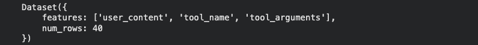
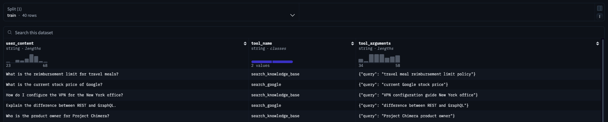
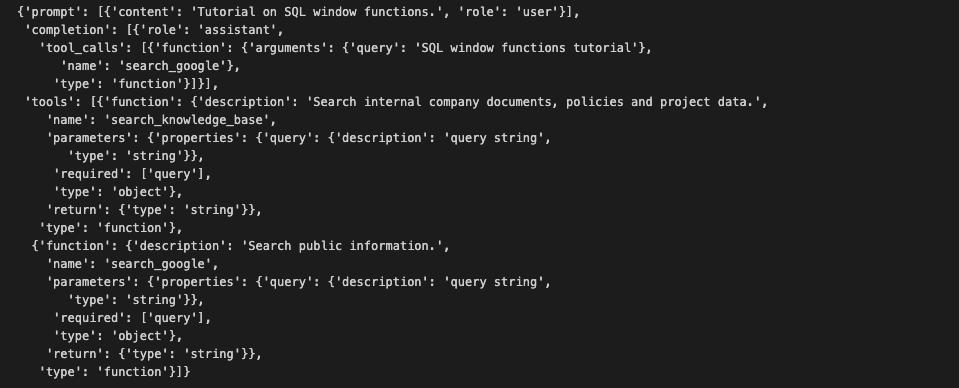
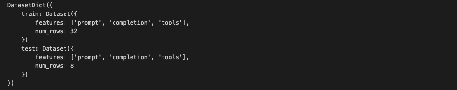
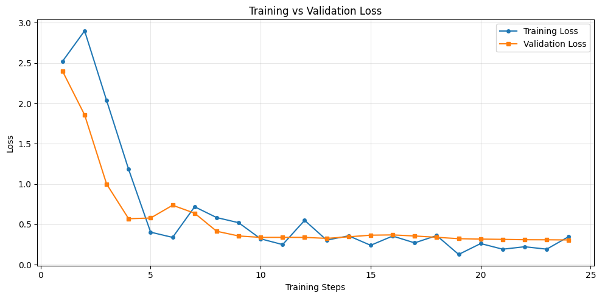
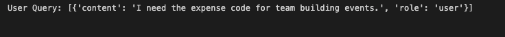
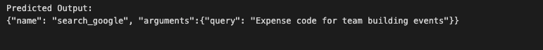
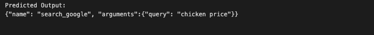
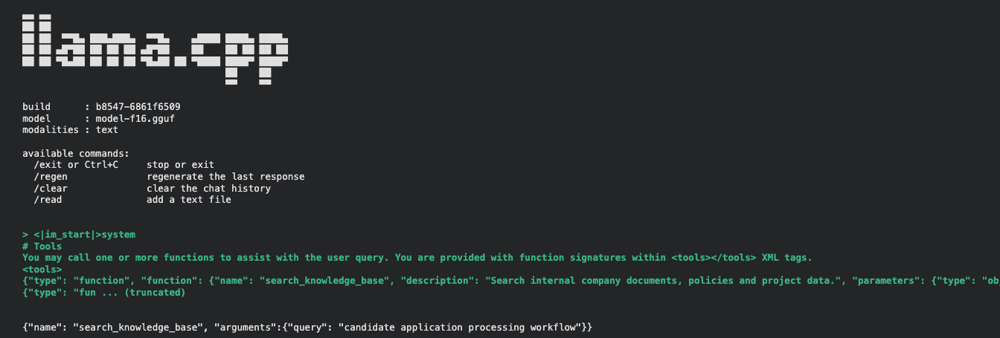

<style>
table {
  border-collapse: collapse;
  width: 100%;
  background-color: transparent; /* nền theo system/theme */
  border-radius: 8px;
  overflow: hidden;
  color: inherit; /* chữ theo theme */
}
th, td {
  padding: 12px 16px;
  border: 1px solid; /* rõ ràng */
  border-color: rgba(0,0,0,0.3); /* mặc định cho light */
}
@media (prefers-color-scheme: dark) {
  th, td {
    border-color: rgba(255,255,255,0.2); /* rõ hơn trong dark */
  }
  tr:nth-child(even) td {
    background-color: rgba(255,255,255,0.05); /* xen kẽ màu dark */
  }
  tr:hover td {
    background-color: rgba(255,255,255,0.1); /* hover rõ dark */
  }
}
@media (prefers-color-scheme: light) {
  tr:nth-child(even) td {
    background-color: rgba(0,0,0,0.05); /* xen kẽ màu light */
  }
  tr:hover td {
    background-color: rgba(0,0,0,0.1); /* hover rõ light */
  }
}
th {
  font-weight: bold;
}

blockquote {
  border-left: 4px solid rgba(128,128,128,0.4);
  margin: 1em 0;
  padding: 0.5em 1em;
  background-color: transparent;
  color: inherit;
  font-family: -apple-system, BlinkMacSystemFont, 'Segoe UI', Roboto, 'Helvetica Neue', Arial, sans-serif;
  font-size: 0.9em;
  font-style: italic;
}
blockquote p {
  margin: 0;
}
blockquote p strong {
  font-weight: bold;
  font-style: italic;
}
blockquote p::before {
  content: "“";
}
blockquote p::after {
  content: "”";
}

ul + p strong:first-child,
ul + p:has(strong:first-child) {
  display: block;
  margin-top: 1.5em;
  margin-bottom: 0.5em;
}
p strong:only-child {
  display: inline-block;
  margin-top: 1em;
  margin-bottom: 0.5em;
}
</style>

## Overview  
This tutorial walks you through the process of fine-tuning a Small Language Model (SLM) to work with tool calling data — datasets that enable the model to understand and execute calls to external tools within a conversation, thereby enhancing automation capabilities and accuracy.

You can download the full notebook to run it in Google Colab or your local environment:



## Initial Model Checkpoint

For this tutorial, we will use **Falcon H1 tiny 90M instruct**, a compact variant of the Falcon H1 series developed by TII.

- **90 million parameters**, yet capable of effective conversational and instruction-following tasks.
- Runs smoothly on environments with limited resources such as laptops or edge devices.
- Designed to be fast, lightweight, and easy to deploy, making it ideal for learning and experimenting without large GPU infrastructure.

## Supervised Fine-Tuning with LoRA and TRL

In this notebook, we apply Supervised Fine-Tuning (SFT) techniques enhanced with LoRA (Low-Rank Adaptation), using the Hugging Face TRL library to streamline training and evaluation. This combination allows efficient and cost-effective finetuning, even on limited hardware.

### Key Concepts

- **SFT**: Trains a model on example input–output pairs to align its behavior with a desired task.
- **Tool Calling**: The ability of a model to respond with a structured function call instead of free-form text.
- **LoRA**: Updates only a small set of low-rank parameters, reducing training cost and memory usage.
- **TRL**: The Hugging Face library that makes fine-tuning and reinforcement learning simple and efficient.

### What You Will Learn

By completing this notebook, you will:

1. Prepare tool calling datasets for finetuning.
2. Configure and run the SFT process with LoRA/QLoRA using TRL.
3. Validate the model's performance.
4. Apply your custom LLM to real-world scenarios.

### Additional Resource: Pre-Fine-Tuned Tool-Calling Model Available

If you'd like to skip the fine-tuning process and try a ready-to-use model, the Technology Innovation Institute (TII) has already released a Falcon H1 Tiny 90M version fine-tuned for tool-calling tasks. This model is optimized to handle structured function calls within conversations, making it ideal for automation workflows.

**References:**

- [Falcon H1 Tiny blog post](https://falconllm.tii.ae/blog/falcon-edge) — Overview of Falcon H1 Tiny series and use cases.
- [Falcon-H1-Tiny-Tool-Calling-90M on Hugging Face](https://huggingface.co/tiiuae/Falcon-H1-Tiny-Tool-Calling-90M) — Pre-fine-tuned model weights.
- [Falcon H1 tiny 90M instruct model weights on Hugging Face](https://huggingface.co/tiiuae/Falcon-H1-Tiny-90M-Instruct)

---

## Install Dependencies

We will install TRL with the PEFT extra, which includes key dependencies:

- Transformers
- PEFT (parameter-efficient fine-tuning)

We also install:

- **trackio** – for experiment logging
- **bitsandbytes** – to enable 8-bit optimizers

```python
!pip install -Uq "trl[peft]" trackio bitsandbytes
```

## Log in to Hugging Face

Log in to your Hugging Face account to push the fine-tuned model to the Hub and access gated models. You can find your access token on your [account settings page](https://huggingface.co/settings/tokens).

```python
from huggingface_hub import notebook_login

notebook_login()
```

## Load Dataset

We load the `bebechien/SimpleToolCalling` dataset, which pairs user queries with the appropriate tool call needed to fulfill each request.

Each record contains:

- `user_content` – the user's query.
- `tool_name` – the tool to be invoked.
- `tool_arguments` – the parameters to pass to the tool.

```python
from datasets import load_dataset

dataset_name = "bebechien/SimpleToolCalling"
dataset = load_dataset(dataset_name, split="train")
```

```python
print(dataset)
```

If the result appears as shown below, it indicates that the data has been successfully loaded.

  

Refer to the sample data screenshot below to gain a clear understanding of the actual data structure.
This visual example will help you identify the format, organization, and key fields present in the dataset.

  

## Prepare Tool-Calling Data

We define two tools: `search_knowledge_base` for internal company documents and `search_google` for public information.

We then write a custom Jinja2 chat template that extends the model's default template with two additions:

1. A **Tool Use** section is appended to the system preamble when `tools` is passed to `apply_chat_template`.
2. Assistant turns with `tool_calls` render the call as structured `<tool_call>` blocks.
3. Each training sample uses the standard `tool_calls` message format with a `tools` key and `SFTTrainer` passes these to `apply_chat_template` automatically.

```python
import json

# These are the tool schemas that are used in the dataset
TOOLS = [
    {
        "type": "function",
        "function": {
            "name": "search_knowledge_base",
            "description": "Search internal company documents, policies and project data.",
            "parameters": {
                "type": "object",
                "properties": {
                    "query": {"type": "string", "description": "query string"}
                },
                "required": ["query"],
            },
            "return": {"type": "string"},
        },
    },
    {
        "type": "function",
        "function": {
            "name": "search_google",
            "description": "Search public information.",
            "parameters": {
                "type": "object",
                "properties": {
                    "query": {"type": "string", "description": "query string"}
                },
                "required": ["query"],
            },
            "return": {"type": "string"},
        },
    },
]

def create_conversation(sample):
    return {
        "prompt": [{"role": "user", "content": sample["user_content"]}],
        "completion": [
            {
                "role": "assistant",
                "tool_calls": [
                    {
                        "type": "function",
                        "function": {
                            "name": sample["tool_name"],
                            "arguments": json.loads(sample["tool_arguments"]),
                        },
                    }
                ],
            },
        ],
        "tools": TOOLS,
    }
```

```python
dataset = dataset.map(create_conversation, remove_columns=dataset.features)
# Split dataset into 80% training samples and 20% test samples
dataset = dataset.train_test_split(test_size=0.2, shuffle=True)
```

Let's examine a sample from the training set to confirm the data format:

```python
print(dataset["train"][0])
```
  

We will verify that our dataset is properly divided into training and test sets:

```python
print(dataset)
```
  

✔ Split confirmed. The dataset is ready. Next, we will load the model.

## Load Model

```python
model_id, output_dir = "tiiuae/Falcon-H1-Tiny-90M-Instruct", "falcon-h1-tiny-90M-tool-calling-SFT"
```

```python
import torch
from transformers import AutoTokenizer, AutoModelForCausalLM
```

```python
model = AutoModelForCausalLM.from_pretrained(
    model_id,
    dtype=torch.float16,  # Change to bfloat16 if GPU has support
)
```

We will set up LoRA for fine-tuning. Instead of changing the model's original weights, we train a lightweight LoRA adapter.

- `target_modules`: Specifies which layers receive the adapter. Modify this if using a different model architecture.

```python
from peft import LoraConfig

peft_config = LoraConfig(
    r=32,
    lora_alpha=32,
    target_modules=['q_proj', 'k_proj', 'v_proj', 'o_proj', 'gate_proj', 'up_proj'],
)
```

> ⚠️ **Note:** The `out_proj` module (mamba output projection layer) is not compatible with Mamba-based models when using LoRA for fine-tuning.

## Train Model

We will set up the training process with `SFTConfig`. The configuration below is optimized for low memory usage.

📖 For a full list of available parameters, see the [TRL SFTConfig documentation](https://huggingface.co/docs/trl/sft_trainer#trl.SFTConfig).

```python
from trl import SFTConfig

training_args = SFTConfig(
    # Training schedule / optimization
    per_device_train_batch_size=1,       # Batch size per GPU
    gradient_accumulation_steps=4,       # Effective batch size = 1 * 4 = 4
    warmup_steps=5,
    learning_rate=2e-4,                  # Learning rate for the optimizer
    optim="paged_adamw_8bit",            # Optimizer

    # Evaluation
    eval_strategy="steps",               # Evaluate every N steps
    eval_steps=1,                        # Run evaluation every 1 step

    # Logging / reporting
    logging_steps=1,                     # Log training metrics every N steps
    report_to="trackio",                 # Experiment tracking tool
    trackio_space_id=output_dir,         # HF Space where the experiment tracking will be saved
    output_dir=output_dir,               # Where to save model checkpoints and logs

    max_length=1024,                     # Maximum input sequence length
    activation_offloading=True,          # Offload activations to CPU to reduce GPU memory usage

    # Hub integration
    push_to_hub=True  # Automatically push the trained model to the Hugging Face Hub
)
```

> ⚠️ **Note:** The training parameters are tuned for a Tesla T4 GPU. Make sure to adjust them to match your GPU's specifications and capabilities.

```python
from trl import SFTTrainer

# Re-initialize Trainer with the updated evaluation config
trainer = SFTTrainer(
    model=model,
    args=training_args,
    train_dataset=dataset['train'],
    eval_dataset=dataset['test'],
    peft_config=peft_config
)
```

Show memory stats before training:

```python
no_gpus = torch.cuda.device_count()
gpu_stats = torch.cuda.get_device_properties(0)
start_gpu_memory = round(torch.cuda.max_memory_reserved() / 1024 / 1024 / 1024, 3)
max_memory = round(gpu_stats.total_memory / 1024 / 1024 / 1024, 3)

print(f"Number of available GPUs: {no_gpus}")
print(f"GPU = {gpu_stats.name}. Max memory = {max_memory} GB.")
print(f"{start_gpu_memory} GB of memory reserved.")
```

### Ready to Train

All configurations are set. Let's start training!

```python
trainer_stats = trainer.train()
```

### Training & Validation Loss Curves

Let's plot the **training loss** and **validation loss** over the training steps to observe the learning dynamics and detect potential issues such as overfitting.

```python
import matplotlib.pyplot as plt

log_history = trainer.state.log_history

# Extract training loss (entries with 'loss' key but not 'eval_loss')
train_steps = [entry["step"] for entry in log_history if "loss" in entry and "eval_loss" not in entry]
train_loss = [entry["loss"] for entry in log_history if "loss" in entry and "eval_loss" not in entry]

# Extract validation loss
eval_steps = [entry["step"] for entry in log_history if "eval_loss" in entry]
eval_loss = [entry["eval_loss"] for entry in log_history if "eval_loss" in entry]

plt.figure(figsize=(10, 5))
plt.plot(train_steps, train_loss, label="Training Loss", marker="o", markersize=4)
plt.plot(eval_steps, eval_loss, label="Validation Loss", marker="s", markersize=4)
plt.xlabel("Training Steps")
plt.ylabel("Loss")
plt.title("Training vs Validation Loss")
plt.legend()
plt.grid(True, alpha=0.3)
plt.tight_layout()
plt.show()
```

> **Note:** In practice, you can use tools such as [Weights & Biases (wandb)](https://wandb.ai/) to visualize and track training loss — the matplotlib plot above is just for demonstration purposes.



**Interpreting the Loss Curve**

Both losses drop sharply in the early steps as the model picks up the tool-calling format. Training loss then keeps decreasing while validation loss flattens out, and a gap between the two opens up, which points to mild overfitting.

This is expected when fine-tuning on a small dataset over multiple epochs: the model eventually memorizes the training examples while validation performance stalls. The LoRA adapter has enough capacity to fit a small dataset closely, which makes this more pronounced.

To mitigate this in production, use a larger and more diverse dataset, reduce the number of epochs or apply early stopping, and consider lowering the LoRA rank. For this tutorial, mild overfitting is acceptable since we are only demonstrating the fine-tuning pipeline.

---

Let's review the GPU resources consumed during training:

```python
used_memory = round(torch.cuda.max_memory_reserved() / 1024 / 1024 / 1024, 3)
used_memory_for_lora = round(used_memory - start_gpu_memory, 3)
used_percentage = round(used_memory / max_memory * 100, 3)
lora_percentage = round(used_memory_for_lora / max_memory * 100, 3)

print(f"{trainer_stats.metrics['train_runtime']} seconds used for training.")
print(f"{round(trainer_stats.metrics['train_runtime']/60, 2)} minutes used for training.")
print(f"Peak reserved memory = {used_memory} GB.")
print(f"Peak reserved memory for training = {used_memory_for_lora} GB.")
print(f"Peak reserved memory % of max memory = {used_percentage} %.")
print(f"Peak reserved memory for training % of max memory = {lora_percentage} %.")
```

## Save the Fine-Tuned Model

Save the trained LoRA adapter locally and push it to the Hugging Face Hub.

```python
trainer.save_model(output_dir)
trainer.push_to_hub()
```

## Load the Fine-Tuned Model and Run Inference

Load the trained LoRA adapter on top of the base model and merge it into the weights for efficient inference.

```python
import torch
from transformers import AutoTokenizer, AutoModelForCausalLM
from peft import PeftModel

# Load from output_dir to get the tokenizer with the updated chat template
tokenizer = AutoTokenizer.from_pretrained(output_dir)

base_model = AutoModelForCausalLM.from_pretrained(
    model_id,
    dtype=torch.float16,
    device_map="auto",
)

model = PeftModel.from_pretrained(base_model, output_dir)
model = model.merge_and_unload()
model.eval()
```

For inference using tool calls, we create a prediction function that leverages `apply_chat_template` with `tools=TOOLS` to build the prompt. The model outputs a JSON-formatted tool call wrapped in its native response delimiters; setting `skip_special_tokens=True` removes these delimiters, returning only the JSON string.

```python
def generate_prediction(prompt):
    text = tokenizer.apply_chat_template(
        prompt, tools=TOOLS, tokenize=False, add_generation_prompt=True
    )
    model_inputs = tokenizer([text], return_tensors="pt").to(model.device)

    generated_ids = model.generate(
        **model_inputs,
        max_new_tokens=512,
    )
    output_ids = generated_ids[0][len(model_inputs.input_ids[0]):]
    return tokenizer.decode(output_ids, skip_special_tokens=True)
```

Let's test the fine-tuned model on an example from the test set:

```python
sample_test_data = dataset["test"][0]  # Get a sample from the test set
user_content = sample_test_data["prompt"]
print(f"User Query: {user_content}")
```
  

```python
predicted_output = generate_prediction(user_content)
print(f"Predicted Output: {predicted_output}")
```
  

```python
user_query = [{"role": "user", "content": "The price of a chicken"}]

predicted_output = generate_prediction(user_query)
print(f"Predicted Output: {predicted_output}")
```
  

The results look promising. Now, let's run inference using the **llama.cpp** framework.

## Inference with llama.cpp

You now have a clear understanding of how to set up and fine-tune, resulting in your own customized model.

The next step is to use this model for inference with the **llama.cpp** framework.

### Step 1: Save Model and Tokenizer

After merging the LoRA weights, save both the model and the tokenizer. This step is essential to enable the subsequent conversion of the model into the `.gguf` format.

```python
finetuned_model_path = "/content/drive/MyDrive/falcon/falcon-h1-tiny-90M-tool-calling-SFT"

model.save_pretrained(finetuned_model_path)
tokenizer.save_pretrained(finetuned_model_path)

print("Temp model saved")
```

### Step 2: Convert to .gguf Format

The `.gguf` format will be used for serving within the llama.cpp framework, ensuring compatibility and efficient inference.

At this stage, it is advisable to download the model to a local environment and perform the conversion there. Executing the process directly on Colab requires installing additional dependencies for llama.cpp by running `pip install -r requirements.txt`. This process may result in extended version conflicts, which are common on Colab.

For those choosing to proceed on Colab, the necessary shell scripts for execution are provided below:

```bash
# Clone llama.cpp repository
git clone https://github.com/ggerganov/llama.cpp
cd llama.cpp

# Install required dependencies
pip install -r requirements.txt

# Convert Hugging Face model to GGUF format (quantized)
python convert_hf_to_gguf.py \
    /content/my_merged_model \
    --outfile /content/model-f16.gguf \
    --outtype f16

echo "Converted to GGUF"
```

After successfully converting the model locally, there are two options for uploading:

1. **Google Drive Folder** (while preserving the directory structure).
2. **Hugging Face Hub**.

In this case, the Google Drive folder option will be used.

Now, run the inference.

```bash
cd /content
git clone https://github.com/ggerganov/llama.cpp
cd llama.cpp
cmake -B build && cmake --build build --config Release -j$(nproc)
```

```bash
# Build the full chat-template prompt (with tool schemas)
prompt="What is the weather like today?"

messages = [{"role": "user", "content": "candidate application processing workflow"}]
prompt = tokenizer.apply_chat_template(
    messages, tools=TOOLS, tokenize=False, add_generation_prompt=True
)

# Save prompt to a file
with open("/content/prompt.txt", "w") as f:
    f.write(prompt)
```

```bash
# Execute llama-cli directly via shell
# Replace `/path/to/your/model.gguf` with the actual path to your GGUF model file.
!./build/bin/llama-cli \
    -m /content/falcon-tool-calling-gguf/model-f16.gguf \
    -f /content/prompt.txt \
    --temp 0.1
```

 

## Conclusion

In this tutorial, we have successfully fine-tuned the **Falcon H1 Tiny 90M Instruct** model for tool-calling tasks using Supervised Fine-Tuning (SFT) with LoRA optimizations via the Hugging Face TRL library.

**Key achievements:**

- Prepared and structured tool-calling datasets.
- Configured and executed the SFT training process efficiently on limited hardware.
- Validated model performance through training/validation metrics and inference tests.
- Demonstrated how a compact LLM can handle structured function calls within conversations, enabling better automation and accuracy.

For models fine-tuned at production scale with diverse tool schemas, we recommend evaluating on the [Berkeley Function Calling Leaderboard (BFCL)](https://github.com/ShishirPatil/gorilla), which tests generalization across hundreds of real-world APIs.
